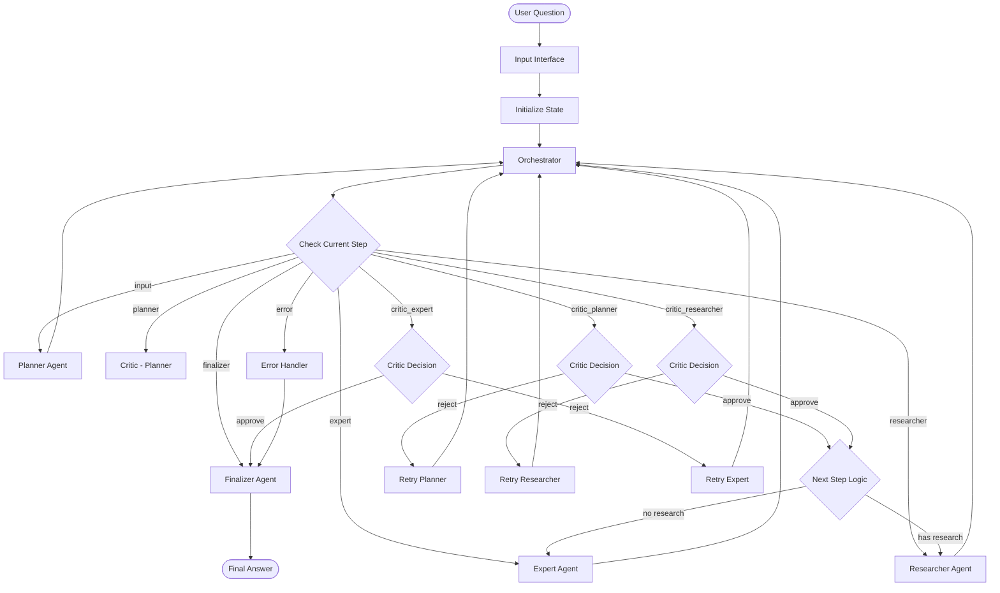

# Multi-Agent System Logical Flow

## Overview

The Multi-Agent System follows a deterministic workflow with feedback loops and retry mechanisms. This document describes the logical flow of execution, decision points, and state transitions that occur when processing a user question.

## High-Level Execution Flow



## Detailed Step-by-Step Execution

### Step 1: Input Interface

**Purpose**: Initialize system state and extract user question

**Execution Logic**:
1. **Extract Question**: Get content from first message in input
2. **Initialize State**: Set all state variables to default values
3. **Set Initial Step**: Set `current_step = "input"` and `next_step = "planner"`
4. **Validate State**: Ensure all required fields are present

**State Changes**:
```python
# Before
state = {"messages": [HumanMessage(content="What is CRISPR?")]}

# After
state = {
    "question": "What is CRISPR?",
    "current_step": "input",
    "next_step": "planner",
    "retry_count": 0,
    "retry_limit": 5,
    "error": None,
    "error_component": None,
    # ... all other fields initialized
}
```

**Decision Points**: None (always proceeds to orchestrator)

### Step 2: Orchestrator - Step Determination

**Purpose**: Determine the next execution step based on current state

**Execution Logic**:
1. **Check Current Step**: Examine `current_step` value
2. **Apply Decision Logic**: Use critic decisions to determine next step
3. **Handle Retry Logic**: Increment retry count on rejections
4. **Check Retry Limits**: Route to finalizer if limit exceeded

**Decision Logic**:

#### When `current_step == "input"`:
- Set `next_step = "planner"`

#### When `current_step == "planner"`:
- Set `next_step = "critic_planner"`

#### When `current_step == "critic_planner"`:
```python
if critic_planner_decision == "approve":
    if len(research_steps) > 0:
        next_step = "researcher"
        # Reset research state
        current_research_index = -1
        research_results = []
        researcher_states = {}
    else:
        next_step = "expert"
elif critic_planner_decision == "reject":
    next_step = "planner"
    retry_count += 1
```

#### When `current_step == "researcher"`:
- Set `next_step = "critic_researcher"`

#### When `current_step == "critic_researcher"`:
```python
if critic_researcher_decision == "approve":
    if current_research_index >= len(research_steps) - 1:
        next_step = "expert"  # All research complete
    else:
        next_step = "researcher"  # More research needed
elif critic_researcher_decision == "reject":
    next_step = "researcher"
    retry_count += 1
```

#### When `current_step == "expert"`:
- Set `next_step = "critic_expert"`

#### When `current_step == "critic_expert"`:
```python
if critic_expert_decision == "approve":
    next_step = "finalizer"
elif critic_expert_decision == "reject":
    next_step = "expert"
    retry_count += 1
```

**Retry Limit Check**:
```python
if retry_count >= retry_limit:
    next_step = "finalizer"
    final_answer = "The question could not be answered."
    final_reasoning_trace = "The question could not be answered."
```

**State Changes**:
- `next_step` updated based on decision logic
- `retry_count` incremented on rejections
- Research state reset when planner approved

### Step 3: Orchestrator - Step Execution

**Purpose**: Execute the determined next step

**Execution Logic**:
1. **Set Current Step**: `current_step = next_step`
2. **Send Message**: Create and send appropriate message to agent
3. **Handle Research Index**: Increment research index for new research steps

**Message Creation Logic**:

#### For Planner:
```python
if critic_planner_decision == "reject":
    message = {
        "sender": "orchestrator",
        "receiver": "planner",
        "type": "instruction",
        "content": critic_planner_feedback,
        "step_id": None
    }
else:
    message = {
        "sender": "orchestrator",
        "receiver": "planner",
        "type": "instruction",
        "content": f"Develop a logical plan to answer: {question}",
        "step_id": None
    }
```

#### For Researcher:
```python
if critic_researcher_decision == "reject":
    message = {
        "sender": "orchestrator",
        "receiver": "researcher",
        "type": "instruction",
        "content": critic_researcher_feedback,
        "step_id": current_research_index
    }
else:
    # Increment research index for new step
    current_research_index += 1
    if current_research_index < len(research_steps):
        message = {
            "sender": "orchestrator",
            "receiver": "researcher",
            "type": "instruction",
            "content": f"Research: {research_steps[current_research_index]}",
            "step_id": current_research_index
        }
    else:
        message = {
            "sender": "orchestrator",
            "receiver": "researcher",
            "type": "instruction",
            "content": "All research steps completed.",
            "step_id": current_research_index - 1
        }
```

#### For Expert:
```python
if critic_expert_decision == "reject":
    message = {
        "sender": "orchestrator",
        "receiver": "expert",
        "type": "instruction",
        "content": critic_expert_feedback,
        "step_id": None
    }
else:
    message = {
        "sender": "orchestrator",
        "receiver": "expert",
        "type": "instruction",
        "content": f"Perform steps: {' '.join(expert_steps)}",
        "step_id": None
    }
```

#### For Critics:
```python
# Critic Planner
if current_step == "critic_planner":
    logical_plan = "\n".join(research_steps) + "\n" + "\n".join(expert_steps)
    message = {
        "sender": "orchestrator",
        "receiver": "critic_planner",
        "type": "instruction",
        "content": f"Review plan: {logical_plan}",
        "step_id": None
    }

# Critic Researcher
elif current_step == "critic_researcher":
    research_result = research_results[current_research_index] if current_research_index < len(research_results) else ""
    message = {
        "sender": "orchestrator",
        "receiver": "critic_researcher",
        "type": "instruction",
        "content": f"Review research: {research_result}",
        "step_id": current_research_index
    }

# Critic Expert
elif current_step == "critic_expert":
    message = {
        "sender": "orchestrator",
        "receiver": "critic_expert",
        "type": "instruction",
        "content": f"Review expert answer: {expert_answer}",
        "step_id": None
    }
```

#### For Finalizer:
```python
message = {
    "sender": "orchestrator",
    "receiver": "finalizer",
    "type": "instruction",
    "content": "Generate final answer and reasoning trace",
    "step_id": None
}
```

### Step 4: Agent Execution

**Purpose**: Execute the specific agent logic

#### Planner Agent Execution:
1. **Get Messages**: Retrieve conversation history with orchestrator
2. **LLM Call**: Call LLM with structured output schema
3. **Validate Response**: Ensure response has required fields
4. **Update State**: Set `research_steps` and `expert_steps`
5. **Send Response**: Send completion message to orchestrator

**State Changes**:
```python
research_steps = response["research_steps"]  # List of research steps
expert_steps = response["expert_steps"]      # List of expert steps
```

#### Researcher Agent Execution:
1. **Get Messages**: Retrieve conversation history for current step
2. **Get/Create State**: Get existing ResearcherState or create new one
3. **Subgraph Execution**: Execute researcher subgraph with tools
4. **Update Results**: Add result to `research_results` list
5. **Send Response**: Send completion message to orchestrator

**State Changes**:
```python
# Add new result
if len(research_results) <= current_research_index:
    research_results.append(subgraph_result["result"])
else:
    research_results[current_research_index] = subgraph_result["result"]

# Update researcher state
researcher_states[current_research_index] = subgraph_state
```

#### Expert Agent Execution:
1. **Get Messages**: Retrieve conversation history with orchestrator
2. **Get/Create State**: Get existing ExpertState or create new one
3. **Subgraph Execution**: Execute expert subgraph with tools
4. **Update State**: Set `expert_answer` and `expert_reasoning`
5. **Send Response**: Send completion message to orchestrator

**State Changes**:
```python
expert_answer = subgraph_state["expert_answer"]
expert_reasoning = subgraph_state["expert_reasoning"]
expert_state = subgraph_state
```

#### Critic Agent Execution:
1. **Get Messages**: Retrieve latest message from orchestrator
2. **LLM Call**: Call LLM with structured output schema
3. **Validate Response**: Ensure response has required fields
4. **Update State**: Set critic decision and feedback
5. **Send Response**: Send completion message to orchestrator

**State Changes**:
```python
# For critic_planner
critic_planner_decision = response["decision"]
critic_planner_feedback = response["feedback"]

# For critic_researcher
critic_researcher_decision = response["decision"]
critic_researcher_feedback = response["feedback"]

# For critic_expert
critic_expert_decision = response["decision"]
critic_expert_feedback = response["feedback"]
```

#### Finalizer Agent Execution:
1. **Get Messages**: Retrieve conversation history with orchestrator
2. **LLM Call**: Call LLM with structured output schema
3. **Validate Response**: Ensure response has required fields
4. **Update State**: Set final answer and reasoning trace
5. **Send Response**: Send completion message to orchestrator

**State Changes**:
```python
final_answer = response["final_answer"]
final_reasoning_trace = response["final_reasoning_trace"]
```

## Decision Points and Business Logic

### Critic Decision Logic

**Approval Criteria**:
- **Planner**: Plan contains sufficient research and expert steps
- **Researcher**: Research results are relevant, accurate, and complete
- **Expert**: Answer addresses the question with proper reasoning

**Rejection Criteria**:
- **Planner**: Plan is incomplete, unclear, or insufficient
- **Researcher**: Research is irrelevant, inaccurate, or incomplete
- **Expert**: Answer doesn't address the question or lacks reasoning

### Retry Logic

**Retry Conditions**:
- Critic rejects agent work
- Retry count is below retry limit
- Error occurs in agent execution

**Retry Behavior**:
- Retry count incremented
- Feedback from critic included in retry
- Same agent called again with improved context

**Termination Conditions**:
- Retry count reaches retry limit
- Critical error occurs
- System determines further retries won't help

### Research Step Logic

**Step Progression**:
1. **Initial**: `current_research_index = -1`
2. **First Step**: Increment to 0, execute research
3. **Subsequent Steps**: Increment after critic approval
4. **Completion**: When index >= len(research_steps) - 1

**Step Management**:
- Each step has its own ResearcherState
- Results stored in `research_results` list
- Step index preserved in message `step_id`

### Error Handling Logic

**Error Categories**:
1. **Network Errors**: API timeouts, connection failures
2. **Validation Errors**: Invalid input, malformed responses
3. **Tool Errors**: Tool execution failures
4. **State Errors**: Corrupted state, missing fields

**Error Response**:
1. **Log Error**: Record error with component context
2. **Set Error State**: Update state with error information
3. **Increment Retry**: Add to retry count if recoverable
4. **Route to Finalizer**: If retry limit exceeded or critical error

## State Transition Examples

### Successful Question Processing

```python
# Initial State
state = {
    "current_step": "input",
    "next_step": "planner",
    "retry_count": 0,
    "research_steps": [],
    "expert_steps": [],
    "research_results": [],
    "expert_answer": "",
    "expert_reasoning": ""
}

# After Planner
state = {
    "current_step": "planner",
    "next_step": "critic_planner",
    "research_steps": ["Research CRISPR definition", "Research CRISPR inventors"],
    "expert_steps": ["Define CRISPR", "Identify inventors"]
}

# After Critic Approval
state = {
    "current_step": "critic_planner",
    "next_step": "researcher",
    "current_research_index": -1,
    "research_results": [],
    "researcher_states": {}
}

# After First Research Step
state = {
    "current_step": "researcher",
    "next_step": "critic_researcher",
    "current_research_index": 0,
    "research_results": ["CRISPR is a gene editing technology"]
}

# After All Research Complete
state = {
    "current_step": "critic_researcher",
    "next_step": "expert",
    "current_research_index": 1,
    "research_results": ["CRISPR is a gene editing technology", "CRISPR was invented by Doudna and Charpentier"]
}

# After Expert
state = {
    "current_step": "expert",
    "next_step": "critic_expert",
    "expert_answer": "CRISPR is a gene editing technology invented by Doudna and Charpentier",
    "expert_reasoning": "Based on research findings..."
}

# After Finalizer
state = {
    "current_step": "finalizer",
    "next_step": "finalizer",
    "final_answer": "CRISPR is a gene editing technology invented by Doudna and Charpentier",
    "final_reasoning_trace": "The system researched CRISPR definition and inventors..."
}
```

### Retry Scenario

```python
# After Critic Rejection
state = {
    "current_step": "critic_planner",
    "next_step": "planner",
    "retry_count": 1,
    "critic_planner_decision": "reject",
    "critic_planner_feedback": "Plan needs more specific research steps"
}

# After Retry with Feedback
state = {
    "current_step": "planner",
    "next_step": "critic_planner",
    "research_steps": ["Research CRISPR definition", "Research CRISPR inventors", "Research CRISPR applications"],
    "expert_steps": ["Define CRISPR", "Identify inventors", "Describe applications"]
}
```

## Business Rules

### Question Processing Rules
1. **Single Question**: Only the first message is processed as the question
2. **Question Extraction**: Question content is extracted and stored in state
3. **State Initialization**: All state variables reset to defaults for new question

### Planning Rules
1. **Research Steps**: Must be specific, actionable research tasks
2. **Expert Steps**: Must be logical reasoning or calculation steps
3. **Optional Research**: Research steps can be empty if question doesn't require external information

### Research Rules
1. **Sequential Execution**: Research steps executed one at a time
2. **Step Validation**: Each research step must be approved before proceeding
3. **Result Accumulation**: Research results stored in order of execution

### Expert Rules
1. **Context Usage**: Expert must use all available research results
2. **Tool Usage**: Expert should use appropriate tools for calculations and reasoning
3. **Answer Quality**: Answer must directly address the original question

### Critic Rules
1. **Quality Assessment**: Critics evaluate work based on relevance, accuracy, and completeness
2. **Feedback Quality**: Rejection feedback must be constructive and actionable
3. **Consistency**: Critics should apply consistent standards across similar work

### Retry Rules
1. **Retry Limit**: Maximum 5 retries per question (configurable)
2. **Feedback Integration**: Retry attempts must incorporate critic feedback
3. **Graceful Degradation**: System terminates gracefully when retry limit exceeded

### Error Rules
1. **Error Logging**: All errors logged with component context
2. **Error Propagation**: Errors propagate to finalizer for user feedback
3. **State Integrity**: State validation ensures data consistency 