# Multi-Agent System Architecture Document

## Document Overview

This document provides an architectural overview of the multi-agent system designed to answer GAIA Level 1 questions through streamlined executor-guard coordination. The system employs graph-based workflow orchestration with an executor agent, dynamic supervision through a guard agent, and comprehensive tool integration.

---

## Table of Contents

1. [Introduction & System Overview](#1-introduction--system-overview)
2. [Core Components & Workflow](#2-core-components--workflow)
3. [Configuration & Deployment](#3-configuration--deployment)
4. [Error Handling & Quality Assurance](#4-error-handling--quality-assurance)
5. [Architectural Decisions](#5-architectural-decisions)

---

## 1. Introduction & System Overview

### 1.1 System Purpose

The multi-agent system answers GAIA Level 1 questions through a streamlined executor-guard workflow:
- **Executor Agent**: Main orchestrator that analyzes tasks, breaks them down, and coordinates tool usage
- **Guard Agent**: Embedded as a tool that provides dynamic supervision and quality control
- **Tool Suite**: Comprehensive set of tools for information gathering, computation, and quality control

### 1.2 Core Architecture

**Core Components:**
- **Executor Agent**: Main orchestrator that analyzes tasks, breaks them down, and coordinates tool usage
- **Guard Agent**: Embedded as a tool that provides dynamic supervision and quality control
- **Tool Suite**: Comprehensive set of tools for information gathering, computation, and quality control
- **Input Interface**: Entry point for question processing and state initialization

**Core Workflow:**
1. **Input**: User question is processed by the Input Interface
2. **Analysis**: Executor Agent analyzes the question and determines required tools
3. **Execution**: Executor Agent executes problem-solving steps using available tools
4. **Dynamic Supervision**: Guard Agent provides course correction and quality control during execution
5. **Synthesis**: Executor Agent synthesizes information and produces final answer
6. **Final Review**: Guard Agent performs final validation and quality assurance
7. **Termination**: Workflow terminates with final answer and reasoning trace

### 1.3 System Capabilities & Limitations

**Capabilities:**
- Answer complex questions requiring research, calculation, and synthesis
- Process files (PDF, Excel, PowerPoint) and extract relevant information
- Perform web searches and access knowledge bases
- Execute mathematical calculations and code
- Provide traceable reasoning for all answers
- Handle errors gracefully with fail-fast error handling and quality control
- Dynamic supervision and course correction during problem-solving

**Limitations:**
- No persistent storage between requests (privacy-focused design)
- Single-question processing (one question per graph run, no concurrent question handling)
- Requires internet connectivity for external APIs
- Limited to English language input/output

### 1.4 System Context Diagrams

**Diagram 1.1: System Context - High-level stakeholder view**

**Diagram 1.2: System Context - Detailed component view**

---

## 2. Core Components & Workflow

### 2.1 Component Architecture

The system consists of streamlined components that work together through executor-guard coordination:

**Core Components:**
- **Executor Agent**: Main orchestrator that analyzes tasks, breaks them down, and coordinates tool usage
- **Guard Agent**: Embedded as a tool that provides dynamic supervision and quality control
- **Tool Suite**: Comprehensive set of tools for information gathering, computation, and quality control
- **Input Interface**: Entry point for question processing and state initialization

**Technology Stack:**
- **LangGraph**: Graph-based workflow orchestration and state management
- **LangChain**: LLM integration and tool framework
- **OpenAI GPT-4o**: Primary LLM for executor and guard agents
- **Python 3.10+**: Runtime environment with standard library logging
- **Opik Framework**: Advanced observability and tracing capabilities

### 2.2 Component Responsibilities

| Component | Purpose | Key Responsibilities | Tools Used |
|-----------|---------|---------------------|------------|
| **Executor Agent** | Main orchestrator | Analyzes tasks, coordinates tools, synthesizes answers | All available tools |
| **Guard Agent** | Quality control tool | Provides dynamic supervision and course correction | None (pure LLM evaluation) |
| **Search Tools** | Information gathering | Web search, Wikipedia, YouTube, file processing | Tavily, Wikipedia API, YouTube API, file readers |
| **Computation Tools** | Mathematical operations | Calculator, unit conversion, Python code execution | Calculator, unit converter, Python REPL |
| **OpikTracer** | Observability | Graph execution tracking, function monitoring | Opik framework integration |

### 2.3 Workflow Architecture

**Diagram 2.1: Workflow Architecture - Technical view**

### 2.4 Workflow Execution

**Diagram 2.2: Workflow Sequence**

### 2.5 State Management

**State Architecture:**
- **GraphState**: Centralized state container with question, file, messages, and error fields
- **MessagesState**: LangGraph's built-in message state management for conversation history
- **Direct State Access**: Executor agent directly manages workflow state and tool interactions
- **State Isolation**: Each question maintains complete isolation with unique thread_id

**State Flow:**
- **Initialization**: Input Interface creates clean GraphState with default values
- **Execution**: Executor agent manages workflow state and tool interactions directly
- **Tool Integration**: Tools are accessed directly by executor agent through tool framework
- **Guard Integration**: Guard agent provides supervision through tool integration
- **Cleanup**: State is cleared between question processing for privacy

### 2.6 Tool Integration

**Tool Categories:**
- **Search Tools**: Web search (Tavily), Wikipedia, YouTube, file processing
- **Computation Tools**: Calculator, unit converter, Python REPL
- **Quality Control Tools**: Guard agent embedded as a tool

**Integration Patterns:**
- **Direct Tool Access**: Executor agent directly accesses tools through tool framework
- **Task-Driven Selection**: Tools are selected based on task requirements and current progress
- **Sequential Execution**: Tools are executed sequentially to respect API rate limits
- **Guard Integration**: Guard agent provides supervision and course correction during tool execution

---

## 3. Configuration & Deployment

### 3.1 Agent Configuration System

**Configuration Definition:**
- **Purpose**: Specifies configuration parameters and system prompts for executor and guard agents
- **Scope**: Configures specific parameters of the graph that must be set before graph compilation
- **Values**: Agent-specific LLM Provider, provider model, LLM temperatures, and agent system prompts

**Configuration Usage:**
- **Runtime Construction**: Configuration is constructed at runtime by the entry point
- **Factory Consumption**: Multi-agent system factory consumes configuration to assign LLM temperatures and agent system prompts to the graph definition before compilation

### 3.2 Factory Pattern Architecture

**Factory Function Responsibilities:**
- **Configuration Assignment**: Assigns all configuration parameters when constructing the graph
- **Graph Construction**: Builds the main graph with executor agent and tool integration
- **Agent Instantiation**: Instantiates executor and guard agent LLMs based on provider and model
- **Prompt Injection**: Loads and injects the correct prompt for each agent when building the graph
- **Tool Binding**: Binds the comprehensive tool suite to the executor agent
- **Observability Integration**: Creates OpikTracer with graph integration for comprehensive monitoring

**Diagram 3.1: Configuration & Factory Pattern**

### 3.3 Entry Point and Batch Processing

**Entry Point Responsibilities:**
- **Configuration Construction**: Constructs configuration with hard-coded LLM temperatures
- **Prompt Loading**: Loads system prompts from external files in prompts/baseline/
- **Graph Compilation**: Compiles the workflow graph once during system initialization with OpikTracer integration
- **Graph Invocation**: Invokes the compiled graph once per question with isolated graph state and unique thread_id
- **Batch Processing**: Processes input questions in batch mode with new graph state per question
- **Output Extraction**: Extracts final answer and reasoning trace from returned graph state
- **Error Handling**: Handles errors gracefully, logs failures, and ensures system resilience

**Batch Processing Features:**
- **Question Isolation**: Each question maintains complete isolation with its own graph state and unique thread_id
- **Graph State Return**: Complete graph state returned after each question processing
- **Output Extraction**: Final answer and reasoning trace extracted from returned graph state
- **Batch Results Storage**: All extracted outputs stored in consolidated batch result files with thread_id tracking
- **Trace Isolation**: Each question processing iteration maintains isolated traces for focused analysis

### 3.4 Output Interface

**Graph Output Interface:**
- **Complete State Return**: The multi-agent system graph returns the complete graph state after each run
- **Final Answer Variable**: Graph state contains the final answer generated by the executor agent
- **Reasoning Trace Variable**: Graph state contains the complete reasoning trace showing the workflow execution
- **No Direct Output**: The graph itself does not write files or format output - it simply returns state

**Entry Point Output Processing:**
- **State Reception**: Entry point receives the complete graph state after each graph invocation
- **Value Extraction**: Entry point extracts the final answer and reasoning trace from the returned state
- **Batch Consolidation**: Extracted outputs are consolidated into batch result files
- **Format Management**: Entry point handles all output formatting and file writing

---

## 4. Error Handling & Quality Assurance

### 4.1 Error Handling Architecture

**High-Level Error Handling Strategy:**
- **Comprehensive Error Detection**: All exceptions and errors are detected and logged regardless of source
- **Error Categorization**: Errors are classified as API errors, validation errors, runtime errors, or tool-specific errors
- **Fail-Fast Error Handling**: When critical errors occur, the system terminates immediately with clear failure reasons

**Error Detection and Reporting:**
- **Context-Rich Error Logging**: Each error is logged with appropriate context including component identification, workflow state, and relevant details
- **Error Details Capture**: Error logs include exception type, message, stack trace, and any relevant state information for debugging

**Diagram 4.1: Error Handling Architecture**

### 4.2 Quality Control and Dynamic Supervision

**Guard Agent Quality Control:**
- **Dynamic Supervision**: The guard agent provides continuous supervision and course correction during problem-solving
- **Quality Assessment**: Guard agent evaluates work quality and provides improvement suggestions
- **Proactive Correction**: Guard agent provides proactive course correction during execution
- **Tool Integration**: Guard agent is embedded as a tool accessible by executor agent

**Dynamic Supervision Patterns:**
- **Continuous Feedback**: Guard agent provides continuous supervision and feedback throughout problem-solving
- **Proactive Correction**: Guard agent provides proactive course correction during execution
- **Quality Integration**: Guard agent feedback is incorporated into executor agent problem-solving process
- **Tool-Based Supervision**: Guard agent supervision is provided through tool integration

**Diagram 4.2: Quality Control Architecture**

```mermaid
graph TD
    Start([Executor Execution])
    Executor["Executor Agent<br/>Problem Solving"]
    Guard["Guard Agent: Supervision"]
    Supervision["Guard Agent: Dynamic Supervision"]
    Feedback["Guard Agent: Feedback & Correction"]
    
    QualityControl["Executor: 🔍 Quality Control Integration"]
    Decision{Quality Assessment}
    ContinuousFeedback["Executor: 📊 Continuous Feedback"]
    DynamicSupervision["Executor: ⚖️ Dynamic Supervision"]
    
    subgraph SupervisionState["Supervision State Management"]
        QualityLevel["🔢 Quality Level"]
        SupervisionMode["📏 Supervision Mode"]
    end
    
    Continue["Executor: 🔄 Continue Execution:<br>1. Integrate guard feedback.<br>2. Continue problem-solving."]
    Success([Success])
    
    Start --> Executor
    Executor --> Guard
    Guard --> Supervision
    Supervision --> Feedback
    Feedback --> QualityControl
    QualityControl --> Decision
    Decision -->|High Quality| Success
    Decision -->|Needs Improvement| ContinuousFeedback
    ContinuousFeedback --> QualityLevel
    SupervisionState --> DynamicSupervision
    DynamicSupervision -->|Continue| Continue
    Continue --> Executor
    
    %% Styling
    classDef executor fill:#00D4AA,stroke:#00B894,stroke-width:2px,color:#000000
    classDef guard fill:#FFB347,stroke:#FF8C00,stroke-width:2px,color:#000000
    classDef supervision fill:#4ECDC4,stroke:#26A69A,stroke-width:2px,color:#000000
    classDef state fill:#FF6B6B,stroke:#FF5252,stroke-width:2px,color:#000000
    classDef success fill:#A8E6CF,stroke:#7FB069,stroke-width:2px,color:#000000
    
    class Executor executor
    class Guard,Supervision,Feedback,Decision guard
    class QualityControl,ContinuousFeedback,DynamicSupervision,Continue supervision
    class QualityLevel,SupervisionMode state
    class Start,Success success
```

### 4.3 Logging and Observability

**Logging Architecture:**
- **Dual Output Configuration**: Standard logging setup with both file and console handlers
- **Comprehensive Log Levels**: INFO, WARNING, ERROR, and DEBUG levels for detailed monitoring
- **Component Identification**: Detailed logging format with timestamps, logger names, and component identification
- **Error Tracking**: Comprehensive error logging with detailed context and stack traces

**Observability Architecture:**
- **LangGraph Integration**: OpikTracer provides complete graph execution flow tracking
- **Function-Level Tracing**: @track decorators enable detailed function execution monitoring
- **Thread-Based Tracing**: Unique thread_id per question enables isolated trace analysis
- **Real-Time Monitoring**: Live trace flushing and monitoring capabilities

**Observability Benefits:**
- **Advanced Debugging**: Detailed execution traces enable complex debugging scenarios
- **Performance Analysis**: Comprehensive performance analysis and bottleneck identification
- **System Understanding**: Complete visibility into system behavior and execution patterns
- **Real-Time Monitoring**: Live monitoring capabilities for operational oversight
- **Thread-Based Analysis**: Isolated trace analysis per question enables focused debugging

---

## 5. Architectural Decisions

### 5.1 Key Design Decisions

**Centralized Orchestrator vs. Distributed Coordination:**
- **Decision**: Centralized orchestrator for workflow control and state management
- **Rationale**: Simplifies coordination, debugging, and state integrity
- **Alternative Considered**: Distributed coordination
- **Rejection Reason**: Increased complexity and synchronization challenges

**Graph-Based Workflow vs. Linear Pipeline:**
- **Decision**: Graph-based workflow (LangGraph) for flexible, conditional routing and modular agent integration
- **Rationale**: Enables complex workflow orchestration and tool integration
- **Alternative Considered**: Linear pipelines
- **Rejection Reason**: Limited extensibility and dynamic workflow control

**Executor-Guard Pattern vs. Multi-Agent Coordination:**
- **Decision**: Streamlined 2-agent system with main executor and embedded guard tool
- **Rationale**: Balances simplicity with dynamic supervision and quality control
- **Alternative Considered**: Complex multi-agent coordination
- **Rejection Reason**: Unnecessary complexity for the problem domain

**Factory Pattern vs. Static Configuration:**
- **Decision**: Factory pattern for dynamic graph creation and configuration injection
- **Rationale**: Enables prompt injection, flexible configuration, and rapid experimentation
- **Alternative Considered**: Static configuration
- **Rejection Reason**: Limited flexibility and experimentation capabilities

### 5.2 Trade-offs and Risks

**Complexity vs. Quality:**
- **Trade-off**: Guard agent and feedback loops add complexity but significantly improve output quality and reliability
- **Mitigation**: Streamlined design and clear component boundaries

**Maintainability vs. Functionality:**
- **Trade-off**: Modular design and subgraph isolation improve maintainability but require more initial design effort
- **Mitigation**: Clear documentation and standardized patterns

**Scalability vs. Simplicity:**
- **Trade-off**: Centralized orchestration limits horizontal scaling but simplifies debugging and state management
- **Mitigation**: Optimized for single-question processing with isolated state

**Quality vs. Speed:**
- **Trade-off**: Iterative feedback and retries improve answer quality but increase latency and resource usage
- **Mitigation**: Dynamic supervision provides quality control without excessive iterations

**Known Risks and Mitigations:**
- **API Dependency**: Reliance on external APIs (LLMs, search) mitigated by error handling and fallback strategies
- **LLM Limitations**: Prompt engineering and critic feedback loops help address LLM unpredictability
- **Configuration Errors**: Pydantic validation and clear error reporting reduce misconfiguration risk
- **Tool Failures**: Fail-fast termination and retry logic ensure system resilience

### 5.3 Architecture Evolution

**Change Management:**
- Version control and documentation of architectural decisions support traceability and review
- Regular review and update procedures ensure architecture remains aligned with system goals

**Backward Compatibility:**
- Changes are evaluated for impact on existing workflows and interfaces
- Migration strategies are planned for major changes

**Extensibility:**
- Plugin architecture and subgraph patterns support future feature additions
- Dynamic workflow routing and distributed orchestration are candidates for future versions

### 5.4 Glossary

**Key Terms:**
- **Agent**: Autonomous component responsible for a specific role (e.g., executor, guard)
- **Executor Agent**: Main orchestrator that analyzes tasks, coordinates tool usage, and synthesizes answers
- **Guard Agent**: Agent embedded as a tool that provides dynamic supervision and quality control
- **GraphState**: Centralized state object containing all workflow and agent data
- **Tool Integration**: Direct access to tools by executor agent through standardized interfaces
- **Dynamic Supervision**: Continuous quality control and course correction provided by guard agent
- **Factory Pattern**: Dynamic graph creation with injected configuration and prompts
- **Fail-Fast Termination**: System behavior that terminates immediately with clear failure reasons when critical errors occur
- **Thread-Based Tracing**: Unique thread_id per question processing iteration enabling isolated trace analysis

**References:**
- **LangGraph Documentation**: https://langchain-ai.github.io/langgraph/
- **LangChain Documentation**: https://python.langchain.com/
- **Opik Documentation**: https://www.comet.com/docs/opik/
- **GAIA Benchmark**: https://gaia-benchmark.github.io/

---

## Diagram Index

This document contains the following 6 diagrams:

### System Overview Diagrams (2)
1. **Diagram 1.1: System Context - High-level stakeholder view** (Section 1.4)
2. **Diagram 1.2: System Context - Detailed component view** (Section 1.4)

### Architecture Diagrams (1)
3. **Diagram 2.1: Workflow Architecture - Technical view** (Section 2.3)

### Workflow Diagrams (1)
4. **Diagram 2.2: Workflow Sequence** (Section 2.4)

### Implementation Diagrams (2)
5. **Diagram 3.1: Configuration & Factory Pattern** (Section 3.2)
6. **Diagram 4.1: Error Handling Architecture** (Section 4.1)
7. **Diagram 4.2: Quality Control Architecture** (Section 4.2)

**Note:** This index provides a quick reference to all diagrams in the document. Each diagram is located in its respective section and provides visual representation of the architectural concepts described in the text.
