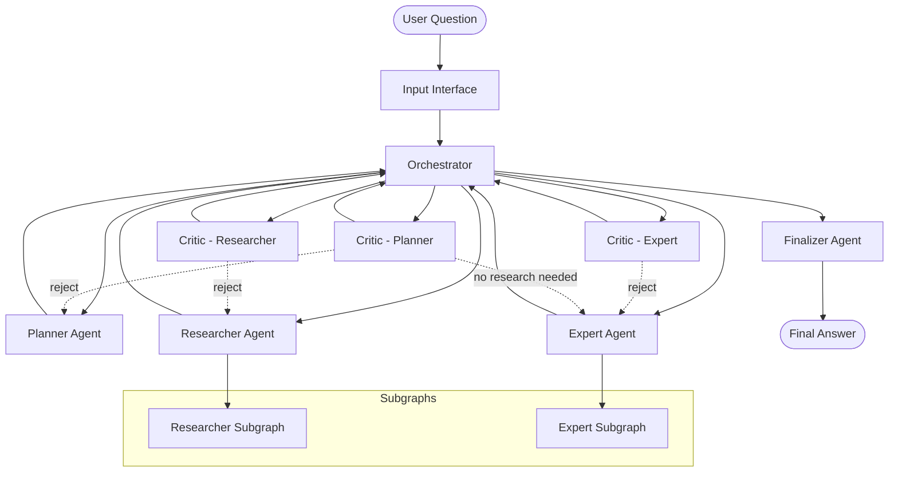

# Multi-Agent System Architecture

## Overview

The Multi-Agent System is designed to answer GAIA Level 1 questions through a coordinated workflow of specialized agents. The system uses a centralized orchestrator pattern with distributed agent nodes, each responsible for specific aspects of question answering.

## System Architecture



## Core Components

### 1. Input Interface
- **Purpose**: Initializes system state and extracts user question
- **Responsibilities**: 
  - Extract question from input messages
  - Initialize all state variables to default values
  - Set initial workflow step
- **State Management**: Creates clean GraphState for new question processing

### 2. Orchestrator
- **Purpose**: Central control node that manages workflow execution
- **Responsibilities**:
  - Determine next execution step based on current state
  - Route messages between agents
  - Manage retry logic and error handling
  - Coordinate critic feedback integration
- **Design Pattern**: Centralized controller with state machine logic

### 3. Planner Agent
- **Purpose**: Analyzes questions and creates execution plans
- **Responsibilities**:
  - Break down questions into research and expert steps
  - Determine if research is needed
  - Create logical execution sequence
- **Tools**: None (pure LLM-based reasoning)
- **Output**: Structured plan with research_steps and expert_steps

### 4. Researcher Agent
- **Purpose**: Gathers information using external tools
- **Responsibilities**:
  - Execute research steps sequentially
  - Use appropriate tools for information gathering
  - Synthesize research results
- **Tools**: Web search, Wikipedia, YouTube transcripts, file readers, MCP tools
- **Subgraph**: Uses LangGraph subgraph for tool interaction

### 5. Expert Agent
- **Purpose**: Synthesizes final answer using gathered information
- **Responsibilities**:
  - Follow expert steps to answer question
  - Use calculation and reasoning tools
  - Generate comprehensive answer with reasoning
- **Tools**: Calculator, unit converter, Python REPL
- **Subgraph**: Uses LangGraph subgraph for tool interaction

### 6. Critic Agents
- **Purpose**: Quality control and feedback mechanism
- **Responsibilities**:
  - Review work from planner, researcher, and expert
  - Provide approve/reject decisions
  - Generate constructive feedback for improvements
- **Types**: Critic_planner, Critic_researcher, Critic_expert
- **Tools**: None (pure LLM-based evaluation)

### 7. Finalizer Agent
- **Purpose**: Produces final answer and reasoning trace
- **Responsibilities**:
  - Synthesize all information into final answer
  - Generate comprehensive reasoning trace
  - Format output for user consumption
- **Tools**: None (pure LLM-based synthesis)

## Data Architecture

### State Management
The system uses a centralized `GraphState` that contains:

```python
class GraphState:
    # Core data
    question: str                    # User's question
    research_steps: list[str]        # Planned research steps
    expert_steps: list[str]          # Planned expert steps
    research_results: list[Any]      # Results from research
    expert_answer: Any               # Expert's answer
    expert_reasoning: str            # Expert's reasoning
    
    # Workflow control
    current_step: str                # Current execution step
    next_step: str                   # Next execution step
    retry_count: int                 # Current retry count
    retry_limit: int                 # Maximum retries
    
    # Communication
    agent_messages: list[AgentMessage]  # Inter-agent messages
    
    # Subgraph states
    researcher_states: dict[int, ResearcherState]  # Per-step researcher state
    expert_state: Optional[ExpertState]            # Expert subgraph state
    
    # Error handling
    error: Optional[str]             # Error message
    error_component: Optional[str]   # Component that failed
```

### Communication Architecture

#### Message Protocol
Agents communicate through a structured message system:

```python
class AgentMessage:
    sender: str        # Source agent
    receiver: str      # Target agent (usually "orchestrator")
    type: str          # "instruction", "feedback", "response"
    content: str       # Message content
    step_id: Optional[int]  # Research step identifier
```

#### Message Flow
1. **Orchestrator → Agent**: Instructions and feedback
2. **Agent → Orchestrator**: Responses and completion messages
3. **Filtering**: Messages filtered by agent and step_id for context

### Subgraph Architecture

#### Researcher Subgraph
- **State**: `ResearcherState` with messages, step_index, and result
- **Nodes**: LLM node and tool node with conditional routing
- **Purpose**: Tool interaction while maintaining conversation context

#### Expert Subgraph
- **State**: `ExpertState` with messages, question, research data, and results
- **Nodes**: LLM node and tool node with conditional routing
- **Purpose**: Tool interaction while maintaining reasoning context

## Technology Stack

### Core Framework
- **LangGraph**: Graph-based workflow orchestration
- **LangChain**: LLM integration and tool framework
- **Pydantic**: Data validation and type safety

### LLM Integration
- **OpenAI GPT-4o**: Primary LLM for complex reasoning
- **OpenAI GPT-4o-mini**: Secondary LLM for research and expert tasks
- **Structured Output**: JSON schema validation for all LLM responses

### External Tools
- **Tavily**: Web search capabilities
- **Wikipedia**: Knowledge base access
- **YouTube**: Video transcript extraction
- **File Readers**: PDF, Excel, PowerPoint processing
- **MCP Tools**: Browser automation and web interaction
- **Python REPL**: Code execution for calculations
- **Unit Converter**: Measurement conversions

### Error Handling
- **Logging**: Structured logging with component context
- **State Validation**: Runtime state integrity checks
- **Retry Logic**: Configurable retry with exponential backoff
- **Graceful Degradation**: Error state propagation to finalizer

## System Boundaries

### Internal Components
- All agent nodes and orchestrator
- State management and validation
- Inter-agent communication
- Error handling and logging

### External Dependencies
- **LLM APIs**: OpenAI GPT-4o and GPT-4o-mini
- **Search APIs**: Tavily search service
- **Knowledge APIs**: Wikipedia API
- **File Systems**: Local file access for document processing
- **Network**: HTTP requests for external services

### Integration Points
- **MCP Browser**: Web automation and interaction
- **File Processing**: Document parsing and content extraction
- **Tool Execution**: Safe execution of external tools

## Scalability Considerations

### Current Architecture
- **Single-threaded**: Sequential execution of workflow steps
- **Stateful**: Complete state maintained in memory
- **Stateless Agents**: Agents don't maintain persistent state

### Scalability Options
- **Horizontal Scaling**: Multiple orchestrator instances with load balancing
- **Agent Pooling**: Multiple instances of each agent type
- **State Persistence**: Database storage for long-running workflows
- **Async Processing**: Non-blocking agent execution
- **Caching**: Result caching for repeated questions

### Performance Characteristics
- **Latency**: Sequential execution with potential for parallel research steps
- **Throughput**: Limited by LLM API rate limits
- **Resource Usage**: Memory usage scales with conversation length
- **Reliability**: Retry logic and error handling for resilience

## Security Architecture

### Input Validation
- **Question Sanitization**: Basic input validation and sanitization
- **Tool Safety**: Restricted tool execution environments
- **State Validation**: Runtime state integrity checks

### Access Control
- **API Key Management**: Secure storage of external API keys
- **Tool Restrictions**: Limited tool execution capabilities
- **Error Handling**: Secure error message handling

### Data Privacy
- **No Persistence**: No persistent storage of user data
- **Memory Cleanup**: State cleared between question processing
- **Tool Isolation**: Isolated execution environments for tools

## Monitoring and Observability

### Logging
- **Structured Logging**: JSON-formatted logs with component context
- **Error Tracking**: Detailed error logging with stack traces
- **Performance Metrics**: Execution time tracking for each component

### Health Checks
- **Component Health**: Individual agent health monitoring
- **External Dependencies**: API availability monitoring
- **State Validation**: Runtime state integrity verification

### Metrics
- **Success Rate**: Question answering success metrics
- **Performance**: Response time and throughput metrics
- **Error Rates**: Component failure and retry metrics 