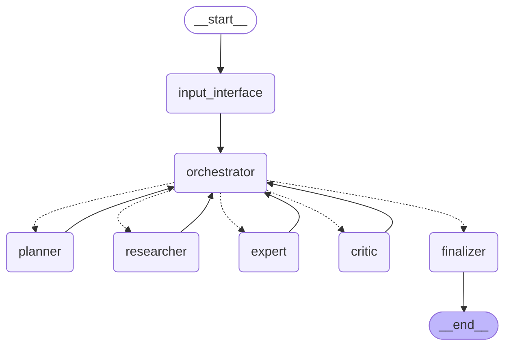
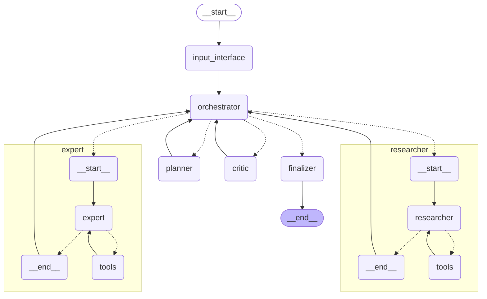

# Multi-Agent System for GAIA Level 1

## Overview
An agent needs to be built that can answer GAIA level 1 questions with at least a score of 30%.
GAIA level 1 questions involve tasks that include:
- answering simple question, puzzle, or riddle.
- reading a file and using it to answer the question
- needing to access the internet to find information

A multi-agent system design is chosen to enable a robust system.

## Components
The mult-agent system has the following components.

### Orchestrator
The orchestrator is the main node that coordinates the other agents by controlling the graph's flow.
It's main function is to oversee the overall process and determine which step is next.
It will send messages to agents delegating a specific task(s) and appropraite instructions
It will receive messages from other agents to determine what the next step should be.
It is not an agent, and instead evaluates the graph state and uses hard-coded conditional logic to determine the next action the system should take.
The orchestrator was designed this way to have robust, predictable behavior.

### Planner
The planner is an agent that is prompted to develop a logical plan.
It uses a simple LLM to generate the plan, and does not use tools.
- Analyze input question.
- Decomposes the question into a list of the logical steps that need to be taken in order to correctly answer the question. These steps need to be atomic. Logical steps in order:
    - Gathering information; gathering a specific piece of information.
    - Analyzing information, performing calculations, answering the question with gathered context, performing a summary, etc. such that the final answer is correct.

The planner may elect to not perform any research if the question can be answered with out needing additional context.

### Researcher
The research agent is responsible for gathering information to develop the necessary context to answer the original question.
It will receive a research request to perform.
If the plan has multiple research steps, each research step is performed sequentially. More on this later.
It functions as a ReAct agent and processes the request to generate the desired information.
The research agent has tools at its dispoal to gather information from a web search, Wikipedia, youtube transcripts, and interactive web browsing.
It will examine the information gathering task and determine the best tool or tools to use to gather appropriate information.
Being a ReAct agent, it may make multiple tool calls to return the requested information.
The research agent can summarize retrieved information and extract factual information

### Expert
The expert agent will receive logical instructions to follow to synthesize the answer to the question.
It will have the required context provided so that it can understand how to complete the logical steps.
It is a ReAct agent; it can perform multi-step reasoning
The expert has tools at its disposal to perfom the logical steps it is asked to take, inluding a calculator, unit conversion, and python REPL tool.
For example, logical steps might be:
- Perform a specific calculation 
- Summarize information to answer the input question. Example: "What is Crisp? Who invented it?" Would be answered using the context gathered by the Researcher.

### Critic
The critic agent will act as a feedback / reflection mechanism.
It uses a simple LLM to generate the decision and feedback, and does not use tools.
It reviews the output from the planner, researcher, and expert and provides feedback to the orchestrator.
This allows the system to catch errors or issues as they happen, versus missing issues upstream.

### Finalizer
The finalizer agent will be triggered when the final answer has been formulated.
Either the system can generate an answer or it returns a failure message that it could not answer the question.
The main job is produce the final answer and create a reasoning trace of how the system answered the question.
It is simple LLM using agent without tools.

## Communication
Messages must be managed

### Across the Multi-Agent System
An imporant aspect with mult-agent systems is how agent-to-agent communicate will work.
The orchestrator must communicate with itself and the other agents.
A shared message channel is used to centralize agent-to-agent messaging.
There will be a message filtering function that reduces the scope of the centralized message channel to keep messages and context relevant to the specific agent.

### Performing Research
Since the researcher agent is a ReAct agent, a subgraph must be employed.
Each individual research step will have a dedicated state for the researcher subgraph.
This is so the researcher agent can keep track of the conversation between itself and the orchestrator for each research step whilst being able to call tools.
The orchestrator will still use the shared message channel to communicate.
When the researcher agent is called in the main graph for a specific research step, the messages the researcher agent uses will be updated before the agent is invoked.

### Expert Answering
Since the expert agent is a ReAct agent, a subgraph must be employed.
The expert subgraph state is employed to propely keep track of the conversation from the messages from the orchestrator and still be able to call tools.
The direct conversation that the expert agent uses is saved in the messages in the expert subgraph state.
The orchestrator will still use the shared message channel to communicate.
When the expert agent is called in the main graph, the messages the expert agent uses will be updated before the agent is invoked.

## The Graph Flow
The graph is not a DAG because the critic agent can re-trigger a called node in the graph.
Here is the general concept of the workflow.
The lines that connect each agent represents the orchestrator.

```mermaid
graph TD
    Start([Start])
    UserInput[/User Question/]
    Planner["🧠 Planner Agent"]
    CriticPlan["🧪 Critic Agent<br/>(on Plan)"]
    Researcher["🔎 Researcher Agent"]
    CriticResearch["🧪 Critic Agent<br/>(on Research)"]
    Expert["🎓 Expert Agent"]
    CriticExpert["🧪 Critic Agent<br/>(on Expert Answer)"]
    Finalizer["✅ Finalizer"]
    End([Final Answer Output])

    Start --> UserInput --> Planner
    Planner --> CriticPlan --> Researcher
    Researcher --> CriticResearch --> Expert
    Expert --> CriticExpert --> Finalizer
    Finalizer --> End

    %% Reject paths
    CriticPlan -.->|reject| Planner
    CriticResearch -.->|reject| Researcher
    CriticExpert -.->|reject| Expert

    %% Optional research bypass
    CriticPlan -.->|If no research needed| Expert
```

### Executing Research Steps
There may be one or more research steps to perform.
The system is designed to have each research step performed sequentially.
THe logic follows this cycle:
1. The researcher will complete the specific step and then the critic will examin the research step results.
2. If the critic rejects, the research will re-trigger the current research step with critic feedback.
3. If the critic approves, then the next step in the research steps will be passed to the research agent.

The cycle continues like this until all research steps are complete.
If no research steps are provided, then the research agent will not be called by the orchestrator

## LangGraph Graphs
The following graphs describe the intended LangGraph graphs to build:

High-level view without subgraph explosions:

High-level view with subgraph explosions:
