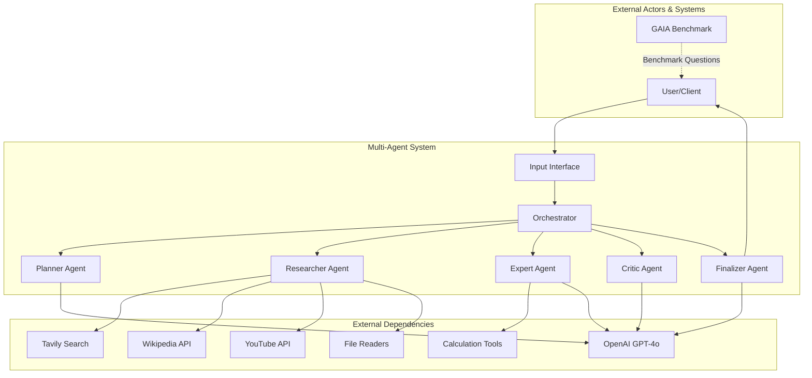
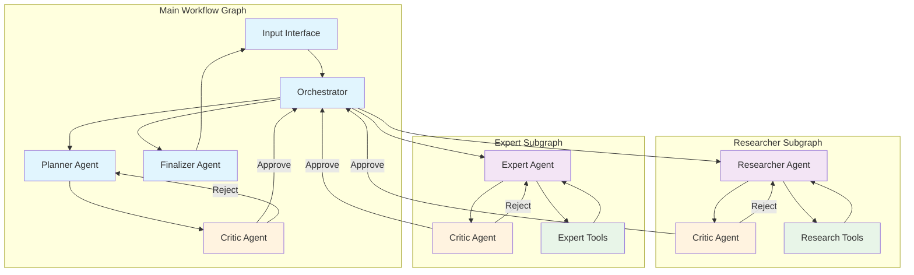
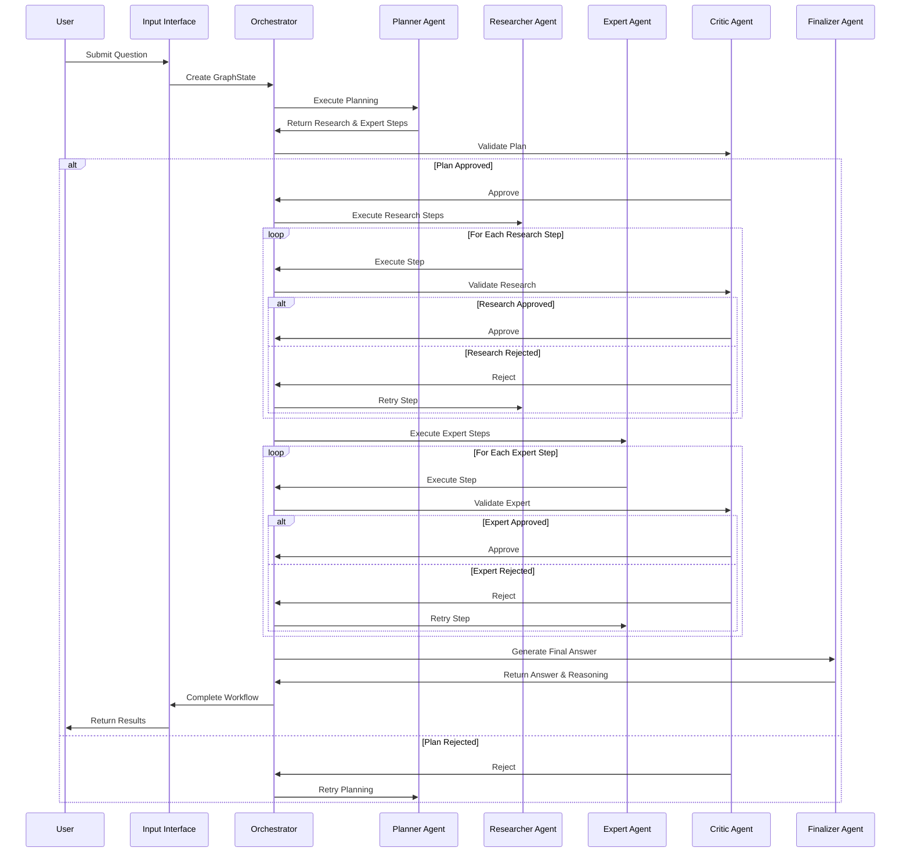
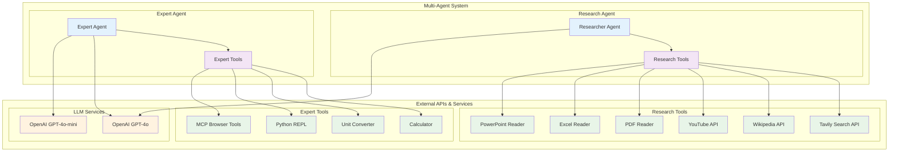
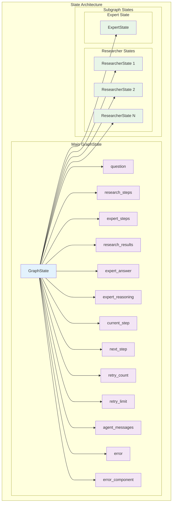
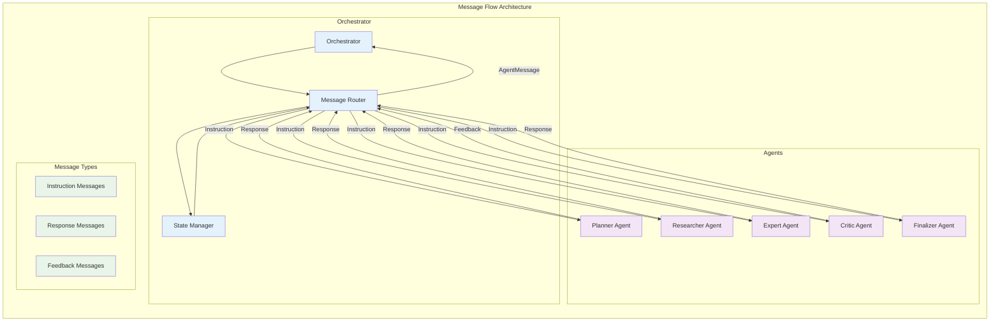
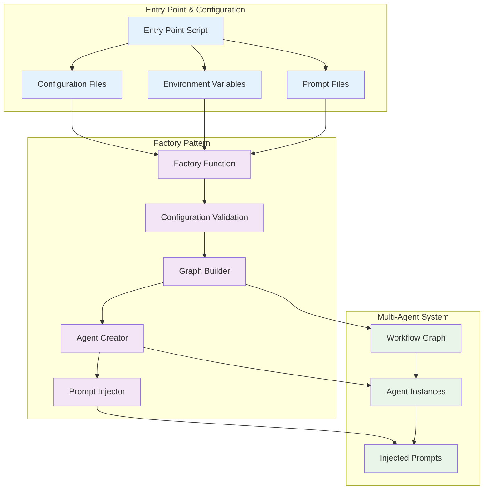
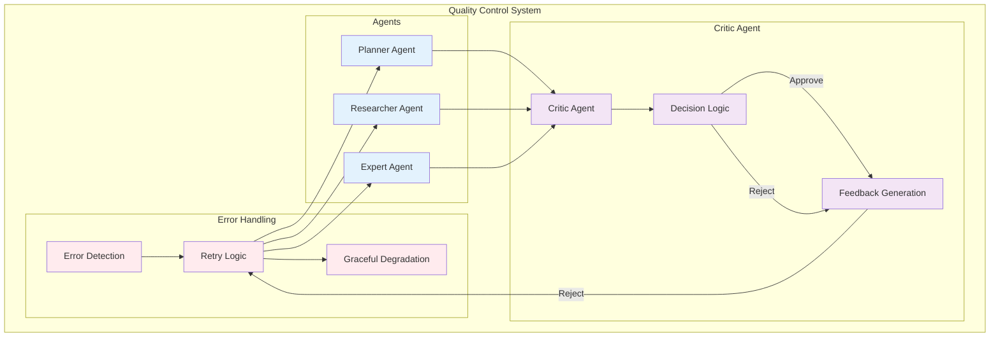
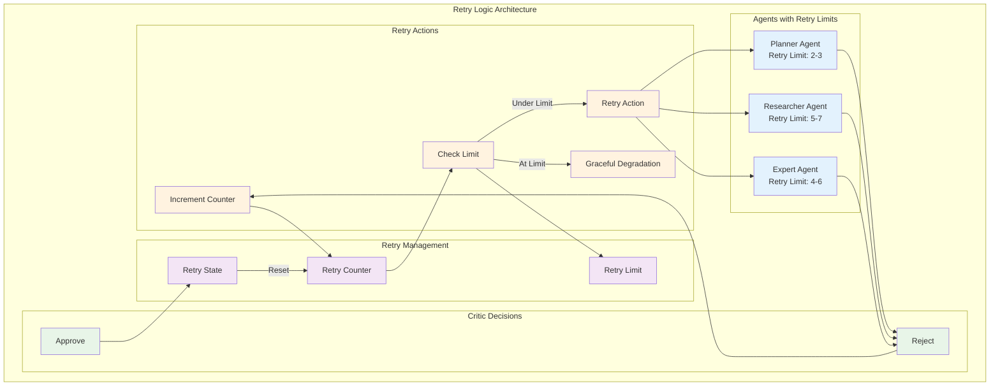

# Multi-Agent System Architecture Document

## Document Overview

This document provides a comprehensive architectural overview of the multi-agent system designed to answer GAIA Level 1 questions through coordinated reasoning and research. The system employs a graph-based workflow orchestration with specialized agents, critic-based quality control, and comprehensive error handling.

---

## Table of Contents

1. [Introduction & System Overview](#1-introduction--system-overview)
2. [Architecture Principles & Patterns](#2-architecture-principles--patterns)
3. [Core Components & Workflow](#3-core-components--workflow)
4. [Technology Stack & Integration](#4-technology-stack--integration)
5. [State Management & Communication](#5-state-management--communication)
6. [Configuration & Deployment](#6-configuration--deployment)
7. [Error Handling & Quality Assurance](#7-error-handling--quality-assurance)
8. [Architectural Decisions & Future Considerations](#8-architectural-decisions--future-considerations)

---

## 1. Introduction & System Overview

**Prerequisites**: None (entry point section)  
**Dependencies**: Referenced by all subsequent sections (2-8)

### 1.1 Document Purpose and Scope

This document provides a comprehensive architectural overview of the multi-agent system designed to answer GAIA Level 1 questions through coordinated reasoning and research. It serves as the primary reference for understanding the system's design, implementation, and operational characteristics.

**Document Purpose:**
- Provide a complete architectural reference for developers, maintainers, and students
- Establish design principles and patterns used throughout the system
- Document key decisions, trade-offs, and rationale for architectural choices
- Serve as a guide for system extension, maintenance, and troubleshooting

**Scope of Coverage:**
- Complete system architecture from high-level design to implementation details
- All major components, their responsibilities, and interaction patterns
- Technology stack, external dependencies, and integration points
- State management, communication protocols, and error handling strategies
- Configuration management, deployment considerations, and operational aspects

**Relationship to Other Documentation:**
- This document focuses on architectural design and system-level understanding
- Implementation details are referenced but not exhaustively covered
- Code-level documentation should be consulted for specific implementation questions
- Operational procedures and deployment guides are separate from this architectural reference

**Intended Audience:**
- **Developers**: Working on the codebase, extending functionality, or debugging issues
- **Architects**: Understanding design decisions, evaluating trade-offs, or planning modifications
- **Students**: Learning about multi-agent systems, LLM orchestration, and graph-based workflows
- **Maintainers**: Understanding system behavior, troubleshooting issues, or performing maintenance

**Required Diagrams**: None (text-based section)

### 1.2 Quick Start Guide

This section provides a 5-minute overview of the multi-agent system for immediate understanding and quick reference.

**Essential Concepts:**
The system answers GAIA Level 1 questions through a coordinated workflow of specialized agents:
- **Planner Agent**: Analyzes questions and creates execution plans
- **Researcher Agent**: Gathers information using web search, Wikipedia, and file processing
- **Expert Agent**: Performs calculations and synthesizes answers
- **Critic Agents**: Provide quality control and feedback at each step
- **Finalizer Agent**: Produces the final answer and reasoning trace

**Key Architecture Patterns:**
- **Graph-Based Workflow**: Uses LangGraph for orchestration with nodes representing agents
- **ReAct Pattern**: Agents use reasoning and action loops for complex problem solving
- **Subgraph Modularity**: Complex agents (Researcher, Expert) use subgraphs for tool interaction
- **Message Passing**: Structured communication between agents through the orchestrator
- **Factory Pattern**: Dynamic agent creation with injected configuration and prompts

**Core Workflow:**
1. **Input**: User question is processed by the Input Interface
2. **Planning**: Planner Agent creates research and expert steps
3. **Research**: Researcher Agent gathers information using external tools
4. **Expert Reasoning**: Expert Agent synthesizes answer using calculations and reasoning
5. **Quality Control**: Critic agents review each step and provide feedback
6. **Finalization**: Finalizer Agent produces the complete answer and reasoning trace

**System Capabilities:**
- Answer complex questions requiring research, calculation, and synthesis
- Process files (PDF, Excel, PowerPoint) and extract relevant information
- Perform web searches and access knowledge bases
- Execute mathematical calculations and code
- Provide traceable reasoning for all answers
- Handle errors gracefully with retry logic and quality control

**System Limitations:**
- No persistent storage between requests (privacy-focused design)
- Single-request processing (no concurrent question handling)
- Requires internet connectivity for external APIs
- Limited to English language input/output
- Focused on GAIA Level 1 question domain

**Required Diagrams**: None (text-based section)

### 1.3 System Purpose and Goals

**What the System Does:**
The multi-agent system is designed to answer GAIA Level 1 questions, which are complex reasoning tasks that require:
- Answering simple questions, puzzles, or riddles
- Reading files and using them to answer questions
- Accessing the internet to find information
- Performing calculations and logical reasoning
- Synthesizing information from multiple sources

**Why the System Exists:**
The system employs a multi-agent approach to break down complex reasoning problems into specialized tasks:
- **Decomposition**: Complex questions are broken into research and expert reasoning steps
- **Specialization**: Each agent focuses on specific capabilities (planning, research, calculation, quality control)
- **Quality Control**: Critic agents provide feedback and validation at each step
- **Traceability**: Complete reasoning traces show how answers were derived
- **Robustness**: Error handling and retry logic ensure reliable operation

**Primary Objectives:**
- **Accuracy Target**: Achieve at least 30% accuracy on GAIA Level 1 benchmark questions
- **Reasoning Quality**: Provide comprehensive, traceable reasoning for all answers
- **Reliability**: Handle errors gracefully with robust retry logic and quality control
- **Maintainability**: Modular design enables easy extension and modification
- **Transparency**: Complete visibility into the reasoning process through detailed traces

**Success Criteria:**
- Successfully answer GAIA Level 1 questions with comprehensive reasoning
- Maintain system reliability through error handling and quality control
- Provide clear, traceable reasoning for all answers
- Support file processing, web search, and calculation capabilities
- Enable easy system extension and maintenance

**System Context and External Dependencies:**
The system integrates with multiple external services and tools:
- **LLM Services**: OpenAI GPT-4o and GPT-4o-mini for reasoning and generation
- **Search Services**: Tavily for web search capabilities
- **Knowledge Bases**: Wikipedia API for factual information
- **Media Services**: YouTube API for video transcript extraction
- **File Systems**: Local file access for document processing (PDF, Excel, PowerPoint)
- **Browser Automation**: MCP tools for web interaction and automation
- **Calculation Tools**: Python REPL, unit converters, and mathematical functions

**Required Diagrams**: 
- **System Context Diagram** - Shows the system and its external actors/dependencies



### 1.4 Technology Stack Overview

**High-Level Technology Stack:**
- **LangGraph**: Graph-based workflow orchestration and state management
- **LangChain**: Multi-agent framework for LLM integration and tool management
- **Python 3.10+**: Runtime environment and language features

**Key Architectural Approach:**
The system uses **graph-based workflow orchestration** with **multi-agent coordination**:
- **Graph Structure**: Directed graph with nodes representing agents and workflow components
- **State Management**: Centralized GraphState with subgraph states for complex agents
- **Message Passing**: Structured communication through the orchestrator
- **Conditional Routing**: State-driven execution with critic-based quality control

**Core Patterns:**
- **ReAct Pattern**: Reasoning and Acting agents for tool-using capabilities
- **Subgraph Modularity**: Complex agent logic isolation in Researcher and Expert subgraphs
- **Message Passing**: Inter-agent communication through structured messages
- **Factory Pattern**: Dynamic agent creation with injected configuration
- **Orchestrator Pattern**: Centralized workflow control with state machine logic

**External Dependencies:**
- **LLM Services**: OpenAI GPT-4o (primary reasoning), GPT-4o-mini (research/expert tasks)
- **Search Tools**: Tavily search API for web search capabilities
- **Knowledge Bases**: Wikipedia API for factual information access
- **Calculation Tools**: Python REPL, unit converters, mathematical functions
- **File Processing**: Document readers for PDF, Excel, PowerPoint formats
- **Browser Tools**: MCP tools for web automation and interaction
- **Media Services**: YouTube API for video transcript extraction

**Integration Architecture:**
- **API Integration**: REST APIs for external services with rate limiting and error handling
- **Tool Framework**: LangChain tool framework for safe tool execution
- **Configuration Management**: Environment variables for API keys and settings
- **Error Handling**: Comprehensive error handling with retry logic and graceful degradation

**Required Diagrams**: None (covered by System Context Diagram in 1.3)

### 1.5 Navigation Tips

This document is organized to support different reading patterns and user needs. Use these navigation tips to find the information you need efficiently.

**For New Readers (Multi-Agent Systems):**
- **Start with**: Section 2 (Architecture Principles & Patterns) for foundational concepts
- **Then read**: Section 3 (Core Components & Workflow) for system understanding
- **Focus on**: Understanding the graph-based workflow and agent coordination patterns

**For Familiar Readers (Multi-Agent Concepts):**
- **Skip to**: Section 3 (Core Components & Workflow) for system details
- **Review**: Section 4 (Technology Stack & Integration) for implementation specifics
- **Reference**: Section 5 (State Management & Communication) for technical details

**For Implementation Details:**
- **Jump to**: Section 5 (State Management & Communication) for state and message protocols
- **Check**: Section 6 (Configuration & Deployment) for setup and configuration
- **Review**: Section 7 (Error Handling & Quality Assurance) for operational concerns

**For Troubleshooting and Operations:**
- **Go to**: Section 7 (Error Handling & Quality Assurance) for error handling and quality control
- **Reference**: Section 8 (Architectural Decisions & Future Considerations) for decision rationale
- **Check**: Section 6 (Configuration & Deployment) for configuration and deployment issues

**For System Extension and Modification:**
- **Start with**: Section 2 (Architecture Principles & Patterns) for design principles
- **Review**: Section 3 (Core Components & Workflow) for component responsibilities
- **Check**: Section 8 (Architectural Decisions & Future Considerations) for design rationale

**Cross-Reference Guide:**
- **State Management**: See Section 5 for GraphState structure and state transitions
- **Tool Integration**: See Section 4 for external tools and integration patterns
- **Error Handling**: See Section 7 for retry logic and quality control
- **Configuration**: See Section 6 for factory pattern and dynamic configuration

**Required Diagrams**: None (text-based section)

**Related Sections**: Section 2 (Architecture Principles & Patterns) for system context

**Section Summary**: This section provides the foundation for understanding and navigating the architecture document, including reader guidance, quick start information, system purpose and goals, technology overview, and navigation tips.

**Key Takeaways**:
- Clear system purpose and success criteria (GAIA Level 1 questions, 30% accuracy target)
- High-level technology stack and architectural approach (LangGraph, LangChain, Python 3.10+)
- Comprehensive reader guidance and orientation for different audience types
- Logical navigation structure and cross-references between sections
- System capabilities (research, reasoning, calculation, file processing, quality control) and limitations (no persistent storage, single-request processing)

---

## 2. Architecture Principles & Patterns

**Prerequisites**: Section 1 (Introduction & System Overview)  
**Dependencies**: Referenced by all subsequent sections (3-8)

### 2.1 Core Design Patterns

The multi-agent system employs five core design patterns that work together to create a robust, maintainable, and extensible architecture.

**Factory Pattern:**
- **Purpose**: Dynamic agent creation and configuration injection
- **Implementation**: Factory function constructs the agent graph with injected prompts and configuration
- **Benefits**: Enables prompt injection, flexible agent configuration, and rapid experimentation
- **Usage**: Main entry point uses factory to build agent workflow graph with runtime configuration

**Orchestrator Pattern:**
- **Purpose**: Centralized workflow control with state machine logic
- **Implementation**: Central controller manages workflow execution, message routing, and state transitions
- **Benefits**: Simplified state management, predictable execution flow, and centralized control
- **Usage**: Orchestrator determines next execution step based on current state and critic decisions

**ReAct Pattern:**
- **Purpose**: Reasoning and Acting agents for tool-using capabilities
- **Implementation**: Agents use iterative reasoning and action loops for complex problem solving
- **Benefits**: Enables complex reasoning, tool interaction, and multi-step problem solving
- **Usage**: Researcher and Expert agents use ReAct pattern for information gathering and reasoning

**Subgraph Pattern:**
- **Purpose**: Modular workflow components for complex agent logic
- **Implementation**: Complex agents (Researcher, Expert) use subgraphs for tool interaction and state management
- **Benefits**: Isolates complex logic, enables modular design, and supports tool integration
- **Usage**: Researcher and Expert agents use subgraphs for multi-step tool interaction

**Message Passing Pattern:**
- **Purpose**: Inter-agent communication through structured messages
- **Implementation**: Agents communicate through structured AgentMessage objects via orchestrator
- **Benefits**: Decoupled communication, structured data exchange, and clear interfaces
- **Usage**: All agent communication flows through orchestrator using standardized message protocol

**Required Diagrams**: None (covered by Graph-Based Architecture Diagram in 2.4)

### 2.2 Key Architectural Decisions

The system architecture is based on several key decisions that balance simplicity, maintainability, and functionality. Each decision was made after considering alternatives and evaluating trade-offs.

**Centralized Orchestrator vs. Distributed Coordination:**
- **Decision**: Centralized orchestrator pattern
- **Rationale**: Simplified state management and workflow control
- **Alternative Considered**: Distributed peer-to-peer agent model
- **Rejection Reason**: Complexity and coordination overhead would make the system harder to understand and maintain

**Graph-Based Workflow vs. Linear Pipeline:**
- **Decision**: Graph-based workflow with conditional routing
- **Rationale**: Enables conditional routing and state-driven execution
- **Alternative Considered**: Linear pipeline with fixed execution order
- **Rejection Reason**: Would not support critic-based feedback loops and retry logic

**Multi-Critic Approach vs. Single Critic:**
- **Decision**: Specialized critic agents for each agent type
- **Rationale**: Provides specialized feedback for each agent type (planner, researcher, expert)
- **Alternative Considered**: Single critic agent for all quality control
- **Rejection Reason**: Would not provide agent-specific feedback and quality assessment

**Subgraph Modularity vs. Monolithic Agents:**
- **Decision**: Subgraph modularity for complex agent logic
- **Rationale**: Enables complex agent logic isolation and reusability
- **Alternative Considered**: Monolithic agents with embedded tool logic
- **Rejection Reason**: Would make agents harder to maintain and test

**Hard-Coded Workflow vs. Dynamic Workflow:**
- **Decision**: Hard-coded workflow with predictable execution
- **Rationale**: Predictable execution and debugging capabilities
- **Alternative Considered**: Dynamic workflow generation
- **Rejection Reason**: Would add complexity and make system behavior less predictable

**Required Diagrams**: None (text-based section)

### 2.3 Quality Attributes

The system architecture is designed to achieve specific quality attributes that ensure reliability, maintainability, extensibility, testability, and performance.

**Reliability:**
- **Error Handling**: Comprehensive error handling with agent-specific retry logic
- **Critic Agents**: Quality control through specialized critic agents at each workflow step
- **Graceful Degradation**: System continues operation even when individual components fail
- **State Validation**: Runtime state integrity checks and validation
- **Retry Logic**: Configurable retry limits for each agent type with exponential backoff

**Maintainability:**
- **Modular Design**: Clear separation of concerns with specialized agent components
- **Factory Pattern**: Dynamic configuration injection enables easy modification
- **Clear Interfaces**: Standardized message protocols and component interfaces
- **Documentation**: Comprehensive architectural documentation and code comments
- **Consistent Patterns**: Uniform use of design patterns throughout the system

**Extensibility:**
- **Plugin Architecture**: Easy addition of new tools and capabilities
- **Configurable Agents**: Dynamic prompt injection and configuration management
- **Tool Integration**: Standardized tool framework for external service integration
- **Subgraph Pattern**: Modular subgraphs enable complex agent logic extension
- **Message Protocol**: Extensible message structure for new communication patterns

**Testability:**
- **Component Isolation**: Individual agents can be tested in isolation
- **Mockable Interfaces**: Clear interfaces enable easy mocking and testing
- **Pure Logic Separation**: Business logic separated from external dependencies
- **State Management**: Centralized state enables comprehensive testing scenarios
- **Error Scenarios**: Built-in error handling supports testing of failure modes

**Performance:**
- **Graph-Based Execution**: Efficient workflow orchestration through LangGraph
- **State Management**: Optimized state transitions and memory management
- **Tool Optimization**: Efficient tool selection and execution patterns
- **Parallel Processing**: Subgraph architecture enables parallel tool execution
- **Resource Management**: Proper cleanup and resource management

**Required Diagrams**: None (text-based section)

### 2.4 System Architecture Overview

The multi-agent system is built as a directed graph using LangGraph, with nodes representing agents and workflow components, and edges representing workflow transitions and data flow.

**High-Level Architecture:**
The system consists of a main graph with specialized subgraphs for complex agent logic:
- **Main Graph**: Contains orchestrator, planner, critic agents, and finalizer
- **Researcher Subgraph**: Handles information gathering with tool interaction
- **Expert Subgraph**: Manages reasoning and calculation with tool interaction

**Graph Structure:**
- **Orchestrator Node**: Central control node that manages workflow execution and state transitions
- **Agent Nodes**: Planner, Researcher, Expert agents with specialized capabilities
- **Critic Nodes**: Quality control agents for planner, researcher, and expert outputs
- **Finalizer Node**: Produces final answer and reasoning trace
- **Subgraph Nodes**: Researcher and Expert subgraphs for complex tool interaction

**Workflow Patterns:**
- **State-Driven Execution**: Workflow progression based on current state and critic decisions
- **Conditional Routing**: Dynamic routing based on critic feedback and retry logic
- **Message Passing**: Structured communication between nodes through orchestrator
- **Quality Control**: Critic agents provide feedback at each workflow step

**Data Flow:**
- **Input Flow**: User questions flow from Input Interface to Orchestrator
- **Planning Flow**: Orchestrator routes to Planner Agent for execution planning
- **Research Flow**: Orchestrator routes to Researcher Agent for information gathering
- **Expert Flow**: Orchestrator routes to Expert Agent for reasoning and calculation
- **Quality Flow**: Critic agents review outputs and provide feedback
- **Output Flow**: Finalizer Agent produces final answer and reasoning trace

**Subgraph Integration:**
- **Researcher Subgraph**: Handles multi-step research with tool interaction
- **Expert Subgraph**: Manages complex reasoning with calculation tools
- **State Synchronization**: Subgraph states are synchronized with main graph state
- **Message Conversion**: Messages are converted between main graph and subgraph formats

**Required Diagrams**: 
- **Graph-Based Architecture Diagram** - Multi-agent system as directed graph with nodes, edges, subgraph boundaries, and workflow patterns



**Related Sections**: Sections 3, 4, 5, 6, 7, 8 (referenced by components, technology, state management, configuration, error handling, and decisions sections)

**Section Summary**: This section covers the fundamental architecture principles and patterns that form the foundation of the multi-agent system, providing the conceptual framework for understanding all subsequent sections.

**Key Takeaways**:
- 5 core design patterns (Factory, Orchestrator, ReAct, Subgraph, Message Passing) work together to create a robust architecture
- Key architectural decisions balance simplicity, maintainability, and functionality with clear rationale for each choice
- Quality attributes (reliability, maintainability, extensibility, testability, performance) are achieved through specific architectural mechanisms
- Graph-based architecture with subgraph modularity enables complex workflow orchestration and tool integration

---

## 3. Core Components & Workflow

**Prerequisites**: Sections 1, 2 (Introduction & Architecture Principles)  
**Dependencies**: Referenced by Sections 4, 5, 6, 7, 8

### 3.1 Component Architecture Overview

The multi-agent system consists of specialized components that work together to answer complex questions through coordinated reasoning and research.

**High-Level Component Relationships:**
The system follows a hierarchical architecture with clear component boundaries:
- **Orchestrator**: Central controller that manages all other components
- **Agent Components**: Specialized agents for planning, research, expert reasoning, and quality control
- **Subgraph Components**: Complex agents use subgraphs for tool interaction and state management
- **Interface Components**: Input interface for question processing and finalizer for answer synthesis

**Component Interaction Patterns:**
- **Centralized Control**: Orchestrator manages all component interactions and workflow execution
- **Message-Based Communication**: Components communicate through structured AgentMessage objects
- **State-Driven Execution**: Component activation based on workflow state and orchestrator decisions
- **Quality Control Integration**: Critic agents review outputs from planning, research, and expert components

**Component Responsibilities and Boundaries:**
- **Input Interface**: Entry point for question processing and state initialization
- **Orchestrator**: Workflow control, message routing, and state management
- **Planner Agent**: Question analysis and execution planning
- **Researcher Agent**: Information gathering with external tools
- **Expert Agent**: Reasoning and calculation with specialized tools
- **Critic Agents**: Quality control and feedback for each agent type
- **Finalizer Agent**: Answer synthesis and reasoning trace compilation

**Overall System Architecture from Component Perspective:**
The system architecture emphasizes modularity, clear interfaces, and centralized control:
- **Modular Design**: Each component has well-defined responsibilities and interfaces
- **Clear Interfaces**: Standardized message protocols and component contracts
- **Centralized Control**: Orchestrator manages workflow and component coordination
- **Quality Integration**: Critic agents provide feedback at each workflow step
- **Tool Integration**: External tools are integrated through specialized subgraphs

**Required Diagrams**: None (covered by Graph-Based Architecture Diagram in 2.4)

### 3.2 Component Summary Table

| Component | Purpose | Key Responsibilities | Tools Used |
|-----------|---------|---------------------|------------|
| **Input Interface** | Entry point, initializes state | Extracts question, sets up workflow, initializes GraphState | None |
| **Orchestrator** | Central controller | Manages workflow, routes messages, handles retries, coordinates critic feedback | None |
| **Planner Agent** | Plans execution steps | Decomposes question, creates research and expert steps, analyzes requirements | None (pure LLM reasoning) |
| **Researcher Agent** | Gathers information | Executes research steps, uses external tools, synthesizes research results | Web search, Wikipedia, YouTube, file readers, MCP tools |
| **Expert Agent** | Synthesizes final answer | Follows expert steps, performs calculations, generates reasoning | Calculator, unit converter, Python REPL |
| **Critic Agents** | Quality control | Reviews outputs, provides feedback, makes approve/reject decisions | None (pure LLM evaluation) |
| **Finalizer Agent** | Produces final answer and reasoning trace | Synthesizes information, formats output, compiles reasoning trace | None (pure LLM synthesis) |

**Component Interfaces and Interaction Patterns:**
- **Orchestrator Interface**: Central message routing and workflow control
- **Agent Interfaces**: Standardized message protocols for instruction and response
- **Subgraph Interfaces**: Tool integration and state management for complex agents
- **Critic Interfaces**: Quality assessment and feedback generation

**Component Relationships and Dependencies:**
- **Orchestrator Dependencies**: All agents depend on orchestrator for workflow control
- **Agent Dependencies**: Agents depend on orchestrator for message routing and state management
- **Subgraph Dependencies**: Researcher and Expert agents depend on subgraphs for tool interaction
- **Tool Dependencies**: Researcher and Expert agents depend on external tools for capabilities

**Required Diagrams**: None (text-based table)

### 3.3 Individual Agent Components

Each agent in the multi-agent system has specialized capabilities and responsibilities designed to handle specific aspects of question answering.

**Planner Agent:**
- **Purpose**: Analyzes questions and creates execution plans
- **Responsibilities**: 
  - Question analysis and strategy creation
  - Research step generation and expert step planning
  - File integration in planning process
  - Output validation and error handling
  - Planning strategy selection and optimization
- **Tools**: None (pure LLM-based reasoning)
- **Output**: Structured plan with research_steps and expert_steps
- **Logic**: Analyzes input question, decomposes into atomic logical steps, determines if research is needed, creates logical execution sequence

**Researcher Agent:**
- **Purpose**: Gathers information using external tools
- **Responsibilities**:
  - Information gathering with tools and subgraph integration
  - ReAct pattern implementation for iterative reasoning
  - Multi-step research coordination and result synthesis
  - Tool selection and usage optimization
  - Research result validation and quality assessment
- **Tools**: Web search, Wikipedia, YouTube transcripts, file readers, MCP tools
- **Subgraph**: Uses LangGraph subgraph for tool interaction
- **Function**: Receives research requests, functions as ReAct agent, makes multiple tool calls, processes multiple research steps sequentially

**Expert Agent:**
- **Purpose**: Synthesizes final answer using gathered information
- **Responsibilities**:
  - Reasoning and calculations with subgraph integration
  - ReAct pattern implementation for complex problem solving
  - Research result integration and answer synthesis
  - Mathematical and logical reasoning capabilities
  - Expert step execution and result validation
- **Tools**: Calculator, unit converter, Python REPL
- **Subgraph**: Uses LangGraph subgraph for tool interaction
- **Function**: Receives logical instructions, has required context provided, functions as ReAct agent with multi-step reasoning

**Critic Agent:**
- **Purpose**: Quality control and feedback for all agent outputs
- **Responsibilities**:
  - Quality control and feedback for all agent outputs
  - Single critic agent with dynamic behavior based on workflow step
  - Three separate prompts (critic_planner, critic_researcher, critic_expert) injected at creation
  - Decision making (approve/reject) and feedback generation for each agent type
  - Quality improvement through iterative feedback
- **Tools**: None (pure LLM-based evaluation)
- **Function**: Acts as feedback/reflection mechanism to catch errors or issues as they happen, no conversation history retention

**Finalizer Agent:**
- **Purpose**: Produces final answer and reasoning trace
- **Responsibilities**:
  - Answer synthesis and formatting from all agent outputs
  - Reasoning trace compilation and final answer generation
  - Agent-specific failure handling with detailed failure attribution
  - Error state handling and failure message formatting
  - Output validation and quality assurance
- **Tools**: None (pure LLM-based synthesis)
- **Function**: Triggered when final answer has been formulated, either generates answer or returns failure message, creates reasoning trace

**Required Diagrams**: None (covered by Graph-Based Architecture Diagram in 2.4)

### 3.4 Orchestrator and Workflow

The orchestrator is the central controller that manages the entire workflow execution, state transitions, and agent coordination.

**Central Workflow Controller and State Machine Logic:**
The orchestrator implements a state machine that manages workflow execution:
- **State Management**: Maintains current workflow state and determines next execution steps
- **Agent Coordination**: Routes messages to appropriate agents based on workflow state
- **Error Handling**: Manages retry logic and graceful degradation when agents fail
- **Quality Control**: Coordinates critic feedback integration at each workflow step

**Step Determination and Routing Logic:**
The orchestrator uses conditional logic to determine workflow progression:
- **Current Step Analysis**: Evaluates current workflow state and agent outputs
- **Next Step Calculation**: Determines next execution step based on critic decisions
- **Retry Management**: Increments retry counters when critics reject agent outputs
- **Completion Detection**: Identifies when workflow should proceed to finalization

**Workflow State Machine with Complete Steps and Transitions:**
The workflow consists of 8 distinct steps with specific transitions:
1. **input**: Start of the graph (default value, never set again)
2. **planner**: Invoke the planning agent
3. **critic_planner**: Invoke the critic for the planning agent
4. **researcher**: Invoke the researcher agent
5. **critic_researcher**: Invoke the critic for the researcher agent
6. **expert**: Invoke the expert agent
7. **critic_expert**: Invoke the critic for the expert agent
8. **finalizer**: Invoke the finalizer agent to generate the final answer and reasoning trace

**Quality Control Integration at Each Workflow Step:**
Critic agents are integrated at three key points in the workflow:
- **Planner Quality Control**: Critic reviews planning strategy and execution steps
- **Researcher Quality Control**: Critic evaluates research results and information quality
- **Expert Quality Control**: Critic assesses expert reasoning and answer quality

**Detailed Workflow Execution Patterns:**
The orchestrator implements specific execution patterns:
- **Sequential Execution**: Steps are executed in a predetermined sequence
- **Conditional Routing**: Critic decisions determine whether to proceed or retry
- **Retry Logic**: Failed steps are retried up to configurable limits
- **Graceful Degradation**: System continues to finalizer even when retry limits are exceeded

**Critic Integration Patterns and Quality Control Details:**
- **Dynamic Prompt Selection**: Critic behavior changes based on current workflow step
- **Feedback Integration**: Critic feedback is incorporated into retry attempts
- **Decision Processing**: Approve/reject decisions drive workflow progression
- **Quality Assessment**: Specialized criteria for each agent type

**Workflow Monitoring and Debugging Capabilities:**
- **State Tracking**: Complete visibility into workflow state and transitions
- **Message Logging**: All inter-agent messages are logged for traceability
- **Error Reporting**: Detailed error information for failed steps
- **Performance Monitoring**: Execution time tracking for each workflow step

**Required Diagrams**: 
- **Main Workflow Sequence Diagram** - Complete end-to-end workflow execution
- **State Transition Diagram** - Workflow state machine with all state transitions



```mermaid
stateDiagram-v2
    [*] --> Initialized: Input Interface creates GraphState
    Initialized --> Planning: Orchestrator starts workflow
    Planning --> PlanValidation: Planner completes
    PlanValidation --> Planning: Critic rejects plan
    PlanValidation --> Research: Critic approves plan
    Research --> ResearchValidation: Research step completes
    ResearchValidation --> Research: Critic rejects research
    ResearchValidation --> Expert: Critic approves research
    Expert --> ExpertValidation: Expert step completes
    ExpertValidation --> Expert: Critic rejects expert
    ExpertValidation --> Finalizing: Critic approves expert
    Finalizing --> Completed: Finalizer completes
    Completed --> [*]: Results returned to user
    
    note right of Planning: Retry limit: 2-3
    note right of Research: Retry limit: 5-7
    note right of Expert: Retry limit: 4-6
```

### 3.5 Component Interaction Patterns

The multi-agent system uses structured interaction patterns to coordinate agent activities and ensure reliable communication.

**Agent-to-Agent Communication Patterns:**
All agent communication flows through the orchestrator using standardized patterns:
- **Centralized Routing**: Orchestrator routes all messages between agents
- **Structured Messages**: Communication uses AgentMessage objects with defined structure
- **Message Filtering**: Agents receive only relevant messages based on sender, receiver, and step_id
- **Context Isolation**: Each agent maintains conversation context with the orchestrator

**Agent Coordination and Synchronization:**
The orchestrator manages agent coordination through specific patterns:
- **Sequential Activation**: Agents are activated in predetermined workflow order
- **State Synchronization**: Agent state is synchronized with main workflow state
- **Message Queuing**: Messages are queued and processed in workflow order
- **Completion Coordination**: Orchestrator ensures workflow completion before proceeding

**Agent State Sharing and Isolation:**
The system implements specific state management patterns:
- **Centralized State**: GraphState contains all workflow state and agent data
- **Agent Isolation**: Each agent operates on isolated state portions
- **State Updates**: Agent outputs update centralized state through orchestrator
- **Context Preservation**: Agent conversation history is preserved for feedback loops

**Agent Lifecycle Management:**
The orchestrator manages agent lifecycle through specific patterns:
- **Initialization**: Agents are initialized with injected configuration and prompts
- **Activation**: Agents are activated based on workflow state and orchestrator decisions
- **Execution**: Agents execute their specialized tasks with provided context
- **Deactivation**: Agents complete execution and return control to orchestrator

**Message Protocol and Structure:**
All agent communication uses the AgentMessage protocol:
- **Sender**: Source agent identifier
- **Receiver**: Target agent identifier (usually "orchestrator")
- **Type**: Message type (instruction, feedback, response)
- **Content**: Message content and data
- **Step ID**: Optional research step identifier for context

**Cross-Graph Communication:**
Complex agents use subgraphs with specific communication patterns:
- **Main Graph to Subgraph**: Messages are converted between AgentMessage and BaseMessage formats
- **Subgraph to Main Graph**: Results are extracted and integrated into main workflow state
- **State Synchronization**: Subgraph states are synchronized with main graph state
- **Message Conversion**: Protocol conversion ensures compatibility between graph types

**Required Diagrams**: 
- **Communication & Message Flow Diagram** - Orchestrator-to-agent communication patterns and message flow

**Related Sections**: Sections 4, 5, 6, 7, 8 (referenced by technology, state management, configuration, error handling, and decisions sections)

**Section Summary**: This section covers the core components of the multi-agent system, including the orchestrator, specialized agents, and their interaction patterns.

**Key Takeaways**:
- 5 specialized agents with distinct roles and responsibilities (Planner, Researcher, Expert, Critic, Finalizer)
- Orchestrator manages workflow and state machine logic with 8 distinct workflow steps
- Each agent has specific tools and capabilities with clear interfaces and interaction patterns
- Components communicate through structured interaction patterns with centralized orchestration
- Quality control through critic agents at each workflow step ensures answer quality and reliability

---

## 4. Technology Stack & Integration

**Prerequisites**: Sections 1, 2, 3 (Introduction, Architecture Principles, Core Components)  
**Dependencies**: Referenced by Sections 5, 6, 7, 8

### 4.1 Core Framework

The multi-agent system is built on a foundation of modern Python frameworks and libraries that provide robust workflow orchestration, LLM integration, and data validation capabilities.

**LangGraph: Graph-Based Workflow Orchestration and State Management**
- **Purpose**: Primary framework for graph-based workflow orchestration
- **Key Features**: 
  - Directed graph construction with nodes and edges
  - State management and workflow execution
  - Conditional routing and state-driven execution
  - Subgraph support for complex agent logic
- **Usage**: Main graph orchestration, subgraph management, state transitions
- **Benefits**: Enables complex workflow patterns, state management, and conditional execution

**LangChain: LLM Integration and Tool Framework**
- **Purpose**: Framework for LLM integration and tool management
- **Key Features**:
  - LLM model integration and configuration
  - Tool framework for external service integration
  - Structured output validation and processing
  - Agent and chain construction patterns
- **Usage**: LLM integration, tool binding, agent construction, structured output handling
- **Benefits**: Standardized LLM integration, tool safety, and agent development patterns

**Pydantic: Data Validation and Type Safety**
- **Purpose**: Data validation and type safety for all system components
- **Key Features**:
  - Runtime type checking and validation
  - Data serialization and deserialization
  - Schema definition and validation
  - Error handling for invalid data
- **Usage**: State validation, message validation, configuration validation
- **Benefits**: Ensures data integrity, catches errors early, improves system reliability

**Python 3.10+: Runtime Environment and Language Features**
- **Purpose**: Runtime environment and language features
- **Key Features**:
  - Modern Python language features and syntax
  - Type hints and static analysis support
  - Async/await support for concurrent operations
  - Rich standard library and ecosystem
- **Usage**: System implementation, tool execution, external API integration
- **Benefits**: Modern language features, extensive ecosystem, developer productivity

**Required Diagrams**: None (text-based section)

### 4.2 LLM Integration

The system integrates with OpenAI's large language models to provide reasoning, generation, and evaluation capabilities across all agents.

**LLM Models and Configuration:**
- **GPT-4o**: Primary LLM for complex reasoning and planning tasks
  - Used by: Planner Agent, Critic Agents, Finalizer Agent
  - Capabilities: Complex reasoning, planning, quality assessment, answer synthesis
  - Configuration: Optimized for reasoning and evaluation tasks
- **GPT-4o-mini**: Secondary LLM for research and expert tasks
  - Used by: Researcher Agent, Expert Agent
  - Capabilities: Information processing, tool interaction, calculation reasoning
  - Configuration: Optimized for tool use and iterative reasoning

**Model Selection and Parameter Settings:**
- **Dynamic Model Selection**: Models are selected based on agent requirements and task complexity
- **Parameter Optimization**: Temperature, max tokens, and other parameters are tuned for each agent type
- **Cost Optimization**: GPT-4o-mini used for tool-heavy tasks to reduce costs
- **Performance Tuning**: Parameters optimized for specific agent capabilities and requirements

**Structured Output Validation and Error Handling:**
- **JSON Schema Validation**: All LLM outputs are validated against predefined schemas
- **Type Safety**: Pydantic models ensure type safety for all structured outputs
- **Error Recovery**: Invalid outputs trigger retry logic with error feedback
- **Fallback Mechanisms**: System gracefully handles LLM failures and invalid responses

**Rate Limiting and API Management:**
- **Rate Limit Handling**: Automatic rate limit detection and exponential backoff
- **API Key Management**: Secure management of OpenAI API keys through environment variables
- **Request Optimization**: Efficient API usage with appropriate request batching
- **Error Handling**: Comprehensive error handling for API failures and network issues

**Required Diagrams**: None (text-based section)

### 4.3 External Tools and Integration

The system integrates with a comprehensive set of external tools and services to provide research, calculation, and information processing capabilities.

**Research Tools:**
- **Web Search**: Tavily search API for comprehensive web search capabilities
  - Purpose: Find current information, facts, and data from the web
  - Integration: REST API with rate limiting and error handling
  - Usage: Researcher Agent for information gathering
- **Knowledge Base Access**: Wikipedia API for factual information
  - Purpose: Access structured knowledge and factual data
  - Integration: REST API with content extraction and processing
  - Usage: Researcher Agent for factual information gathering
- **Media Transcript Extraction**: YouTube API for video content analysis
  - Purpose: Extract and analyze video transcripts and content
  - Integration: REST API with transcript processing and analysis
  - Usage: Researcher Agent for multimedia content analysis

**Expert Tools:**
- **Mathematical Computation**: Calculator and mathematical functions
  - Purpose: Perform mathematical calculations and operations
  - Integration: Python mathematical libraries and functions
  - Usage: Expert Agent for calculation and mathematical reasoning
- **Unit Conversion**: Unit converter for measurement conversions
  - Purpose: Convert between different units and measurement systems
  - Integration: Python unit conversion libraries
  - Usage: Expert Agent for unit conversions and calculations
- **Code Execution**: Python REPL for complex calculations and data processing
  - Purpose: Execute Python code for complex calculations and data analysis
  - Integration: Secure Python execution environment
  - Usage: Expert Agent for complex mathematical and data processing tasks

**File Processing:**
- **Document Readers**: Support for PDF, Excel, PowerPoint formats
  - Purpose: Extract and process content from various document formats
  - Integration: Specialized libraries for each file format
  - Usage: Researcher Agent for document content analysis
- **Content Extraction**: Text and data extraction from documents
  - Purpose: Extract relevant information from document content
  - Integration: OCR and text processing capabilities
  - Usage: Researcher Agent for document-based information gathering

**Browser Tools:**
- **Browser Automation**: MCP tools for web interaction and automation
  - Purpose: Automate web browsing and interaction tasks
  - Integration: Model Context Protocol for browser control
  - Usage: Researcher Agent for dynamic web content and interaction

**Required Diagrams**: 
- **Tool Integration & External Dependencies Diagram** - Research tools, expert tools, and external API integration



### 4.4 Tool Integration Patterns

The system implements specific patterns for tool integration that ensure safety, reliability, and efficient operation.

**Tool Categorization and Selection Principles:**
Tools are categorized based on their purpose and usage patterns:
- **Research Tools**: External APIs for information gathering (web search, Wikipedia, YouTube)
- **Expert Tools**: Calculation and reasoning tools (calculator, unit converter, Python REPL)
- **File Processing Tools**: Document readers and content extractors (PDF, Excel, PowerPoint)
- **Browser Tools**: Web automation and interaction tools (MCP browser tools)

**Tool Execution Patterns and Safety Mechanisms:**
- **Safe Execution Environment**: Tools execute in isolated environments with restricted access
- **Input Validation**: All tool inputs are validated before execution
- **Output Sanitization**: Tool outputs are sanitized and validated before use
- **Error Handling**: Comprehensive error handling for tool failures and exceptions
- **Rate Limiting**: Automatic rate limiting for external API tools

**Tool Error Handling and Fallback Mechanisms:**
- **Graceful Degradation**: System continues operation when individual tools fail
- **Retry Logic**: Automatic retry with exponential backoff for transient failures
- **Alternative Tools**: Fallback to alternative tools when primary tools are unavailable
- **Error Reporting**: Detailed error reporting for tool failures and debugging
- **Resource Cleanup**: Proper cleanup of tool resources and connections

**Tool Result Processing and Validation:**
- **Result Validation**: All tool results are validated against expected formats
- **Content Processing**: Results are processed and formatted for agent consumption
- **Quality Assessment**: Tool results are assessed for relevance and quality
- **Integration**: Results are integrated into agent workflow and state management
- **Caching**: Appropriate caching of tool results to improve performance

**Comprehensive Tool Integration Architecture Overview:**
The tool integration architecture provides:
- **Unified Interface**: Standardized interface for all tool types
- **Dynamic Binding**: Tools are dynamically bound to agents based on requirements
- **Configuration Management**: Tool configuration is managed through environment variables
- **Monitoring**: Tool usage and performance are monitored and logged
- **Extensibility**: New tools can be easily added through the tool framework

**Tool Categorization and Selection Principles:**
- **Purpose-Based Selection**: Tools are selected based on specific task requirements
- **Capability Matching**: Tool capabilities are matched to agent requirements
- **Performance Optimization**: Tools are selected for optimal performance and cost
- **Reliability Considerations**: Tool reliability and availability are considered in selection

**Tool Execution Patterns and Safety Mechanisms:**
- **Sandboxed Execution**: Tools execute in sandboxed environments
- **Resource Limits**: Execution time and resource usage are limited
- **Security Validation**: Tool execution is validated for security concerns
- **Audit Logging**: All tool executions are logged for audit and debugging

**Required Diagrams**: None (covered by Tool Integration & External Dependencies Diagram in 4.3)

**Related Sections**: Sections 5, 6, 7, 8 (referenced by state management, configuration, error handling, and decisions sections)

**Section Summary**: This section covers the technology stack and external dependencies of the multi-agent system, describing the technologies and tools that enable the system's capabilities.

**Key Takeaways**:
- Core frameworks (LangGraph, LangChain, Pydantic) provide robust workflow orchestration, LLM integration, and data validation
- LLM integration with GPT-4o and GPT-4o-mini enables reasoning, generation, and evaluation capabilities
- External tools and their integration patterns support research, calculation, and information processing
- Tool execution environment and safety mechanisms ensure reliable and secure operation

---

## 5. State Management & Communication

**Prerequisites**: Sections 1, 2, 3, 4 (Introduction, Architecture Principles, Core Components, Technology Stack)  
**Dependencies**: Referenced by Sections 6, 7, 8

### 5.1 State Architecture Overview

The multi-agent system uses a centralized state management architecture that coordinates state across all components while maintaining clear boundaries and relationships.

**High-Level State Management Strategy:**
The system implements a hierarchical state management approach:
- **Centralized GraphState**: Main state container that holds all workflow state and data
- **Subgraph States**: Specialized states for complex agents (Researcher, Expert) with their own state management
- **State Coordination**: Orchestrator manages state synchronization between main graph and subgraphs
- **State Isolation**: Each component operates on isolated portions of the overall state

**State Hierarchy and Relationship Principles:**
The state architecture follows specific hierarchy and relationship principles:
- **Main GraphState**: Contains all workflow state, agent data, and coordination information
- **Researcher Subgraph States**: Individual states for each research step with conversation context
- **Expert Subgraph State**: Single state for expert agent with conversation context and tool state
- **State Ownership**: Main graph owns all state, subgraphs manage their internal state
- **State Access Patterns**: Components access only their relevant state portions

**State Flow Patterns and Coordination Mechanisms:**
State flows through the system using specific patterns:
- **Initialization Flow**: Input Interface creates clean GraphState with default values
- **Update Flow**: Agents update state through orchestrator with validation
- **Synchronization Flow**: Subgraph states are synchronized with main graph state
- **Cleanup Flow**: State is cleared between question processing for privacy

**Overall State Architecture and Design:**
The state architecture is designed for:
- **Reliability**: State integrity is maintained throughout workflow execution
- **Performance**: Efficient state access and update patterns
- **Maintainability**: Clear state structure and relationships
- **Extensibility**: Easy addition of new state fields and components
- **Privacy**: No persistent storage ensures user data privacy

**Required Diagrams**: 
- **Data Architecture Diagram** - GraphState lifecycle and hierarchical state structure



### 5.2 State Hierarchy and Relationships

The system implements a hierarchical state structure with clear relationships between main graph state and subgraph states.

**Main GraphState as Central State Container:**
The GraphState serves as the central state container for the entire workflow:
- **Core Data Fields**: question, research_steps, expert_steps, research_results, expert_answer, expert_reasoning
- **Workflow Control Fields**: current_step, next_step, retry_count, retry_limit
- **Communication Fields**: agent_messages for inter-agent communication
- **Subgraph State References**: researcher_states, expert_state for subgraph state management
- **Error Handling Fields**: error, error_component for error state management

**Subgraph States Contained Within Main GraphState:**
Complex agents use subgraph states for their internal state management:
- **ResearcherState**: Individual state for each research step with conversation context and tool state
- **ExpertState**: Single state for expert agent with conversation context and calculation state
- **State Containment**: Subgraph states are contained within the main GraphState
- **State Isolation**: Each subgraph manages its own internal state independently

**State Isolation vs. Sharing Patterns:**
The system implements specific patterns for state isolation and sharing:
- **Main Graph Isolation**: Main graph state is isolated from subgraph internal operations
- **Subgraph Isolation**: Each subgraph operates on its own isolated state
- **Controlled Sharing**: State is shared through orchestrated synchronization
- **Message-Based Communication**: State updates flow through message passing

**State Ownership and Access Patterns:**
Clear ownership and access patterns ensure state integrity:
- **Main Graph Ownership**: Main graph owns all state and controls access
- **Subgraph Ownership**: Subgraphs own their internal state and conversation context
- **Orchestrator Access**: Orchestrator has access to all state for coordination
- **Agent Access**: Agents access only their relevant state portions
- **Validation**: All state access is validated to ensure integrity

**Complete GraphState Structure Documentation:**
The GraphState contains the following fields:
- **question**: User's question string
- **research_steps**: List of planned research steps
- **expert_steps**: List of planned expert steps
- **research_results**: Results from research execution
- **expert_answer**: Expert's final answer
- **expert_reasoning**: Expert's reasoning process
- **current_step**: Current workflow step
- **next_step**: Next workflow step
- **retry_count**: Current retry count
- **retry_limit**: Maximum retry limit
- **agent_messages**: List of inter-agent messages
- **researcher_states**: Dictionary of research step states
- **expert_state**: Expert subgraph state
- **error**: Error message if any
- **error_component**: Component that failed

**All State Fields and Their Purposes:**
Each state field serves a specific purpose in the workflow:
- **Workflow Control**: current_step, next_step, retry_count, retry_limit manage workflow execution
- **Data Storage**: question, research_steps, expert_steps, research_results store workflow data
- **Communication**: agent_messages enable inter-agent communication
- **Subgraph Management**: researcher_states, expert_state manage subgraph state
- **Error Handling**: error, error_component track error state

**State Field Relationships and Dependencies:**
State fields have specific relationships and dependencies:
- **Workflow Dependencies**: current_step determines which agent is active
- **Data Dependencies**: research_results depend on research_steps execution
- **Communication Dependencies**: agent_messages depend on workflow progression
- **Subgraph Dependencies**: subgraph states depend on main graph workflow state
- **Error Dependencies**: error state depends on component execution results

**Required Diagrams**: None (covered by Data Architecture Diagram in 5.1)

### 5.3 State Transition Logic

The system implements specific state transition logic that governs how state changes occur between workflow steps and how state updates are managed.

**How State Transitions Occur Between Workflow Steps:**
State transitions follow a structured process managed by the orchestrator:
- **Step Determination**: Orchestrator determines next step based on current state and critic decisions
- **State Validation**: Current state is validated before transition to ensure integrity
- **State Update**: State is updated with new step information and agent outputs
- **Transition Execution**: State transition is executed with proper error handling
- **State Synchronization**: Subgraph states are synchronized with main graph state

**State Update Patterns and Validation Rules:**
The system implements specific patterns for state updates:
- **Atomic Updates**: State updates are atomic to prevent partial state corruption
- **Validation Rules**: All state updates are validated against schema and business rules
- **Rollback Capability**: Failed updates can be rolled back to previous state
- **Consistency Checks**: State consistency is verified after each update
- **Error Handling**: Invalid state updates are caught and handled gracefully

**Agent-Specific Retry Counter Increments During Critic Rejections:**
Retry logic is managed through specific state update patterns:
- **Retry Counter Management**: retry_count is incremented when critics reject agent outputs
- **Agent-Specific Limits**: Different agents have different retry limits (planner: 2-3, researcher: 5-7, expert: 4-6)
- **Retry State Tracking**: Current retry count is tracked in state for each agent
- **Limit Enforcement**: Retry limits are enforced through state validation
- **Graceful Degradation**: System proceeds to finalizer when retry limits are exceeded

**State Integrity Checks and Error Handling:**
State integrity is maintained through comprehensive checks:
- **Schema Validation**: All state updates are validated against Pydantic schemas
- **Business Rule Validation**: State updates are validated against business logic rules
- **Consistency Validation**: State consistency is verified across all components
- **Error Detection**: Invalid state changes are detected and reported
- **Recovery Mechanisms**: State recovery mechanisms handle corrupted state

**Required Diagrams**: None (covered by State Transition Diagram in 3.4)

### 5.4 Message Protocols and Routing

The system uses structured message protocols and routing mechanisms to enable reliable communication between agents and components.

**AgentMessage Structure and Types:**
All agent communication uses the standardized AgentMessage protocol:
- **sender**: Source agent identifier (e.g., "planner", "researcher", "expert")
- **receiver**: Target agent identifier (usually "orchestrator")
- **type**: Message type ("instruction", "feedback", "response")
- **content**: Message content and data payload
- **step_id**: Optional research step identifier for context isolation

**Message Routing and Filtering Through Graph Edges:**
Message routing is managed through specific mechanisms:
- **Centralized Routing**: Orchestrator routes all messages between agents
- **Edge-Based Filtering**: Messages are filtered based on graph edge relationships
- **Context Isolation**: Each agent receives only relevant messages
- **Message Queuing**: Messages are queued and processed in workflow order
- **Routing Logic**: Conditional routing based on workflow state and agent requirements

**Main Graph and Subgraph Communication Patterns:**
The system implements specific communication patterns:
- **Main Graph Communication**: Direct communication between main graph agents
- **Subgraph Communication**: Internal communication within subgraphs
- **Cross-Graph Communication**: Communication between main graph and subgraphs
- **Message Conversion**: Protocol conversion between different message formats

**Cross-Graph Communication Protocols and Message Conversion:**
Complex agents use subgraphs with specific communication protocols:
- **Main Graph to Subgraph**: AgentMessage format converted to BaseMessage format
- **Subgraph to Main Graph**: BaseMessage format converted to AgentMessage format
- **State Synchronization**: Subgraph state synchronized with main graph state
- **Message Context**: Message context preserved during conversion

**Detailed Communication Architecture Overview:**
The communication architecture provides:
- **Unified Protocol**: Standardized message format across all components
- **Reliable Delivery**: Message delivery guaranteed through orchestrator
- **Context Management**: Message context preserved for conversation history
- **Error Handling**: Communication errors handled gracefully
- **Performance Optimization**: Efficient message routing and processing

**Message Flow Architecture and Routing Principles:**
Message flow follows specific architectural principles:
- **Unidirectional Flow**: Messages flow from orchestrator to agents and back
- **State-Driven Routing**: Routing decisions based on current workflow state
- **Quality Control Integration**: Messages include quality control information
- **Error Propagation**: Error messages propagated through communication channels
- **Audit Trail**: Complete message audit trail for debugging and traceability

**Communication Boundaries and Isolation Patterns:**
Communication boundaries ensure proper isolation:
- **Agent Isolation**: Each agent operates in isolated communication context
- **Subgraph Isolation**: Subgraphs maintain isolated communication channels
- **Context Boundaries**: Clear boundaries between different communication contexts
- **Security Isolation**: Communication channels isolated for security
- **Performance Isolation**: Communication performance isolated between components

**Required Diagrams**: 
- **Communication & Message Flow Diagram** - Orchestrator-to-agent communication patterns and message flow



### 5.5 State Coordination

The system implements sophisticated state coordination mechanisms to ensure consistency and reliability across all components.

**How State is Coordinated Across Multiple Components:**
State coordination is managed through specific mechanisms:
- **Centralized Coordination**: Orchestrator coordinates state across all components
- **Synchronization Protocols**: Standardized protocols for state synchronization
- **Consistency Guarantees**: State consistency guaranteed across all components
- **Conflict Resolution**: Mechanisms for resolving state conflicts
- **Coordination Patterns**: Specific patterns for different coordination scenarios

**State Sharing Patterns Between Agents and Orchestrator:**
The system implements specific state sharing patterns:
- **Orchestrator Ownership**: Orchestrator owns and manages all shared state
- **Agent Access**: Agents access state through orchestrator-controlled interfaces
- **State Updates**: All state updates flow through orchestrator validation
- **State Isolation**: Agents operate on isolated state portions
- **State Synchronization**: State synchronized between agents and orchestrator

**State Update Synchronization and Conflict Resolution:**
State updates are synchronized through specific mechanisms:
- **Atomic Updates**: State updates are atomic to prevent conflicts
- **Sequential Processing**: Updates processed sequentially to maintain consistency
- **Conflict Detection**: Conflicts detected and resolved automatically
- **Rollback Mechanisms**: Failed updates rolled back to maintain consistency
- **Validation**: All updates validated before application

**State Coordination Protocols and Consistency Guarantees:**
The system provides specific consistency guarantees:
- **Strong Consistency**: All components see consistent state
- **Eventual Consistency**: State eventually consistent across all components
- **Causal Consistency**: Causally related updates maintain consistency
- **Read Consistency**: Read operations return consistent state
- **Write Consistency**: Write operations maintain state consistency

**Required Diagrams**: None (covered by Data Architecture Diagram in 5.1)

**Related Sections**: Sections 6, 7, 8 (referenced by configuration, error handling, and decisions sections)

**Section Summary**: This section covers the state management architecture and communication patterns of the multi-agent system, describing how the system maintains and synchronizes state across all components.

**Key Takeaways**:
- Centralized GraphState with subgraph states provides hierarchical state management
- State hierarchy and relationship principles ensure clear state organization and access patterns
- State transition logic and validation maintain state integrity throughout workflow execution
- Message protocols and routing patterns enable reliable communication between components
- State coordination across components ensures consistency and reliability

---

## 6. Configuration & Deployment

**Prerequisites**: Sections 1, 2, 3, 4, 5 (Introduction, Architecture Principles, Core Components, Technology Stack, State Management)  
**Dependencies**: Referenced by Sections 7, 8

### 6.1 Dynamic Configuration

The system supports dynamic configuration to enable flexible deployment, agent customization, and environment-specific settings.

**Configuration Sources and Hierarchy:**
- **Environment Variables**: Used for sensitive data (API keys, secrets) and environment-specific overrides.
- **Configuration Files**: YAML/JSON files for default and project-wide settings.
- **Runtime Arguments**: Command-line or runtime parameters for batch jobs and overrides.
- **Defaults**: Hardcoded defaults for all required settings to ensure safe operation.

**Configuration Injection:**
- **Factory Pattern**: All configuration is injected at graph/agent creation time via the factory.
- **Agent-Specific Settings**: Each agent receives only the configuration relevant to its role (e.g., retry limits, prompt versions).
- **Validation**: All configuration is validated using Pydantic schemas before use.
- **Override Mechanisms**: Environment variables and runtime arguments override file-based and default settings.

**Configuration Management Best Practices:**
- **Separation of Concerns**: Configuration is kept separate from code logic.
- **Versioning**: Configuration files are version-controlled for reproducibility.
- **Error Handling**: Invalid or missing configuration triggers clear error messages and safe fallback.

**Required Diagrams**: None (text-based section)

### 6.2 Factory Pattern Architecture

The system uses a factory pattern to dynamically construct the multi-agent workflow graph and inject configuration and prompts.

**Factory Function Responsibilities:**
- **Graph Construction**: Builds the main graph and all subgraphs (Researcher, Expert) based on configuration.
- **Agent Instantiation**: Creates each agent node with injected configuration and prompt.
- **Prompt Injection**: Loads and injects the correct prompt for each agent, including critic variants.
- **Tool Binding**: Binds the correct set of tools to each agent based on configuration.
- **Validation**: Ensures all required configuration and prompts are present and valid.

**Dynamic Graph Creation Flow:**
1. **Entry Point**: Main script loads configuration and prompts.
2. **Factory Call**: Passes configuration and prompt objects to the factory function.
3. **Graph Assembly**: Factory creates all agent nodes, subgraphs, and edges.
4. **Injection**: Prompts and configuration are injected into each agent.
5. **Graph Compilation**: Returns a fully configured, ready-to-run workflow graph.

**Error Handling:**
- **Validation Errors**: Missing or invalid configuration/prompt triggers clear errors.
- **Fallbacks**: Defaults are used if optional configuration is missing.

**Required Diagrams**: 
- **Configuration & Factory Pattern Diagram** - Entry point flow and factory pattern implementation



### 6.3 Prompt Management

Prompt management is critical for agent behavior, quality, and flexibility.

**Prompt Loading and Injection:**
- **External Sources**: Prompts are loaded from external files or configuration objects.
- **Template Support**: Prompts can use templates with variables for dynamic content.
- **Versioning**: Multiple prompt versions can be maintained for experimentation.
- **Validation**: Prompts are checked for non-emptiness and basic format before use.

**Runtime Prompt Usage:**
- **Dynamic Injection**: Prompts are injected into agents at creation time via the factory.
- **Contextual Prompts**: Critic agent receives different prompts depending on workflow step (planner, researcher, expert).
- **Prompt Updates**: Prompts can be updated without code changes, supporting rapid iteration.

**Prompt Management Best Practices:**
- **Separation**: Prompts are kept separate from code for maintainability.
- **Testing**: Prompt changes are tested for quality and safety.
- **Documentation**: Each prompt is documented for purpose and expected behavior.

**Required Diagrams**: None (text-based section)

### 6.4 Entry Point and Batch Processing

The main entry point script is responsible for initializing the system, loading configuration, and managing batch processing.

**Entry Point Responsibilities:**
- **Argument Handling**: Parses command-line arguments for input/output files and configuration overrides.
- **Configuration Loading**: Loads and validates all configuration and prompts.
- **Graph Instantiation**: Calls the factory to build the workflow graph.
- **Batch Processing**: Processes input questions in batch mode (e.g., from JSONL files).
- **Error Handling**: Handles errors gracefully, logs failures, and ensures system resilience.
- **Output Writing**: Writes answers and reasoning traces to output files in required format.

**Batch Processing Features:**
- **Progress Tracking**: Tracks and logs progress through batch jobs.
- **Resource Management**: Manages memory and cleans up resources between questions.
- **Performance**: Optimized for efficient batch execution.

**Required Diagrams**: None (text-based section)

**Related Sections**: Sections 7, 8 (referenced by error handling and decisions sections)

**Section Summary**: This section covers the configuration management, factory pattern implementation, prompt management, and entry point/batch processing capabilities of the multi-agent system, describing how the system is configured, instantiated, and deployed for flexible and robust operation.

**Key Takeaways**:
- Dynamic configuration enables flexible deployment and agent customization
- Factory pattern supports modular, maintainable, and testable graph construction
- Prompt management allows rapid iteration and quality control of agent behavior
- Entry point and batch processing support scalable, resilient, and automated operation

---

## 7. Error Handling & Quality Assurance

**Prerequisites**: Sections 1, 2, 3, 4, 5, 6 (Introduction, Architecture Principles, Core Components, Technology Stack, State Management, Configuration)  
**Dependencies**: Referenced by Section 8

### 7.1 Error Handling Architecture

The system implements a robust error handling architecture to ensure reliability, resilience, and clear failure attribution throughout the multi-agent workflow.

**High-Level Error Handling Strategy:**
- **Centralized Error Management:** The orchestrator coordinates error detection, propagation, and recovery across all agents and workflow steps.
- **Error Categorization:** Errors are classified as API errors, validation errors, runtime errors, or tool-specific errors.
- **Error Propagation:** Errors are propagated through the workflow state and communicated to relevant agents and the finalizer.
- **Graceful Degradation:** When errors cannot be resolved, the system degrades gracefully, providing partial results and clear failure reasons.

**Error Detection and Reporting:**
- **Validation Errors:** Detected during state updates, configuration loading, and prompt injection.
- **Agent Errors:** Each agent reports errors encountered during execution, including tool failures and invalid outputs.
- **Tool Errors:** Tool integration includes error handling for API failures, timeouts, and invalid responses.
- **Error Logging:** All errors are logged with detailed context for debugging and monitoring.

**Error Recovery and Resilience:**
- **Retry Mechanisms:** Automatic retries for transient errors, with agent-specific retry limits.
- **Fallbacks:** Use of alternative tools or default behaviors when primary actions fail.
- **State Repair:** State recovery mechanisms attempt to restore valid workflow state after errors.

**Required Diagrams**: 
- **Quality Control & Error Handling Diagram** - Critic agent decision-making and error handling



### 7.2 Agent-Specific Retry Logic

The system uses agent-specific retry logic to improve robustness and quality, while preventing infinite retry loops.

**Retry Configuration:**
- **Role-Based Limits:** Each agent type has configurable retry limits (planner: 2-3, researcher: 5-7, expert: 4-6).
- **Configuration Injection:** Retry limits are injected via configuration and can be overridden per environment.

**Retry Counter Management:**
- **Independent Counters:** Each agent maintains its own retry counter, tracked in the workflow state.
- **Increment on Critic Rejection:** Retry counters increment when the critic agent rejects an agent’s output.
- **Limit Enforcement:** When retry limits are reached, the system proceeds to the finalizer with failure attribution.

**Retry Patterns:**
- **Exponential Backoff:** Optional backoff strategies for repeated failures.
- **Graceful Degradation:** If retries are exhausted, the system provides the best available answer and clear failure reasons.

**Required Diagrams**: 
- **Retry Logic Architecture Diagram** - Agent-specific retry configuration and management



### 7.3 Quality Control System

Quality assurance is integrated at every workflow step through the critic agent and feedback loops.

**Critic Agent Integration:**
- **Dynamic Prompts:** The critic agent uses different prompts for planner, researcher, and expert outputs.
- **Decision Making:** The critic decides to approve or reject outputs, providing constructive feedback for improvement.
- **Iterative Feedback:** Agents can retry and improve outputs based on critic feedback, up to their retry limit.

**Quality Assessment Criteria:**
- **Output Validation:** Critic checks for completeness, correctness, and adherence to requirements.
- **Evaluation Metrics:** Quality is assessed using predefined criteria and metrics for each agent type.
- **Traceability:** All critic decisions and feedback are logged for audit and improvement.

**Quality Control Patterns:**
- **Feedback Loops:** Iterative improvement through repeated critic review and agent retries.
- **No History Retention:** Critic agent does not retain conversation history, ensuring unbiased feedback each time.

**Required Diagrams**: None (covered by Quality Control & Error Handling Diagram in 7.1)

### 7.4 System Resilience

The architecture is designed for resilience, ensuring the system continues to function and provide value even in the presence of errors or partial failures.

**Resilience Strategies:**
- **Graceful Degradation:** The system provides partial answers and clear failure reasons when full completion is not possible.
- **Error Recovery:** State repair and retry mechanisms attempt to recover from transient and recoverable errors.
- **Fault Tolerance:** The workflow is robust to individual agent or tool failures, isolating failures and preventing system-wide crashes.
- **Monitoring and Alerting:** Errors and failures are logged and can trigger alerts for operational monitoring.

**System Health and Monitoring:**
- **Structured Logging:** All errors, retries, and critic feedback are logged with context.
- **Health Checks:** Optional health check endpoints or scripts can be used for deployment monitoring.
- **Metrics Collection:** Retry rates, error rates, and critic rejection rates are tracked for quality assurance.

**Required Diagrams**: None (covered by Quality Control & Error Handling Diagram in 7.1)

### 7.5 Testing Strategies

Testing is a first-class concern, with architecture designed for testability at all levels.

**Testable Architecture:**
- **Component Isolation:** Agents and tools are designed for independent testing and mocking.
- **Pure Logic Separation:** Business logic is separated from I/O and external dependencies for unit testing.
- **State Management Testability:** State transitions and updates are testable via Pydantic validation.

**Testing Support:**
- **Unit Testing:** Pure logic and agent behaviors are covered by unit tests.
- **Integration Testing:** End-to-end workflow and agent interactions are tested in integration tests.
- **Mocking and Fixtures:** Mock frameworks and test fixtures are used for tool and agent simulation.

**Testing Infrastructure:**
- **Automated Test Suites:** Continuous integration runs all tests on code changes.
- **Test Data Management:** Test data and fixtures are version-controlled and reusable.
- **Coverage Metrics:** Test coverage is tracked to ensure quality.

**Required Diagrams**: None (text-based section)

**Related Sections:** Section 8 (referenced by decisions section)

**Section Summary:**
This section covers the error handling, retry logic, quality assurance, system resilience, and testing strategies of the multi-agent system, describing how the system maintains reliability, quality, and robustness in the face of errors and failures.

**Key Takeaways:**
- Comprehensive error handling and retry logic ensure system reliability and graceful degradation
- Critic agent and feedback loops provide integrated quality control at every workflow step
- System resilience strategies enable robust operation and clear failure attribution
- Testing strategies and infrastructure support maintainable, high-quality code and architecture

---

## 8. Architectural Decisions & Future Considerations

**Prerequisites**: Sections 1, 2, 3, 4, 5, 6, 7 (All previous sections)  
**Dependencies**: None (final section)

### 8.1 Key Design Decisions

The architecture is shaped by several foundational design decisions, each made to balance complexity, maintainability, and system goals.

**Centralized Orchestrator vs. Distributed Coordination:**
- Chose a centralized orchestrator for workflow control and state management to simplify coordination, debugging, and state integrity.
- Distributed coordination was rejected due to increased complexity and synchronization challenges.

**Graph-Based Workflow vs. Linear Pipeline:**
- Adopted a graph-based workflow (LangGraph) for flexible, conditional routing and modular agent integration.
- Linear pipelines were rejected as they limit extensibility and dynamic workflow control.

**Multi-Critic Approach vs. Single Critic:**
- Implemented a single critic agent with dynamic prompts for each workflow step, balancing quality control and system simplicity.
- Multiple critics were considered but added unnecessary complexity.

**Subgraph Modularity vs. Monolithic Agents:**
- Used subgraph modularity for complex agents (Researcher, Expert) to isolate logic and enable independent tool integration.
- Monolithic agents were rejected to avoid tightly coupled logic and reduced maintainability.

**Hard-Coded Workflow vs. Dynamic Workflow:**
- Chose a hard-coded workflow for predictability, easier debugging, and clear state transitions.
- Dynamic workflows were considered but deferred for future extensibility.

**Required Diagrams**: None (text-based section)

### 8.2 Alternatives Considered

Several alternative architectural approaches were evaluated and rejected, with rationale documented for future reference.

**Distributed Orchestration:**
- Considered for scalability but rejected due to increased coordination overhead and state consistency risks.

**Single-Pass Execution:**
- Rejected in favor of iterative, feedback-driven workflow to improve answer quality and enable critic-based retries.

**Monolithic Agent Design:**
- Rejected to maintain separation of concerns, enable modular testing, and support future extensibility.

**Dynamic Workflow Routing:**
- Deferred for future versions to keep initial implementation simple and maintainable.

**Alternative Tool Integration Patterns:**
- Explored plugin-based tool loading but prioritized explicit tool binding for safety and traceability.

**Required Diagrams**: None (text-based section)

### 8.3 Trade-offs and Risks

The architecture reflects conscious trade-offs to balance system goals, with identified risks and mitigation strategies.

**Complexity vs. Quality:**
- Critic agent and feedback loops add complexity but significantly improve output quality and reliability.

**Maintainability vs. Functionality:**
- Modular design and subgraph isolation improve maintainability but require more initial design effort.

**Scalability vs. Simplicity:**
- Centralized orchestration limits horizontal scaling but simplifies debugging and state management.

**Quality vs. Speed:**
- Iterative feedback and retries improve answer quality but increase latency and resource usage.

**Known Risks and Mitigations:**
- **API Dependency:** Reliance on external APIs (LLMs, search) mitigated by error handling and fallback strategies.
- **LLM Limitations:** Prompt engineering and critic feedback loops help address LLM unpredictability.
- **Configuration Errors:** Pydantic validation and clear error reporting reduce misconfiguration risk.
- **Tool Failures:** Graceful degradation and retry logic ensure system resilience.

**Required Diagrams**: None (text-based section)

### 8.4 Architecture Evolution

The architecture is designed to support future evolution and adaptation as requirements change.

**Change Management:**
- Version control and documentation of architectural decisions (ADRs) support traceability and review.
- Regular review and update procedures ensure architecture remains aligned with system goals.

**Backward Compatibility:**
- Changes are evaluated for impact on existing workflows and interfaces.
- Migration strategies are planned for major changes.

**Extensibility:**
- Plugin architecture and modular agent/subgraph design support future feature additions.
- Dynamic workflow routing and distributed orchestration are candidates for future versions.

**Governance:**
- Architecture reviews and stakeholder input guide major changes.
- Quality metrics and feedback inform ongoing improvements.

**Required Diagrams**: None (text-based section)

### 8.5 Glossary and References

**Glossary:**
- **Agent:** Autonomous component responsible for a specific role (e.g., planner, researcher, expert, critic, finalizer).
- **Orchestrator:** Central controller managing workflow, state, and agent coordination.
- **GraphState:** Centralized state object containing all workflow and agent data.
- **Subgraph:** Modular workflow component for complex agent logic (e.g., Researcher, Expert).
- **Critic Agent:** Agent responsible for quality control and feedback at each workflow step.
- **Prompt:** Instructional text injected into agents to guide LLM behavior.
- **Tool:** External capability (API, function, script) used by agents to perform tasks.
- **Retry Logic:** Mechanism for re-attempting failed agent actions up to a configured limit.
- **Graceful Degradation:** System behavior that provides partial results and clear failure reasons when full completion is not possible.

**References:**
- **Source Code:** See project repository for implementation details.
- **LangGraph Documentation:** https://langchain-ai.github.io/langgraph/
- **LangChain Documentation:** https://python.langchain.com/
- **Pydantic Documentation:** https://docs.pydantic.dev/
- **C4 Model:** https://c4model.com/
- **Mermaid Syntax:** https://mermaid-js.github.io/
- **GAIA Benchmark:** https://gaia-benchmark.github.io/

**Further Reading:**
- Multi-agent system design patterns
- Prompt engineering best practices
- Error handling and resilience in distributed systems
- Testability and maintainability in AI workflows

**Required Diagrams**: None (text-based section)

**Section Summary:**
This section documents the key architectural decisions, alternatives considered, trade-offs, risks, and future evolution plans for the multi-agent system. It also provides a glossary and references for further study.

**Key Takeaways:**
- Key design decisions are documented with rationale and alternatives
- Trade-offs and risks are identified with mitigation strategies
- Architecture is designed for future extensibility and maintainability
- Glossary and references support onboarding and ongoing learning

---

## Diagram Index

This document contains the following 10 diagrams as specified in the architecture requirements:

### Core System Diagrams (4)
1. **System Context Diagram** (Section 1.3) - Shows the system and its external actors/dependencies
2. **Graph-Based Architecture Diagram** (Section 2.4) - Multi-agent system as directed graph with nodes, edges, subgraph boundaries, and workflow patterns
3. **Main Workflow Sequence Diagram** (Section 3.4) - Complete end-to-end workflow execution
4. **State Transition Diagram** (Section 3.4) - Workflow state machine with all state transitions

### Detailed Architecture Diagrams (4)
5. **Communication & Message Flow Diagram** (Section 3.5) - Orchestrator-to-agent communication patterns and message flow
6. **Tool Integration & External Dependencies Diagram** (Section 4.3) - Research tools, expert tools, and external API integration
7. **Quality Control & Error Handling Diagram** (Section 7.1) - Critic agent decision-making and error handling
8. **Data Architecture Diagram** (Section 5.1) - GraphState lifecycle and hierarchical state structure

### Implementation Detail Diagrams (2)
9. **Configuration & Factory Pattern Diagram** (Section 6.2) - Entry point flow and factory pattern implementation
10. **Retry Logic Architecture Diagram** (Section 7.2) - Agent-specific retry configuration and management

---