# Multi-Agent System Architecture Document

## Document Overview

This document provides a comprehensive architectural overview of the multi-agent system designed to answer GAIA Level 1 questions through coordinated reasoning and research. The system employs a graph-based workflow orchestration with specialized agents, critic-based quality control, and comprehensive error handling.

---

## Table of Contents

1. [Introduction & System Overview](#1-introduction--system-overview)
2. [Architecture Principles & Patterns](#2-architecture-principles--patterns)
3. [Core Components & Workflow](#3-core-components--workflow)
4. [Technology Stack & Integration](#4-technology-stack--integration)
5. [State Management & Communication](#5-state-management--communication)
6. [Configuration & Deployment](#6-configuration--deployment)
7. [Error Handling & Quality Assurance](#7-error-handling--quality-assurance)
8. [Architectural Decisions & Future Considerations](#8-architectural-decisions--future-considerations)

---

## 1. Introduction & System Overview

**Prerequisites**: None (entry point section)  
**Dependencies**: Referenced by all subsequent sections (2-8)

### 1.1 Document Purpose and Scope

This document provides a comprehensive architectural overview of the multi-agent system designed to answer GAIA Level 1 questions through coordinated reasoning and research. It serves as the primary reference for understanding the system's design, implementation, and operational characteristics.

**Document Purpose:**
- Provide a complete architectural reference for developers, maintainers, and students
- Establish design principles and patterns used throughout the system
- Document key decisions, trade-offs, and rationale for architectural choices
- Serve as a guide for system extension, maintenance, and troubleshooting

**Scope of Coverage:**
- Complete system architecture from high-level design to implementation details
- All major components, their responsibilities, and interaction patterns
- Technology stack, external dependencies, and integration points
- State management, communication protocols, and error handling strategies
- Configuration management, deployment considerations, and operational aspects

**Relationship to Other Documentation:**
- This document focuses on architectural design and system-level understanding
- Implementation details are referenced but not exhaustively covered
- Code-level documentation should be consulted for specific implementation questions
- Operational procedures and deployment guides are separate from this architectural reference

**Intended Audience:**
- **Developers**: Working on the codebase, extending functionality, or debugging issues
- **Architects**: Understanding design decisions, evaluating trade-offs, or planning modifications
- **Students**: Learning about multi-agent systems, LLM orchestration, and graph-based workflows
- **Maintainers**: Understanding system behavior, troubleshooting issues, or performing maintenance


### 1.2 Quick Start Guide

This section provides a 5-minute overview of the multi-agent system for immediate understanding and quick reference.

**Essential Concepts:**
The system answers GAIA Level 1 questions through a coordinated workflow of specialized agents:
- **Planner Agent**: Analyzes questions and creates execution plans
- **Researcher Agent**: Gathers information using web search, Wikipedia, and file processing
- **Expert Agent**: Performs calculations and synthesizes answers
- **Critic Agent**: Provides quality control and feedback at each step
- **Finalizer Agent**: Produces the final answer and reasoning trace

**Key Architecture Patterns:**
- **Multi-Agent System**: Decomposes complex problems into specialized, autonomous agents
- **Graph-Based Workflow**: Uses LangGraph for orchestration with nodes representing agents
- **ReAct Pattern**: Iterative reasoning and action loops for complex problem solving
- **Subgraph Patterns**: Hierarchical workflow components for complex agent logic isolation
- **Message Passing**: Structured communication between agents through the orchestrator
- **Factory Pattern**: Dynamic agent creation with injected configuration and prompts

**Core Workflow:**
1. **Input**: User question is processed by the Input Interface
2. **Planning**: Planner Agent creates research and expert steps
3. **Research**: Researcher Agent gathers information using external tools
4. **Expert Reasoning**: Expert Agent synthesizes answer using calculations and reasoning
5. **Quality Control**: Critic agent reviews each step and provides feedback
6. **Finalization**: Finalizer Agent produces the complete answer and reasoning trace
7. **Termination**: Workflow terminates on END node after finalizer agent completes

**System Capabilities:**
- Answer complex questions requiring research, calculation, and synthesis
- Process files (PDF, Excel, PowerPoint) and extract relevant information
- Perform web searches and access knowledge bases
- Execute mathematical calculations and code
- Provide traceable reasoning for all answers
- Handle errors gracefully with retry logic and quality control
- Return complete graph state with final answers and reasoning traces

**System Limitations:**
- No persistent storage between requests (privacy-focused design)
- Single-question processing (one question per graph run, no concurrent question handling)
- Single graph compilation with per-question invocation pattern
- Complete question isolation (no state crossing between questions)
- Requires internet connectivity for external APIs
- Limited to English language input/output
- Focused on GAIA Level 1 question domain


### 1.3 System Purpose and Goals

**What the System Does:**
The multi-agent system is designed to answer GAIA Level 1 questions, which are complex reasoning tasks that require:
- Answering simple questions, puzzles, or riddles
- Reading files and using them to answer questions
- Accessing the internet to find information
- Performing calculations and logical reasoning
- Synthesizing information from multiple sources

**Graph Compilation and Invocation Pattern:**
When used via the entry point, the multi-agent system follows a specific compilation and invocation pattern:
- **Single Graph Compilation**: The workflow graph is compiled once during system initialization
- **Configuration Supply**: Entry point supplies graph configuration and prompts to the multi-agent system factory
- **Factory Processing**: Factory processes configuration contents and sets appropriate values in the graph
- **Prompt Injection**: Factory injects prompts when building and compiling the graph
- **Per-Question Invocation**: The compiled graph is invoked once per question to be answered
- **Isolated Graph State**: Each question has its own isolated graph state when the graph is invoked
- **Batch Processing**: When the entry point script iterates through multiple questions, a new graph state is created for each question
- **Single Question Per Run**: A single graph run will answer only one question
- **No State Crossing**: There will never be any crossing of questions in the same state - each question maintains complete isolation
- **Graph State Return**: After each graph run, the entry point receives the complete graph state containing all workflow information
- **Output Extraction**: The entry point extracts the final answer and reasoning trace from the returned graph state
- **Batch Results Storage**: Extracted answers and reasoning traces are stored in batch result files for all processed questions

**Why the System Exists:**
The system employs a multi-agent approach to break down complex reasoning problems into specialized tasks:
- **Decomposition**: Complex questions are broken into research and expert reasoning steps
- **Specialization**: Each agent focuses on specific capabilities (planning, research, calculation, quality control)
- **Quality Control**: Critic agent provides feedback and validation at each step
- **Traceability**: Complete reasoning traces show how answers were derived
- **Robustness**: Error handling and retry logic ensure reliable operation

**Primary Objectives:**
- **Accuracy Target**: Achieve at least 30% accuracy on GAIA Level 1 benchmark questions
- **Reasoning Quality**: Provide comprehensive, traceable reasoning for all answers
- **Reliability**: Handle errors gracefully with robust retry logic and quality control
- **Maintainability**: Modular design enables easy extension and modification
- **Transparency**: Complete visibility into the reasoning process through detailed traces

**Success Criteria:**
- Successfully answer GAIA Level 1 questions with comprehensive reasoning
- Maintain system reliability through error handling and quality control
- Provide clear, traceable reasoning for all answers
- Support file processing, web search, and calculation capabilities
- Enable easy system extension and maintenance

**System Context and External Dependencies:**
The system integrates with multiple external services and tools:
- **LLM Services**: OpenAI GPT-4o and GPT-4o-mini for reasoning and generation
- **Search Services**: Tavily for web search capabilities
- **Knowledge Bases**: Wikipedia API for factual information
- **Media Services**: YouTube API for video transcript extraction
- **File Systems**: Local file access for document processing (PDF, Excel, PowerPoint)
- **Browser Automation**: MCP tools for web interaction and automation
- **Calculation Tools**: Python REPL, unit converters, and mathematical functions

### 1.4 Technology Stack Overview

**High-Level Technology Stack:**
- **LangGraph**: Graph-based workflow orchestration and state management
- **LangChain**: Multi-agent framework for LLM integration and tool management
- **Structlog**: Structured logging framework for observability and traceability
- **Python 3.10+**: Runtime environment and language features

**Key Architectural Approach:**
The system uses **graph-based workflow orchestration** with **multi-agent coordination**:
- **Graph Structure**: Directed graph with nodes representing agents and workflow components
- **State Management**: Centralized GraphState with subgraph states for complex agents
- **Message Passing**: Structured communication through the orchestrator
- **Conditional Routing**: State-driven execution with critic-based quality control

**Core Patterns:**
- **ReAct Pattern**: Iterative reasoning and action loops for complex problem solving
- **Modular Agent Architecture**: Hierarchical workflow components for complex agent logic isolation
- **Message Passing**: Inter-agent communication through structured messages
- **Factory Pattern**: Dynamic agent creation with injected configuration
- **Orchestrator Pattern**: Centralized workflow control with state machine logic

**External Dependencies:**
- **LLM Services**: OpenAI GPT-4o (primary reasoning), GPT-4o-mini (research/expert tasks)
- **Search Tools**: Tavily search API for web search capabilities
- **Knowledge Bases**: Wikipedia API for factual information access
- **Calculation Tools**: Python REPL, unit converters, mathematical functions
- **File Processing**: Document readers for PDF, Excel, PowerPoint formats
- **Browser Tools**: MCP tools for web automation and interaction
- **Media Services**: YouTube API for video transcript extraction

**Integration Architecture:**
- **API Integration**: REST APIs for external services with rate limiting and error handling
- **Tool Framework**: LangChain tool framework for safe tool execution
- **Configuration Management**: Environment variables for API keys and settings
- **Error Handling**: Comprehensive error handling with retry logic and fail-fast termination


### 1.5 Diagrams
**Diagram 1.1: Level 1 System Context Diagram -- Multi-Agent System** - High-level stakeholder view showing external entities and data flow
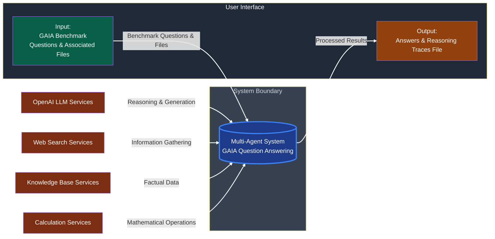

**Diagram 1.2a: Level 1 System Context Diagram -- Multi-Agent System** - Detailed view showing internal components and external services
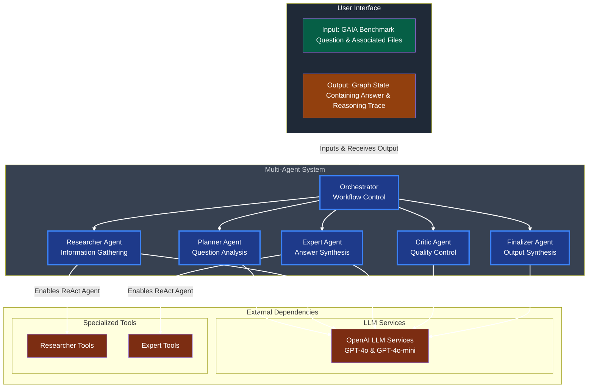

**Diagram 1.2b: Level 1 System Context Diagram -- Input/Output and Entry Point System** - Detailed view showing internal components and external services
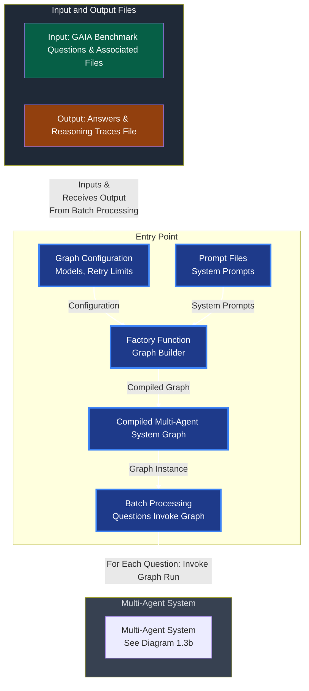

**Related Sections**: Section 2 (Architecture Principles & Patterns) for system context

**Section Summary**: This section provides the foundation for understanding and navigating the architecture document, including reader guidance, quick start information, system purpose and goals, technology overview, and navigation tips.

**Key Takeaways**:
- Clear system purpose and success criteria (GAIA Level 1 questions, 30% accuracy target)
- High-level technology stack and architectural approach (LangGraph, LangChain, Python 3.10+)
- Comprehensive reader guidance and orientation for different audience types
- Logical navigation structure and cross-references between sections
- System capabilities (research, reasoning, calculation, file processing, quality control) and limitations (no persistent storage, single-request processing)

---

## 2. Architecture Principles & Patterns

**Prerequisites**: Section 1 (Introduction & System Overview)  
**Dependencies**: Referenced by all subsequent sections (3-8)

### 2.1 Core Design Patterns

The multi-agent system employs six core design patterns that work together to create a robust, maintainable, and extensible architecture.

**Multi-Agent System Pattern:**
- **Purpose**: Decompose complex problems into specialized, autonomous agents
- **Implementation**: System-level architectural pattern that distributes responsibilities across multiple cooperating components
- **Benefits**: Modularity, specialization, distributed responsibility, coordinated problem solving
- **Usage**: Applied to complex reasoning tasks requiring multiple capabilities and coordinated problem solving

**Factory Pattern:**
- **Purpose**: Dynamic agent creation and configuration injection
- **Implementation**: Factory function constructs the agent graph with injected prompts and configuration
- **Benefits**: Enables prompt injection, flexible agent configuration, and rapid experimentation
- **Usage**: Main entry point uses factory to build agent workflow graph with runtime configuration

**Orchestrator Pattern:**
- **Purpose**: Centralized workflow control with state machine logic
- **Implementation**: Central controller manages workflow execution, message routing, and state transitions
- **Benefits**: Simplified state management, predictable execution flow, and centralized control
- **Usage**: Orchestrator determines next execution step based on current state and critic decisions

**ReAct Pattern:**
- **Purpose**: Iterative reasoning and action loops for complex problem solving
- **Implementation**: Agents use iterative reasoning and action loops for complex problem solving
- **Benefits**: Enables complex reasoning, tool interaction, and multi-step problem solving
- **Usage**: Researcher and Expert agents use ReAct pattern for information gathering and reasoning

**Subgraph Patterns:**
- **Purpose**: Isolate complex agent logic for maintainability and reusability
- **Implementation**: Hierarchical workflow components with specialized capabilities
- **Benefits**: Clear separation of concerns, independent tool integration, modular testing
- **Usage**: Researcher and Expert agents (ReAct agents) use subgraph patterns for sophisticated reasoning and tool interaction

**Message Passing Pattern:**
- **Purpose**: Inter-agent communication through structured messages
- **Implementation**: Agents communicate through structured AgentMessage objects via orchestrator
- **Benefits**: Decoupled communication, structured data exchange, and clear interfaces
- **Usage**: All agent communication flows through orchestrator using standardized message protocol

**Required Diagrams**: None (covered by Graph-Based Architecture Diagram in 2.4)

### 2.2 Key Architectural Decisions

The system architecture is based on several key decisions that balance simplicity, maintainability, and functionality. Each decision was made after considering alternatives and evaluating trade-offs.

**Centralized Orchestrator vs. Distributed Coordination:**
- **Decision**: Centralized orchestrator pattern
- **Rationale**: Simplified state management and workflow control
- **Alternative Considered**: Distributed peer-to-peer agent model
- **Rejection Reason**: Complexity and coordination overhead would make the system harder to understand and maintain

**Graph-Based Workflow vs. Linear Pipeline:**
- **Decision**: Graph-based workflow with conditional routing
- **Rationale**: Enables conditional routing and state-driven execution
- **Alternative Considered**: Linear pipeline with fixed execution order
- **Rejection Reason**: Would not support critic-based feedback loops and retry logic

**Multi-Critic Approach vs. Single Critic:**
- **Decision**: Single critic agent with dynamic prompts for each workflow step
- **Rationale**: Provides specialized feedback for each agent type (planner, researcher, expert) through different prompts
- **Alternative Considered**: Multiple specialized critic agents for each agent type
- **Rejection Reason**: Would add unnecessary complexity while single critic with dynamic prompts achieves the same goal

**Subgraph Patterns vs. Monolithic Agents:**
- **Decision**: Subgraph patterns for complex agent logic
- **Rationale**: Enables complex agent logic isolation and reusability
- **Alternative Considered**: Monolithic agents with embedded tool logic
- **Rejection Reason**: Would make agents harder to maintain and test

**Hard-Coded Workflow vs. Dynamic Workflow:**
- **Decision**: Hard-coded workflow with predictable execution
- **Rationale**: Predictable execution and debugging capabilities
- **Alternative Considered**: Dynamic workflow generation
- **Rejection Reason**: Would add complexity and make system behavior less predictable


### 2.3 Quality Attributes

The system architecture is designed to achieve specific quality attributes that ensure reliability, maintainability, extensibility, testability, and performance.

**Reliability:**
- **Error Handling**: Comprehensive error handling with agent-specific retry logic
- **Fail-Fast Error Handling**: System terminates immediately when critical errors occur
- **State Validation**: Runtime state integrity checks and validation
- **Critic Agent**: Quality control through single critic agent with dynamic prompts at each workflow step
- **Critic Rejection Retry Logic**: Configurable retry limits for each agent type when critic rejects their work, with graceful failure when limits exceeded
- **Graceful Critic Rejection Failure**: When critic rejection retry limits are exceeded, orchestrator sets finalizer as next step and instructs finalizer to return specific final answer with failing agent attribution in reasoning trace.

**Maintainability:**
- **Modular Design**: Clear separation of concerns with specialized agent components
- **Factory Pattern**: Dynamic configuration injection enables easy modification
- **Clear Interfaces**: Standardized message protocols and component interfaces
- **Documentation**: Comprehensive architectural documentation and code comments
- **Consistent Patterns**: Uniform use of design patterns throughout the system
- **Structured Logging**: Structlog provides consistent logging patterns and debugging capabilities across all components

**Extensibility:**
- **Plugin Architecture**: Easy addition of new tools and capabilities
- **Configurable Agents**: Dynamic prompt injection and configuration management
- **Tool Integration**: Standardized tool framework for external service integration
- **Subgraph Patterns**: Modular subgraphs enable complex agent logic extension
- **Message Protocol**: Extensible message structure for new communication patterns

**Testability:**
- **Component Isolation**: Individual agents can be tested in isolation
- **Mockable Interfaces**: Clear interfaces enable easy mocking and testing
- **Pure Logic Separation**: Business logic separated from external dependencies
- **State Management**: Centralized state enables comprehensive testing scenarios
- **Error Scenarios**: Built-in error handling supports testing of failure modes

**Performance:**
- **Graph-Based Execution**: Efficient workflow orchestration through LangGraph
- **State Management**: Optimized state transitions and memory management
- **Tool Optimization**: Efficient tool selection and execution patterns
- **Sequential Execution**: Sequential processing ensures API rate limit compliance
- **Resource Management**: Proper cleanup and resource management


### 2.4 System Architecture Overview

The multi-agent system is built as a directed graph using LangGraph, with nodes representing agents and workflow components, and edges representing workflow transitions and data flow.

**High-Level Architecture:**
The system consists of a main graph with all agents, where complex agents use subgraph patterns for tool interaction:
- **Main Graph**: Contains orchestrator, planner, researcher node, expert node, critic agent, and finalizer
- **Researcher Node**: Main graph node responsible for managing research workflow and subgraph state (invokes Researcher Agent in subgraph)
- **Expert Node**: Main graph node responsible for managing expert workflow and subgraph state (invokes Expert Agent in subgraph)
- **Critic Agent**: Quality control agent for planner, researcher, and expert outputs with dynamic prompts
- **Finalizer Agent**: Produces final answer and reasoning trace

**Graph Structure:**
- **Orchestrator**: Central control node that manages workflow execution and state transitions
- **Planner Agent**: Agent responsible for question analysis and strategy creation
- **Researcher Node**: Main graph node responsible for managing research workflow and subgraph state (invokes Researcher Agent in subgraph)
- **Expert Node**: Main graph node responsible for managing expert workflow and subgraph state (invokes Expert Agent in subgraph)
- **Critic Agent**: Quality control agent for planner, researcher, and expert outputs with dynamic prompts
- **Finalizer Agent**: Produces final answer and reasoning trace

**Node vs Agent Clarification:**
- **Main Graph Nodes**: Orchestrator, Planner Agent, Researcher Node, Expert Node, Critic Agent, Finalizer Agent
- **Subgraph Agents**: Researcher Agent (within Researcher Node's subgraph), Expert Agent (within Expert Node's subgraph)
- **Direct Agents**: Planner Agent, Critic Agent, Finalizer Agent (operate directly in main graph)
- **Subgraph Agents**: Researcher Agent, Expert Agent (operate within their respective subgraphs)

**Workflow Patterns:**
- **State-Driven Execution**: Workflow progression based on current state and critic decisions
- **Conditional Routing**: Dynamic routing based on critic feedback and critic rejection retry logic
- **Message Passing**: Structured communication between nodes through orchestrator
- **Quality Control**: Critic agent provides feedback at each workflow step

**Data Flow:**
- **Input Flow**: User questions flow from Input Interface to Orchestrator
- **Planning Flow**: Orchestrator routes to Planner Agent for execution planning
- **Research Flow**: Orchestrator routes to Researcher Node, which invokes Researcher Agent in subgraph
- **Expert Flow**: Orchestrator routes to Expert Node, which invokes Expert Agent in subgraph
- **Critic Flow**: Critic agent reviews outputs and provides feedback
- **Finalizer Flow**: Finalizer Agent produces final answer and reasoning trace

**Subgraph Integration:**
- **Researcher Node & Subgraph**: Main graph node manages research workflow and invokes Researcher Agent in subgraph
  - Researcher Node handles dynamic state creation based on research step count
  - Researcher Agent performs actual research tasks using ReAct patterns
  - No states created if no research steps exist
- **Expert Node & Subgraph**: Main graph node manages expert workflow and invokes Expert Agent in subgraph
  - Expert Node always creates and manages expert subgraph state
  - Expert Agent performs reasoning and calculations using ReAct patterns
  - State always exists regardless of research requirements
- **State Synchronization**: Main graph nodes manage state synchronization when invoking their respective subgraphs


### 2.5 Diagrams
**Diagram 2.1: Level 2 System Context Diagram -- Multi-Agent System Architecture** - Technical view showing subgraph patterns
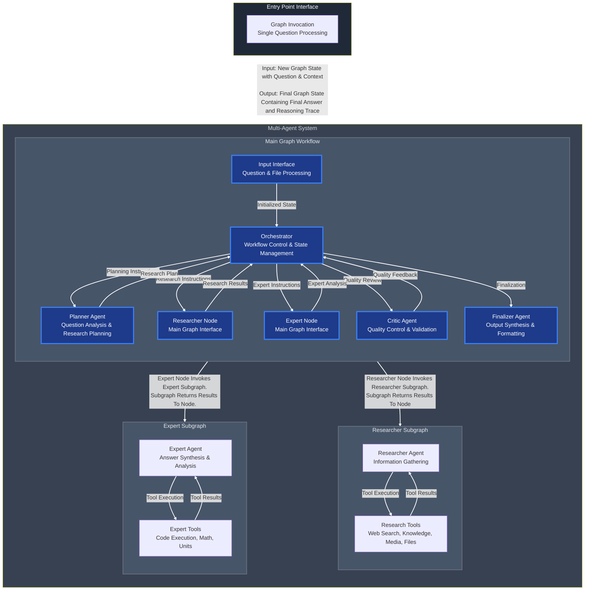

**Related Sections**: Sections 3, 4, 5, 6, 7, 8 (referenced by components, technology, state management, configuration, error handling, and decisions sections)

**Section Summary**: This section covers the fundamental architecture principles and patterns that form the foundation of the multi-agent system, providing the conceptual framework for understanding all subsequent sections.

**Key Takeaways**:
- 6 core design patterns (Multi-Agent System, Factory, Orchestrator, ReAct, Subgraph Patterns, Message Passing) work together to create a robust architecture
- Key architectural decisions balance simplicity, maintainability, and functionality with clear rationale for each choice
- Quality attributes (reliability, maintainability, extensibility, testability, performance) are achieved through specific architectural mechanisms
- Graph-based architecture with subgraph patterns enables complex workflow orchestration and tool integration
- **Node vs Agent Architecture**: Clear distinction between main graph nodes (orchestration/management) and subgraph agents (task execution)

---

## 3. Core Components & Workflow

**Prerequisites**: Sections 1, 2 (Introduction & Architecture Principles)  
**Dependencies**: Referenced by Sections 4, 5, 6, 7, 8

### 3.1 Component Architecture Overview

The multi-agent system consists of specialized components that work together to answer complex questions through coordinated reasoning and research.

**High-Level Component Relationships:**
The system follows a hierarchical architecture with clear component boundaries:
- **Orchestrator**: Central controller that manages all other components
- **Agent Components**: Specialized agents for planning, research, expert reasoning, and quality control
- **Subgraph Components**: Complex agents use subgraphs for tool interaction and state management
- **Interface Components**: Input interface for question processing and finalizer for answer synthesis

**Component Architecture Clarification:**
- **Main Graph Components**: Orchestrator, Planner Agent, Researcher Node, Expert Node, Critic Agent, Finalizer Agent
- **Subgraph Components**: Researcher Agent (within Researcher Node), Expert Agent (within Expert Node)
- **Direct Components**: Planner Agent, Critic Agent, Finalizer Agent (operate directly in main graph)
- **Subgraph Components**: Researcher Agent, Expert Agent (operate within their respective subgraphs)

**Component Interaction Patterns:**
- **Centralized Control**: Orchestrator manages all component interactions and workflow execution
- **Message-Based Communication**: Components communicate through structured AgentMessage objects
- **State-Driven Execution**: Component activation based on workflow state and orchestrator decisions
- **Quality Control Integration**: Critic agent reviews outputs from planning, research, and expert components

**Component Responsibilities and Boundaries:**
- **Input Interface**: Entry point for question processing and state initialization
- **Orchestrator**: Workflow control, message routing, and state management
- **Planner Agent**: Question analysis and execution planning
- **Researcher Node**: Manages research workflow and subgraph state (invokes Researcher Agent in subgraph)
- **Researcher Agent**: Information gathering with external tools (operates within Researcher Node's subgraph)
- **Expert Node**: Manages expert workflow and subgraph state (invokes Expert Agent in subgraph)
- **Expert Agent**: Reasoning and calculation with specialized tools (operates within Expert Node's subgraph)
- **Critic Agent**: Quality control and feedback for each agent type
- **Finalizer Agent**: Answer synthesis and reasoning trace compilation

**Overall System Architecture from Component Perspective:**
The system architecture emphasizes modularity, clear interfaces, and centralized control:
- **Modular Design**: Each component has well-defined responsibilities and interfaces
- **Clear Interfaces**: Standardized message protocols and component contracts
- **Centralized Control**: Orchestrator manages workflow and component coordination
- **Quality Integration**: Critic agent provides feedback at each workflow step
- **Tool Integration**: External tools are integrated through specialized subgraphs

**Required Diagrams**: None (covered by Graph-Based Architecture Diagram in 2.4)

### 3.2 Component Summary Table

| Component | Purpose | Key Responsibilities | Tools Used |
|-----------|---------|---------------------|------------|
| **Input Interface** | Entry point, initializes state | Extracts question, sets up workflow, initializes GraphState | None |
| **Orchestrator** | Central controller | Manages workflow, routes messages, handles retries, coordinates critic feedback | None |
| **Planner Agent** | Plans execution steps | Decomposes question, creates research and expert steps, analyzes requirements | None (pure LLM reasoning) |
| **Researcher Agent** | Gathers information | Executes research steps, uses external tools, synthesizes research results | Web search, Wikipedia, YouTube, file readers, MCP tools |
| **Expert Agent** | Synthesizes final answer | Follows expert steps, performs calculations, generates reasoning | Calculator, unit converter, Python REPL |
| **Critic Agent** | Quality control | Reviews outputs, provides feedback, makes approve/reject decisions | None (pure LLM evaluation) |
| **Finalizer Agent** | Produces final answer and reasoning trace | Synthesizes information, formats output, compiles reasoning trace | None (pure LLM synthesis) |

**Component Interfaces and Interaction Patterns:**
- **Orchestrator Interface**: Central message routing and workflow control
- **Agent Interfaces**: Standardized message protocols for instruction and response
- **Subgraph Interfaces**: Tool integration and state management for complex agents
- **Critic Interface**: Quality assessment and feedback generation

**Component Relationships and Dependencies:**
- **Orchestrator Dependencies**: All agents depend on orchestrator for workflow control
- **Agent Dependencies**: Agents depend on orchestrator for message routing and state management
- **Subgraph Dependencies**: Researcher and Expert agents depend on subgraphs for tool interaction
- **Tool Dependencies**: Researcher and Expert agents depend on external tools for capabilities

**Required Diagrams**: None (text-based table)

### 3.3 Individual Agent Components

Each agent in the multi-agent system has specialized capabilities and responsibilities designed to handle specific aspects of question answering.

**Planner Agent:**
- **Purpose**: Analyzes questions and creates execution plans
- **Responsibilities**: 
  - Question analysis and strategy creation
  - Research step generation and expert step planning
  - File integration in planning process
  - Output validation and error handling
  - Planning strategy selection and optimization
- **Tools**: None (pure LLM-based reasoning)
- **Output**: Structured plan with research_steps and expert_steps
- **Logic**: Analyzes input question, decomposes into atomic logical steps, determines if research is needed, creates logical execution sequence
- **Planning Decisions**: May create research steps (optional) or determine no research is needed. Must always create expert steps (mandatory) for the expert agent to follow.

**Researcher Agent:**
- **Purpose**: Information gathering and research using external tools
- **Responsibilities**:
  - Multi-step research execution with tool interaction
  - Web search, Wikipedia, YouTube, and file processing
  - Sequential research step execution with critic validation
  - State management for research progress and results
- **Tools**: Web search (Tavily), Wikipedia, YouTube API, file readers (PDF, Excel, PowerPoint), MCP tools
- **Subgraph Pattern**: Uses LangGraph subgraph for tool interaction (ReAct agent)
- **Function**: Receives logical instructions, has required context provided, functions as ReAct agent with multi-step reasoning

**Expert Agent:**
- **Purpose**: Specialized reasoning and calculations using research results
- **Responsibilities**:
  - Complex reasoning and calculation tasks
  - Mathematical computations and logical analysis
  - Answer synthesis from research results
  - Multi-step reasoning with tool interaction
- **Tools**: Calculator, unit converter, Python REPL, MCP browser tools
- **Subgraph Pattern**: Uses LangGraph subgraph for tool interaction (ReAct agent)
- **Function**: Receives research results and logical instructions, functions as ReAct agent with sophisticated reasoning and calculation capabilities

**Critic Agent:**
- **Purpose**: Quality control and feedback for all agent outputs
- **Main Responsibility**: Assess the work of a specific agent and determine to approve the work or reject it with feedback to improve the quality of the work
- **Responsibilities**:
  - Quality control and feedback for all agent outputs
  - Single critic agent with dynamic behavior based on workflow step
  - Three separate prompts (critic_planner, critic_researcher, critic_expert) injected at creation
  - Decision making (approve/reject) and feedback generation for each agent type
  - Quality improvement through iterative feedback
- **Tools**: None (pure LLM-based evaluation)
- **Function**: Acts as feedback/reflection mechanism to catch errors or issues as they happen, no conversation history retention

**Finalizer Agent:**
- **Purpose**: Produces final answer and reasoning trace
- **Responsibilities**:
  - Answer synthesis and formatting from all agent outputs
  - Reasoning trace compilation and final answer generation
  - Agent-specific failure handling with detailed failure attribution
  - Error state handling and failure message formatting
  - Output validation and quality assurance
- **Tools**: None (pure LLM-based synthesis)
- **Function**: Triggered when final answer has been formulated, either generates answer or returns failure message, creates reasoning trace

**Required Diagrams**: None (covered by Graph-Based Architecture Diagram in 2.4)

### 3.4 Orchestrator and Workflow

The orchestrator is the central controller that manages the entire workflow execution, state transitions, and agent coordination.

**Central Workflow Controller and State Machine Logic:**
The orchestrator implements a state machine that manages workflow execution:
- **State-Driven Control**: Uses current step and next step state variables to control workflow progression
- **Conditional Logic**: Employs conditional logic to determine the next workflow step based on current state and agent outputs
- **Agent Coordination**: Routes messages to appropriate agents based on workflow state
- **Retry Management**: Manages agent-specific retry counters and enforces retry limits
- **Quality Control**: Coordinates critic feedback integration at each workflow step

**Step Determination and Routing Logic:**
The orchestrator uses conditional logic to determine workflow progression:
- **State-Based Routing**: Evaluates current workflow state and agent outputs to determine next step
- **Conditional Logic**: Uses conditional logic to determine the next workflow step based on critic decisions and retry status
- **Retry Management**: Increments agent-specific retry counters when critic rejects agent outputs and enforces retry limits
- **State Transition**: Updates current step state variable and routes appropriate messages to the next agent
- **Completion Detection**: Identifies when workflow should proceed to finalization

**Workflow State Machine with Complete Steps and Transitions:**
The workflow consists of 8 distinct steps with specific transitions:
1. **input**: Start of the graph (default value, never set again)
2. **planner**: Invoke the planning agent
3. **critic_planner**: Invoke the critic agent with planner evaluation prompt
4. **researcher**: Invoke the Researcher Node (which invokes Researcher Agent in subgraph)
5. **critic_researcher**: Invoke the critic agent with researcher evaluation prompt
6. **expert**: Invoke the Expert Node (which invokes Expert Agent in subgraph)
7. **critic_expert**: Invoke the critic agent with expert evaluation prompt
8. **finalizer**: Invoke the finalizer agent to generate the final answer and reasoning trace
9. **END**: Workflow termination node (finalizer agent routes to END node after completing its work)

**Research Step Execution Pattern:**
The research phase follows a specific sequential execution pattern:
- **Sequential Research Execution**: Research steps are executed one at a time, not in parallel, to respect API rate limits
- **Step-by-Step Evaluation**: Each research step receives individual critic evaluation
- **State Isolation**: Each research step uses unique step_id (0, 1, 2, etc.) for state isolation
- **Message Routing**: Messages are filtered by step_id to route to correct research step
- **Retry Logic**: Failed research steps are retried with critic feedback until approved or retry limit reached
- **Progression Logic**: Only after critic approves current research step does the system proceed to next research step
- **Completion Detection**: When all research steps are approved, system proceeds to expert phase

**Quality Control Integration at Each Workflow Step:**
Critic agent is integrated at three key points in the workflow with different prompts:
- **Planner Quality Control**: Critic agent reviews planning strategy and execution steps using planner evaluation prompt
- **Researcher Quality Control**: Critic agent evaluates research results and information quality using researcher evaluation prompt. This is done for each research step individually, if any.
- **Expert Quality Control**: Critic agent assesses expert reasoning and answer quality using expert evaluation prompt

**Detailed Workflow Execution Patterns:**
The orchestrator implements specific execution patterns:
- **Sequential Execution**: Steps are executed in a predetermined sequence
- **Conditional Routing**: Critic decisions determine whether to proceed or retry
- **Critic Rejection Retry Logic**: Failed steps are retried up to configurable limits when critic rejects agent work
- **Graceful Critic Rejection Failure**: When critic rejection retry limits are exceeded, orchestrator sets finalizer as next step and instructs finalizer to return specific final answer with failing agent attribution in reasoning trace
- **Sequential Research Execution**: Research steps are executed one at a time, not in parallel, to respect API rate limits
- **Step-by-Step Research Process**: For each research step: Researcher Agent (ReAct agent) executes → Critic Agent evaluates → If approved, move to next step; if rejected, retry current step
- **Research Step Isolation**: Each research step uses unique step_id (0, 1, 2, etc.) for state isolation and message routing
- **Individual Critic Evaluation**: Each research step receives individual critic evaluation before proceeding to the next step
- **Workflow Termination**: Finalizer agent routes to END node after completing its work

**Critic Integration Patterns and Quality Control Details:**
- **Dynamic Prompt Selection**: Critic agent behavior changes based on current workflow step using different prompts
- **Quality Assessment**: Specialized criteria for each agent type through different prompts
- **Decision Processing**: Approve/reject decisions drive workflow progression
- **Feedback Integration**: Critic feedback is incorporated into retry attempts

**Workflow Monitoring and Debugging Capabilities:**
- **State Tracking**: Complete visibility into workflow state and transitions
- **Message Logging**: All inter-agent messages are logged for traceability
- **Error Reporting**: Detailed error information for failed steps

**Required Diagrams**: 
- **Diagram 3.1: Main Workflow Sequence Diagram** - Complete end-to-end workflow execution
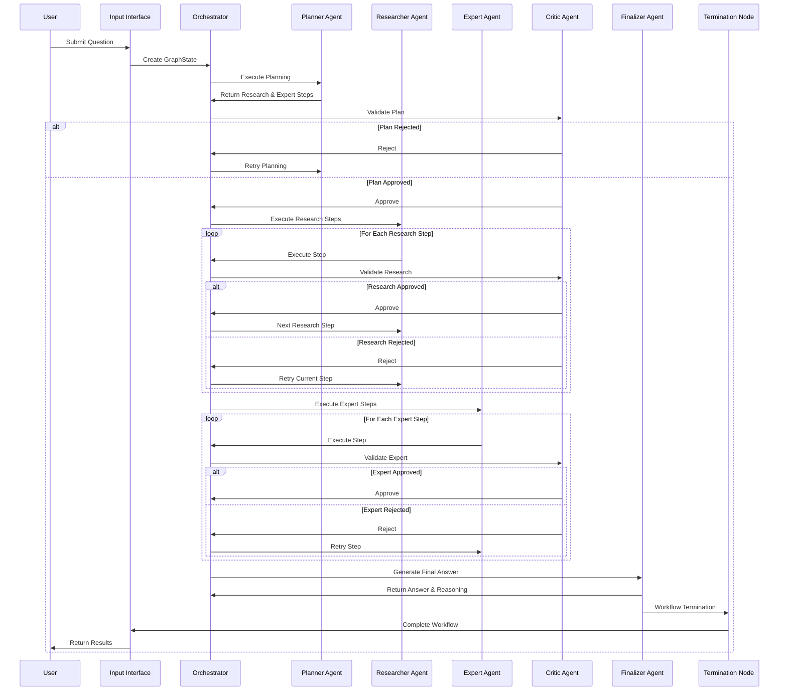

**Diagram 3.2: Workflow Process Diagram**
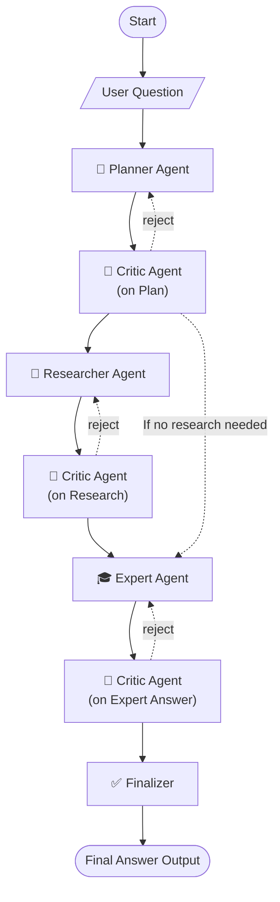

- **Diagram 3.3: State Transition Diagram** - Workflow state machine with all state transitions
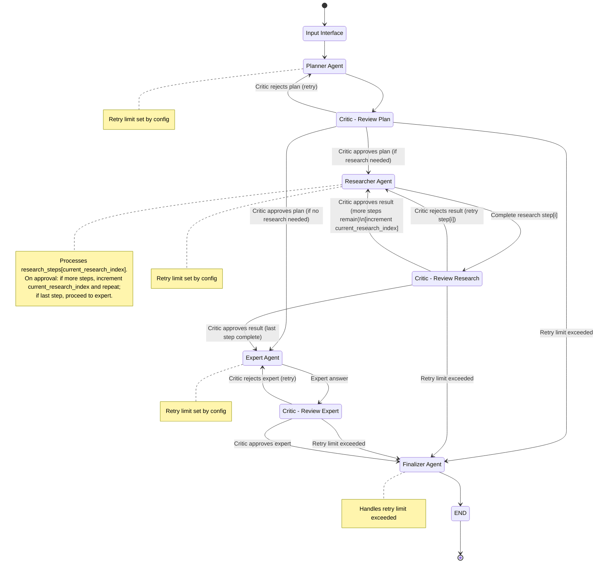


### 3.5 Component Interaction Patterns

The multi-agent system uses structured interaction patterns to coordinate agent activities and ensure reliable communication.

**Agent-to-Agent Communication Patterns:**
All agent communication flows through the orchestrator using standardized patterns:
- **Centralized Routing**: Orchestrator routes all messages between agents
- **Structured Messages**: Communication uses AgentMessage objects with defined structure
- **Message Filtering**: Agents receive only relevant messages based on sender, receiver, and step_id
- **Context Isolation**: Each agent has isolated conversation context from other agents
- **Planner Conversation History**: Incorporates all messages to and from orchestrator in conversation history
- **Researcher Conversation History**: Maintains conversation history through subgraph state management by research step ID
- **Expert Conversation History**: Maintains conversation history through subgraph state management
- **Critic Conversation History**: Does not maintain conversation history
- **Finalizer Conversation History**: Invoked once and does not maintain conversation history

**Agent Coordination and Synchronization:**
The orchestrator manages agent coordination through state-driven workflow control:
- **State-Driven Activation**: Agents are activated based on current workflow state and conditional logic
- **Conditional Workflow Control**: Orchestrator uses current_step and next_step state variables to determine next execution step
- **First-Time Agent Invocation**: Orchestrator sends instructions to planner, researcher, and expert agents for initial task execution (create plan, research topic, answer question)
- **Critic Rejection Handling**: Orchestrator sends feedback messages to agents when critic rejects their work, enabling agents to improve quality
- **Research Message Partitioning**: Messages to research agent are partitioned by current research step ID
- **Retry Management**: Orchestrator manages agent-specific retry counters and enforces retry limits
- **Finalizer Routing**: Orchestrator routes to finalizer agent when critic approves expert's work or when any agent's retry limit is exceeded

**Agent State Sharing and Isolation:**
The system implements specific state management patterns:
- **Centralized State**: GraphState contains all workflow state and agent data
- **Agent Isolation**: Subgraph agents (Researcher, Expert) have isolated conversations within their respective subgraph states, with main graph nodes managing the interface; direct agents (Planner, Critic, Finalizer) communicate directly with orchestrator
- **Direct Agent State Access**: Direct agents (Planner, Critic, Finalizer) share access to main graph state variables where appropriate
- **Subgraph Agent State Access**: Subgraph agents (Researcher Agent, Expert Agent) only access their respective subgraph states
- **Direct State Updates**: Planner, Critic, and Finalizer agents directly access and update the main graph state with their results
- **Orchestrator State Management**: Orchestrator updates the main graph state for workflow management (current_step, next_step, retry_count, current_research_step_id, etc.)
- **Main Graph Node State Management**: Main graph nodes (Researcher Node, Expert Node) handle dynamic creation, management, and updating of their respective subgraph states
- **Subgraph State Access**: Subgraph states are accessible by both their respective subgraphs and the main graph nodes that manage them
- **State Extraction and Integration**: Main graph nodes extract information from subgraph states and update main graph state variables
- **Context Preservation**: Each agent maintains conversation history according to their specific patterns
- **Planner Context**: Incorporates all messages to and from orchestrator in conversation history
- **Researcher Context**: Maintains conversation history through subgraph state management by research step ID
- **Expert Context**: Maintains conversation history through subgraph state management
- **Critic Context**: Does not maintain conversation history
- **Finalizer Context**: Invoked once and does not maintain conversation history

**Research Agent Workflow Management:**
The research agent workflow involves coordination between orchestrator and researcher node:
- **Orchestrator Research Responsibilities**:
  - Tracks, updates, and manages the current research step ID in the main graph state
  - Sends instructions to research agent for initial task execution (research topic)
  - Sends feedback messages to research agent when critic rejects work, enabling improvement
  - Partitions messages to research agent by current research step ID
  - Manages research step progression based on critic decisions
- **Researcher Node Responsibilities**:
  - Dynamic creation, management, updating, and access of research subgraph states by research step ID
  - Acts as interface between main graph and specific subgraph state
  - Manages orchestrator and research agent communication based on step ID
  - Fetches only the last message from orchestrator (based on current research step ID) and adds it to conversation
  - Maintains isolated conversation history within researcher subgraph state for the current research step ID
  - Sends standardized responses to orchestrator without incorporating agent results
  - Extracts information and updates main graph state
  - Invokes researcher agent via researcher subgraph
- **Research Step Coordination**: Orchestrator manages step progression while researcher node manages state and subgraph execution

**Expert Agent Workflow Management:**
The expert agent workflow involves coordination between orchestrator and expert node:
- **Orchestrator Expert Responsibilities**:
  - Sends instructions to expert agent for initial task execution (answer question)
  - Sends feedback messages to expert agent when critic rejects work, enabling improvement
  - Handles agent communication with the expert agent
- **Expert Node Responsibilities**:
  - Owns creation, management, updating, and access of expert subgraph state
  - Acts as interface between main graph and expert subgraph state
  - Manages orchestrator and expert agent communication
  - Handles all aspects of updating the main graph and subgraph states
  - Fetches only the last message from orchestrator and adds it to conversation
  - Maintains isolated conversation history within expert subgraph state
  - Sends standardized responses to orchestrator without incorporating agent results
  - Extracts information and updates main graph state
  - Invokes expert agent via expert subgraph
- **Expert Coordination**: Orchestrator handles agent communication with expert agent based on first-time invocation or critic rejection retry

**Agent Lifecycle Management:**
The orchestrator manages agent lifecycle through state-driven workflow control:
- **State-Driven Activation**: Agents are activated based on current workflow state and orchestrator conditional logic
- **Workflow State Transitions**: Orchestrator updates current_step state variable and routes to next agent based on conditional logic
- **Research Step Progression**: Orchestrator manages research step progression based on critic decisions
- **Retry Coordination**: Orchestrator manages agent-specific retry counters and enforces retry limits
- **Finalizer Routing**: Orchestrator routes to finalizer agent when critic approves expert's work or when any agent's retry limit is exceeded

**Message Protocol and Structure:**
All agents communicate with the orchestrator using the AgentMessage protocol:
- **AgentMessage Protocol**: Standard protocol for all agent-orchestrator communication
  - **Sender**: Source agent identifier
  - **Receiver**: Target agent identifier (usually "orchestrator")
  - **Type**: Message type (instruction, feedback, response)
  - **Content**: Message content and data
  - **Step ID**: Optional research step identifier for context
- **Direct Agent Communication**: Planner, critic, and finalizer agents communicate directly with orchestrator
- **Subgraph Agent Communication**: Researcher and expert agents communicate with orchestrator through their respective main graph nodes
- **Main Graph Node Synchronization**: Researcher and expert main graph nodes synchronize conversation between main graph's AgentMessage protocol and their respective subgraph states
- **AgentMessage Protocol**: Used for all agent-to-agent communication in the main graph workflow
- **BaseMessage Protocol**: Used for LLM conversations within agents and subgraphs (LangChain's standard)
- **Conversion Responsibility**: Direct agents (Planner, Critic, Finalizer) manage their own AgentMessage → BaseMessage conversion when invoked. The Researcher Node and Expert Node on the main graph manage conversion for their respective subgraph agents

**Orchestrator Message Patterns:**
The orchestrator follows specific message patterns when communicating with agents:
- **First-Time Agent Invocation**: 
  - Sends instructions to planner agent for initial task execution (create plan)
  - Sends instructions to research agent for initial task execution (research topic)
  - Sends instructions to expert agent for initial task execution (answer question)
- **Critic Rejection Handling**:
  - Sends feedback messages to planner agent when critic rejects work, enabling improvement
  - Sends feedback messages to research agent when critic rejects work, enabling improvement
  - Sends feedback messages to expert agent when critic rejects work, enabling improvement
- **Research Message Partitioning**: Messages to research agent are partitioned by current research step ID
- **Message Content**: Instructions contain task-specific guidance, feedback messages contain critic's improvement suggestions
- **Finalizer Routing**: Finalizer agent routes to END node after completing its work, orchestrator routes to finalizer when critic approves expert's work or when any agent's retry limit is exceeded

**Cross-Graph Communication:**
Complex agents use subgraphs with specific communication patterns:
- **Main Graph to Subgraph**: Messages are converted between AgentMessage and BaseMessage formats
- **Subgraph to Main Graph**: Results are extracted and integrated into main workflow state
- **Main Graph Node Management**: Main graph nodes handle dynamic state creation and management for their respective subgraphs
- **Researcher Node Interface**: Acts as interface between main graph and research subgraph state
- **Expert Node Interface**: Acts as interface between main graph and expert subgraph state
- **Research Step Coordination**: Orchestrator manages research step progression while researcher node handles subgraph execution
- **Expert Coordination**: Orchestrator sends instructions to expert agent for initial task execution and feedback messages when critic rejects work
- **State Synchronization**: Main graph nodes manage state synchronization when invoking their respective subgraphs
- **State Extraction and Integration**: Main graph nodes extract information from subgraph states and update main graph state variables
- **Message Conversion**: Messages sent to an agent using AgentMessage protocol must be converted to the BaseMessage protocol to enable the conversation with the agent's LLM.
- **Last Message Only**: Researcher and Expert nodes fetch only the last message from orchestrator for each invocation
- **Conversation Isolation**: Messages sent to orchestrator are never incorporated into agent conversations
- **Result Isolation**: Agent results are never incorporated into orchestrator conversations

**Required Diagrams**: 


**Related Sections**: Sections 4, 5, 6, 7, 8 (referenced by technology stack, state management, configuration, error handling, and decisions sections)

**Section Summary**: This section covers the core components and workflow of the multi-agent system, describing the specialized agents, orchestrator, workflow patterns, and component interaction mechanisms that enable coordinated question answering.

**Key Takeaways**:
- Specialized agent components (Planner, Researcher, Expert, Critic, Finalizer) work together through centralized orchestrator control
- Graph-based workflow with 8 distinct steps enables conditional routing and state-driven execution
- Subgraph patterns for complex agents (Researcher, Expert) provide tool interaction and state management capabilities
- Structured message protocols and centralized routing ensure reliable communication between components
- Quality control integration through critic agent at each workflow step improves answer quality and reliability

---

## 4. Technology Stack & Integration

**Prerequisites**: Sections 1, 2, 3 (Introduction, Architecture Principles, Core Components)  
**Dependencies**: Referenced by Sections 5, 6, 7, 8

### 4.1 Core Framework

The multi-agent system is built on a foundation of modern Python frameworks and libraries that provide robust workflow orchestration, LLM integration, and data validation capabilities.

**LangGraph: Graph-Based Workflow Orchestration and State Management**
- **Purpose**: Primary framework for graph-based workflow orchestration
- **Key Features**: 
  - Directed graph construction with nodes and edges
  - State management and workflow execution
  - Conditional routing and state-driven execution
  - Subgraph support for complex agent logic
- **Usage**: Main graph orchestration, subgraph management, state transitions
- **Benefits**: Enables complex workflow patterns, state management, and conditional execution

**LangChain: LLM Integration and Tool Framework**
- **Purpose**: Framework for LLM integration and tool management
- **Key Features**:
  - LLM model integration and configuration
  - Tool framework for external service integration
  - Structured output validation and processing
  - Agent and chain construction patterns
- **Usage**: LLM integration, tool binding, agent construction, structured output handling
- **Benefits**: Standardized LLM integration, tool safety, and agent development patterns

**Pydantic: Data Validation and Type Safety**
- **Purpose**: Data validation and type safety for all system components
- **Key Features**:
  - Runtime type checking and validation
  - Data serialization and deserialization
  - Schema definition and validation
  - Error handling for invalid data
- **Usage**: State validation, message validation, configuration validation
- **Benefits**: Ensures data integrity, catches errors early, improves system reliability

**Structlog: Structured Logging and Observability**
- **Purpose**: Structured logging framework for comprehensive observability and traceability
- **Key Features**:
  - Structured JSON logging with correlation ID support
  - Configurable log levels and output formats
  - Context-aware logging with automatic field injection
  - Performance monitoring and metrics collection
  - Security-conscious design with sensitive data filtering
- **Usage**: Entry point logging, multi-agent system logging, correlation-based tracing
- **Benefits**: Enables complete traceability, rapid debugging, and operational monitoring

**Python 3.10+: Runtime Environment and Language Features**
- **Purpose**: Runtime environment and language features
- **Key Features**:
  - Modern Python language features and syntax
  - Type hints and static analysis support
  - Async/await support for concurrent operations
  - Rich standard library and ecosystem
- **Usage**: System implementation, tool execution, external API integration
- **Benefits**: Modern language features, extensive ecosystem, developer productivity


### 4.2 LLM Integration

The system integrates with OpenAI's large language models to provide reasoning, generation, and evaluation capabilities across all agents.

**LLM Models and Configuration:**
- **GPT-4o**: Primary LLM for complex reasoning and planning tasks
  - Used by: Planner Agent, Critic Agent, Finalizer Agent
  - Capabilities: Complex reasoning, planning, quality assessment, answer synthesis
  - Configuration: Optimized for reasoning and evaluation tasks
- **GPT-4o-mini**: Secondary LLM for research and expert tasks
  - Used by: Researcher Agent, Expert Agent
  - Capabilities: Information processing, tool interaction, calculation reasoning
  - Configuration: Optimized for tool use and iterative reasoning

**Model Selection and Parameter Settings:**
- **Dynamic Model Selection**: Models are selected based on agent requirements and task complexity
- **Parameter Optimization**: Temperature, max tokens, and other parameters are tuned for each agent type
- **Cost Optimization**: GPT-4o-mini used for tool-heavy tasks to reduce costs
- **Performance Tuning**: Parameters optimized for specific agent capabilities and requirements

**Structured Output Validation and Error Handling:**
- **JSON Schema Validation**: All LLM outputs are validated against predefined schemas
- **Type Safety**: Pydantic models ensure type safety for all structured outputs
- **Error Recovery**: Invalid outputs trigger retry logic with error feedback
- **Fallback Mechanisms**: System gracefully handles LLM failures and invalid responses

**Rate Limiting and API Management:**
- **Rate Limit Handling**: Automatic rate limit detection and immediate failure when limits exceeded
- **API Key Management**: Secure management of OpenAI API keys through environment variables
- **Request Optimization**: Efficient API usage with appropriate request batching
- **Error Handling**: Comprehensive error handling for API failures and network issues


### 4.3 External Tools and Integration

The system integrates a comprehensive set of external tools and services to provide research, calculation, and information processing capabilities with the ReAct agents.

**Research Tools:**
- **Web Search**: Tavily search API for comprehensive web search capabilities
  - Purpose: Find current information, facts, and data from the web
  - Integration: REST API with rate limiting and error handling
  - Usage: Researcher Agent for information gathering
- **Knowledge Base Access**: Wikipedia API for factual information
  - Purpose: Access structured knowledge and factual data
  - Integration: REST API with content extraction and processing
  - Usage: Researcher Agent for factual information gathering
- **Media Transcript Extraction**: YouTube API for video content analysis
  - Purpose: Extract and analyze video transcripts and content
  - Integration: REST API with transcript processing and analysis
  - Usage: Researcher Agent for multimedia content analysis
- **Document Processing**: Support for PDF, Excel, PowerPoint formats
  - Purpose: Extract and process content from various document formats
  - Integration: Specialized libraries for each file format with OCR capabilities
  - Usage: Researcher Agent for document content analysis and information extraction
- **Browser Automation**: MCP tools for web interaction and automation
  - Purpose: Automate web browsing and interaction tasks
  - Integration: Model Context Protocol for browser control
  - Usage: Researcher Agent for dynamic web content and interaction

**Expert Tools:**
- **Mathematical Computation**: Calculator and mathematical functions
  - Purpose: Perform mathematical calculations and operations
  - Integration: Python mathematical libraries and functions
  - Usage: Expert Agent for calculation and mathematical reasoning
- **Unit Conversion**: Unit converter for measurement conversions
  - Purpose: Convert between different units and measurement systems
  - Integration: Python unit conversion libraries
  - Usage: Expert Agent for unit conversions and calculations
- **Code Execution**: Python REPL for complex calculations and data processing
  - Purpose: Execute Python code for complex calculations and data analysis
  - Integration: Secure Python execution environment
  - Usage: Expert Agent for complex mathematical and data processing tasks


### 4.4 Tool Integration Patterns

The system implements specific patterns for tool integration that ensure safety, reliability, and efficient operation.

**Tool Categorization and Selection Principles:**
Tools are categorized based on their purpose and usage patterns:
- **Research Tools**: Information gathering and content processing tools
  - External APIs (web search, Wikipedia, YouTube)
  - Document processing (PDF, Excel, PowerPoint readers)
  - Browser automation (MCP browser tools)
- **Expert Tools**: Calculation and reasoning tools (calculator, unit converter, Python REPL)

**Tool Execution Patterns and Safety Mechanisms:**
- **Safe Execution Environment**: Tools execute in isolated environments with restricted access
- **Input Validation**: All tool inputs are validated before execution
- **Output Sanitization**: Tool outputs are sanitized and validated before use
- **Error Handling**: Comprehensive error handling for tool failures and exceptions
- **Rate Limiting**: Automatic rate limiting for external API tools

**Tool Error Handling and Fallback Mechanisms:**
- **Fail-Fast Termination**: System terminates immediately when individual tools fail
- **Alternative Tools**: Fallback to alternative tools when primary tools are unavailable
- **Error Reporting**: Detailed error reporting for tool failures and debugging
- **Resource Cleanup**: Proper cleanup of tool resources and connections

**Tool Result Processing and Validation:**
- **Result Validation**: All tool results are validated against expected formats
- **Content Processing**: Results are processed and formatted for agent consumption
- **Quality Assessment**: Tool results are assessed for relevance and quality
- **Integration**: Results are integrated into agent workflow and state management
- **Caching**: Appropriate caching of tool results to improve performance

**Comprehensive Tool Integration Architecture Overview:**
The tool integration architecture provides:
- **Unified Interface**: Standardized interface for all tool types
- **Dynamic Binding**: Tools are dynamically bound to agents based on requirements
  - Research tools bound to Researcher Agent for information gathering
  - Expert tools bound to Expert Agent for reasoning and calculations
- **Configuration Management**: Tool configuration is managed through environment variables
- **Monitoring**: Tool usage and performance are monitored and logged
- **Extensibility**: New tools can be easily added through the tool framework

**Tool Categorization and Selection Principles:**
- **Purpose-Based Selection**: Tools are selected based on specific task requirements
  - Research tools for information gathering and content processing
  - Expert tools for reasoning and calculations
- **Capability Matching**: Tool capabilities are matched to agent requirements
  - Researcher Agent uses research tools for comprehensive information gathering
  - Expert Agent uses expert tools for mathematical and logical reasoning
- **Performance Optimization**: Tools are selected for optimal performance and cost
- **Reliability Considerations**: Tool reliability and availability are considered in selection

**Tool Execution Patterns and Safety Mechanisms:**
- **Sandboxed Execution**: Tools execute in sandboxed environments
- **Resource Limits**: Execution time and resource usage are limited
- **Security Validation**: Tool execution is validated for security concerns
- **Audit Logging**: All tool executions are logged for audit and debugging

**Required Diagrams**: None (covered by Tool Integration & External Dependencies Diagram in 4.3)

**Related Sections**: Sections 5, 6, 7, 8 (referenced by state management, configuration, error handling, and decisions sections)

**Section Summary**: This section covers the technology stack and external dependencies of the multi-agent system, describing the technologies and tools that enable the system's capabilities.

**Key Takeaways**:
- Core frameworks (LangGraph, LangChain, Pydantic) provide robust workflow orchestration, LLM integration, and data validation
- LLM integration with GPT-4o and GPT-4o-mini enables reasoning, generation, and evaluation capabilities
- External tools and their integration patterns support research, calculation, and information processing
- Tool execution environment and safety mechanisms ensure reliable and secure operation

---

## 5. State Management & Communication

**Prerequisites**: Sections 1, 2, 3, 4 (Introduction, Architecture Principles, Core Components, Technology Stack)  
**Dependencies**: Referenced by Sections 6, 7, 8

### 5.1 State Architecture Overview

The multi-agent system uses a centralized state management architecture that coordinates state across all components while maintaining clear boundaries and relationships.

**High-Level State Management Strategy:**
The system implements a hierarchical state management approach:
- **Centralized GraphState**: Main state container that holds all workflow state and data
- **Subgraph States**: Specialized states for complex agents (Researcher Agent, Expert Agent) with their own state management
- **Main Graph Node State Management**: Main graph nodes (Researcher Node, Expert Node) handle dynamic creation, management, and updating of their respective subgraph states
- **State Coordination**: Main graph nodes manage state synchronization between main graph and their respective subgraph agents

**State Hierarchy and Relationship Principles:**
The state architecture follows specific hierarchy and relationship principles:
- **Main GraphState**: Centralized state containing all workflow data and agent information
- **Subgraph States**: Specialized states for complex agents (Researcher Agent, Expert Agent) with their own state management
- **Main Graph Node States**: State management handled by main graph nodes (Researcher Node, Expert Node) for their respective subgraphs

**Researcher and Expert Nodes vs Agents:**

The architecture distinguishes between **main graph nodes** and **subgraph agents**:

**Main Graph Nodes (Researcher Node, Expert Node):**
- **Researcher Node**: Main graph node responsible for managing research workflow and subgraph state
- **Expert Node**: Main graph node responsible for managing expert workflow and subgraph state
- **Node Responsibilities**: These nodes handle dynamic creation, management, and updating of their respective subgraph states
- **Interface Role**: Act as interfaces between main graph and their respective subgraph agents
- **State Management**: Own and manage subgraph states within the main GraphState

**Subgraph Agents (Researcher Agent, Expert Agent):**
- **Researcher Agent**: ReAct agent within researcher subgraph that performs actual research tasks
- **Expert Agent**: ReAct agent within expert subgraph that performs reasoning and calculations
- **Agent Responsibilities**: Execute specific tasks using tools and ReAct patterns
- **Subgraph Context**: Operate within their respective subgraphs with isolated state management

**State Management Architecture:**
- **State Containment**: Subgraph states are contained within the main GraphState
- **Subgraph State Access**: Subgraph states are accessible by both their respective subgraphs and the main graph nodes that manage them
- **Main Graph State Access**: Direct agents (Planner, Critic, Finalizer) share access to main graph state variables where appropriate. Subgraph agents (Researcher Agent, Expert Agent) only access their respective subgraph states.
- **Direct State Updates**: Planner, Critic, and Finalizer agents directly access and update the main graph state with their results
- **Orchestrator State Management**: Orchestrator manages workflow state variables (current_step, next_step, retry_count, etc.)
- **Main Graph Node State Management**: Main graph nodes (Researcher Node, Expert Node) handle dynamic creation, management, and updating of their respective subgraph states, and update main graph state with information from their subgraphs
- **Dynamic Research States**: Main graph Researcher Node creates Research State instances dynamically based on orchestrator's current research step ID
- **Conditional Research Creation**: If no research steps exist, no Researcher subgraph states are created
- **Mandatory Expert State**: Expert subgraph state is always created and owned by the Expert Node since Expert Agent must always formulate an answer
- **Planner Decision Logic**: Planner agent may determine research steps are needed (creates research_steps) or no research is needed (empty research_steps). Expert steps are always required and must be created by planner.
- **researcher_states**: Dictionary of research step states (Researcher Agent) - created only when research steps exist
- **expert_state**: Expert subgraph state (Expert Agent) - always created
- **Subgraph Dependencies**: subgraph states depend on main graph workflow state

**State Flow Patterns and Coordination Mechanisms:**
State flows through the system using specific patterns:
- **Initialization Flow**: Input Interface creates clean GraphState with default values
- **Main Graph Node State Management**: Main graph nodes (Researcher Node, Expert Node) handle dynamic creation, management, and updating of their respective subgraph states, and update main graph state with information from their subgraphs
- **Research State Creation**: Main graph Researcher Node creates Research State instances dynamically for each research step based on orchestrator's current research step ID
- **Expert State Creation**: Main graph Expert Node always creates and owns Expert subgraph state since Expert Agent is mandatory
- **Direct Agent Updates**: Planner, Critic, and Finalizer agents directly update main graph state with their results
- **Orchestrator Workflow Updates**: Orchestrator updates workflow state variables (current_step, next_step, retry_count, etc.)
- **State Extraction and Integration**: Main graph nodes extract information from subgraph states and update main graph state variables
- **State Maintenance**: Main graph nodes keep subgraph states updated throughout workflow execution
- **Cleanup Flow**: State is cleared between question processing for privacy

**Overall State Architecture and Design:**
The state architecture is designed for:
- **Reliability**: State integrity is maintained throughout workflow execution
- **Performance**: Efficient state access and update patterns
- **Maintainability**: Clear state structure and relationships
- **Extensibility**: Easy addition of new state fields and components
- **Privacy**: No persistent storage ensures user data privacy


### 5.2 State Hierarchy and Relationships

The system implements a hierarchical state structure with clear relationships between main graph state and subgraph states.

**Main GraphState as Central State Container:**
The GraphState serves as the central state container for the entire workflow:
- **Core Data Fields**: question, research_steps, expert_steps, research_results, expert_answer, expert_reasoning
- **Workflow Control Fields**: current_step, next_step, retry_count, retry_limit
- **Communication Fields**: agent_messages for inter-agent communication
- **Critic Decision Fields**: critic_planner_decision, critic_planner_feedback, critic_researcher_decision, critic_researcher_feedback, critic_expert_decision, critic_expert_feedback for quality control state management per agent
- **Subgraph State References**: researcher_states, expert_state for subgraph state management
- **Error Handling Fields**: error, error_component for error state management

**Subgraph States Contained Within Main GraphState:**
Complex agents use subgraph states for their internal state management:
- **Research State**: Individual state for each research step with conversation context and tool state
- **Expert subgraph state**: Single state for expert agent with conversation context and calculation state
- **State Containment**: Subgraph states are contained within the main GraphState
- **State Isolation**: Each subgraph manages its own internal state independently

**State Isolation vs. Sharing Patterns:**
The system implements specific patterns for state isolation and sharing:
- **Main Graph Isolation**: Main graph state is isolated from subgraph internal operations
- **Subgraph Isolation**: Each subgraph operates on its own isolated state
- **Main Graph Node State Management**: Main graph nodes (Researcher Node, Expert Node) manage their respective subgraph states and update main graph state with results
- **State Extraction and Integration**: Main graph nodes extract information from subgraph states and update main graph state variables
- **Research Step Isolation**: Each research step uses unique step_id for state isolation and message routing

**State Ownership and Access Patterns:**
Clear ownership and access patterns ensure state integrity:
- **Main Graph Ownership**: Main graph owns all state and controls access
- **Subgraph State Ownership**: The main graph and subgraphs (that manifest the Researcher and Expert agents) share ownership of the specific subgraph state and conversation context
- **Orchestrator Access**: Orchestrator has access to all state for coordination
- **Direct Agent Access**: Direct agents (Planner, Critic, Finalizer) access main graph state variables where appropriate
- **Subgraph Agent Access**: Subgraph agents (Researcher Agent, Expert Agent) only access their respective subgraph states
- **LangGraph Validation**: LangGraph provides automatic state validation and type checking

**Complete GraphState Structure Documentation:**
The GraphState contains the following fields:
- **question**: User's question string
- **research_steps**: List of planned research steps
- **expert_steps**: List of planned expert steps
- **research_results**: Results from research execution
- **expert_answer**: Expert's final answer
- **expert_reasoning**: Expert's reasoning process
- **current_step**: Current workflow step
- **next_step**: Next workflow step
- **retry_count**: Current retry count
- **retry_limit**: Maximum retry limit
- **current_research_step_id**: Current research step identifier for state isolation and message routing
- **agent_messages**: List of inter-agent messages
- **critic_planner_decision**: String containing critic decision for planner agent evaluation
- **critic_planner_feedback**: String containing critic feedback for planner agent improvements
- **critic_researcher_decision**: String containing critic decision for researcher agent evaluation
- **critic_researcher_feedback**: String containing critic feedback for researcher agent improvements
- **critic_expert_decision**: String containing critic decision for expert agent evaluation
- **critic_expert_feedback**: String containing critic feedback for expert agent improvements
- **researcher_states**: Dictionary of research step states
- **expert_state**: Expert subgraph state
- **error**: Error message if any
- **error_component**: Component that failed

**All State Fields and Their Purposes:**
Each state field serves a specific purpose in the workflow:
- **Workflow Control**: current_step, next_step, retry_count, retry_limit, current_research_step_id manage workflow execution
- **Data Storage**: question, research_steps, expert_steps, research_results store workflow data
- **Communication**: agent_messages enable inter-agent communication
- **Quality Control**: critic_planner_decision, critic_planner_feedback, critic_researcher_decision, critic_researcher_feedback, critic_expert_decision, critic_expert_feedback track critic evaluations and improvement suggestions per agent
- **Subgraph Management**: researcher_states, expert_state manage subgraph state
- **Error Handling**: error, error_component track error state

**State Field Relationships and Dependencies:**
State fields have specific relationships and dependencies:
- **Workflow Dependencies**: current_step determines which agent is active, current_research_step_id determines which research step is active
- **Data Dependencies**: research_results depend on research_steps execution
- **Communication Dependencies**: agent_messages depend on workflow progression
- **Subgraph State Dependencies**: researcher_states and expert_state depend on main graph workflow state
- **Error Dependencies**: error state depends on component execution results

**Required Diagrams**: None (covered by Data Architecture Diagram in 5.1)

### 5.3 State Transition Logic

The system implements specific state transition logic that governs how state changes occur between workflow steps and how state updates are managed.

**Orchestrator State Transition Control:**
The orchestrator manages workflow progression through specific control mechanisms:
- **State-Driven Control**: Orchestrator uses current_step and next_step state variables to control workflow progression
- **Conditional Logic**: Employs conditional logic to determine the next workflow step based on current state and critic decisions (if applicable)
- **Critic Decision Integration**: Critic decisions (approve/reject) drive workflow progression and state transitions
- **Workflow Control**: Orchestrator manages workflow progression based on critic decisions and retry limits

**State Transition Patterns:**
State transitions follow specific architectural patterns:
- **Dynamic State Creation**: Main graph nodes (Researcher Node, Expert Node) create and manage their respective subgraph states as needed during workflow execution
- **Research State Management**: Main graph Researcher Node creates researcher_states dynamically for each research step based on orchestrator's current research step ID
- **Expert State Management**: Main graph Expert Node always creates and manages expert_state since Expert Agent is mandatory
- **State Validation**: Current state is validated before transition to ensure integrity
- **State Update**: State is updated with new step information, agent outputs, and critic decisions
- **State Synchronization**: Main graph nodes manage state synchronization when invoking their respective subgraphs

**State Update Patterns:**
The system leverages LangGraph's built-in state management capabilities:
- **LangGraph Validation**: LangGraph provides automatic state validation and type checking
- **Dynamic State Updates**: Graph state and subgraph states are dynamically updated based on the particular agent or node that is called
- **Error Handling**: System captures invalid state updates, logs errors, and fails fast

**Agent-Specific Retry Counter Increments During Critic Rejections:**
Retry logic is managed through specific state update patterns:
- **Retry Counter Management**: Orchestrator increments agent-specific retry counters when critic rejects agent outputs
- **Agent-Specific Limits**: Different agents have different retry limits (planner: 2-3, researcher: 5-7, expert: 4-6)
- **Retry State Tracking**: Current retry count is tracked in state for each agent
- **Limit Enforcement**: Orchestrator enforces retry limits through state validation
- **Graceful Failure Process**: When retry limits are exceeded, orchestrator sets finalizer as next step and instructs finalizer to return specific final answer with failing agent attribution in reasoning trace
- **Workflow Control**: Orchestrator manages workflow progression based on critic decisions and retry limits

**State Integrity Checks and Error Handling:**
State integrity is maintained through comprehensive checks:
- **LangGraph Schema Validation**: LangGraph provides automatic Pydantic schema validation
- **Error Handling**: System captures invalid state updates, logs errors, and fails fast

**Required Diagrams**: None (covered by State Transition Diagram in 3.4)

### 5.4 Message Protocols and Routing

The system uses structured message protocols and routing mechanisms to enable reliable communication between agents and components.

**AgentMessage Structure and Types:**
All agent communication uses the standardized AgentMessage protocol:
- **sender**: Source agent identifier (e.g., "planner", "researcher", "expert")
- **receiver**: Target agent identifier (usually "orchestrator")
- **type**: Message type ("instruction", "feedback", "response")
- **content**: Message content and data payload
- **step_id**: Optional research step identifier for context isolation

**Message Routing and Orchestrator Control:**
Message routing is managed through specific mechanisms:
- **Centralized Routing**: Orchestrator routes all messages between agents
- **State-Driven Routing**: Routing decisions based on current workflow state and orchestrator conditional logic
- **Agent-Specific Communication**: Direct agents communicate directly with orchestrator, subgraph agents communicate through their respective main graph nodes
- **Research Message Partitioning**: Messages to research agent are partitioned by current research step ID
- **Conditional Routing**: Routing based on workflow state, critic decisions, and agent requirements

**Main Graph and Subgraph Communication Patterns:**
The system implements specific communication patterns:
- **Direct Agent Communication**: Planner, Critic, and Finalizer agents communicate directly with orchestrator using AgentMessage protocol
- **Subgraph Agent Communication**: Researcher and Expert agents communicate with orchestrator through their respective main graph nodes
- **Main Graph Node Interface**: Researcher and Expert main graph nodes act as interfaces between orchestrator and their respective subgraph agents
- **Last Message Fetching**: Main graph nodes fetch only the last message from orchestrator for each invocation
- **Conversation Isolation**: Messages sent to orchestrator from Researcher and Expert agents are never incorporated into their conversations; Planner incorporates all messages to and from orchestrator in conversation history
- **Message Conversion**: Main graph nodes handle protocol conversion between AgentMessage and BaseMessage for subgraph communication

**Cross-Graph Communication Protocols:**
The orchestrator communicates with Researcher and Expert agents using the AgentMessage protocol:
- **Message Types**: Instructions to follow or feedback from the critic agent
- **Protocol Consistency**: AgentMessage protocol used for all orchestrator-to-agent communication
- **Message Conversion**: Main graph nodes handle protocol conversion between AgentMessage and BaseMessage for subgraph communication

**Researcher Node Communication Pattern:**

**Conversation Management:**
- Maintains conversation history only within the researcher subgraph state for the current research step ID
- Creates researcher subgraph state when first invoked for a new research step ID
- Initializes conversation with research agent system prompt as the first message

**Message Flow:**
- **From Orchestrator**: Fetches only the LAST message from orchestrator (AgentMessage protocol) and adds it to conversation
- **To Orchestrator**: Sends standardized response using AgentMessage protocol to indicate task completion
- **Isolation 1**: Messages sent to orchestrator are never incorporated into the researcher agent's conversation
- **Isolation 2**: Actual results from researcher agent are never incorporated into conversation with orchestrator

**Invocation Pattern:**
- Each invocation extends conversation by adding the latest orchestrator message
- Conversation history is isolated per research step ID

**Expert Node Communication Pattern:**

**Conversation Management:**
- Maintains conversation history only within the expert subgraph state
- Creates expert subgraph state when first invoked
- Initializes conversation with expert agent system prompt as the first message

**Message Flow:**
- **From Orchestrator**: Fetches only the LAST message from orchestrator (AgentMessage protocol) and adds it to conversation
- **To Orchestrator**: Sends standardized response using AgentMessage protocol to indicate task completion
- **Isolation 1**: Messages sent to orchestrator are never incorporated into the expert agent's conversation
- **Isolation 2**: Actual results from expert agent are never incorporated into conversation with orchestrator

**Invocation Pattern:**
- Each invocation extends conversation by adding the latest orchestrator message

**Subgraph Agent Communication:**
- **Researcher Agent**: Stores response in conversation history within specific subgraph state
- **Expert Agent**: Stores response in conversation history within subgraph state

**Agent-Specific Communication Patterns:**

**Planner Agent Communication:**
- **Conversation History**: Directly accesses full conversation history at each invocation
- **Message Response**: Returns planning results in message to orchestrator
- **History Incorporation**: Incorporates all messages to and from orchestrator in conversation history
- **State Updates**: Updates main graph state to add or update research steps and expert steps (planning results)

**Critic Agent Communication:**
- **Conversation History**: Does not maintain conversation history
- **Message Response**: Does not incorporate results into messages to orchestrator
- **State Updates**: Updates main graph state for critic decision and feedback based on the agent being critiqued

**Finalizer Agent Communication:**
- **Conversation History**: Is invoked once, so doesn't maintain conversation history
- **Message Response**: Sends message to orchestrator containing results (final answer and reasoning trace)
- **State Updates**: Final answer and reasoning trace are directly assigned to main graph state by the agent

**Detailed Communication Architecture Overview:**
The communication architecture provides:
- **Unified Protocol**: Standardized message format across all components
- **Reliable Delivery**: Message delivery guaranteed through orchestrator
- **Context Management**: Message context preserved for conversation history where applicable (Planner, Researcher, Expert agents)
- **Error Handling**: Communication errors handled gracefully
- **Performance Optimization**: Efficient message routing and processing

**Message Flow Architecture and Routing Principles:**
Message flow follows specific architectural principles:
- **Unidirectional Flow**: Messages flow from orchestrator to agents and back
- **State-Driven Routing**: Routing decisions based on current workflow state
- **Quality Control Integration**: Messages include quality control information
- **Isolated Conversations**: Planner, Researcher, and Expert agents maintain isolated conversation history; Critic agent does not maintain conversation history; Finalizer is invoked once and does not maintain conversation history
- **Last Message Only**: Researcher and Expert nodes fetch only the last message from orchestrator for each invocation

**Communication Boundaries and Isolation Patterns:**
Communication boundaries ensure proper isolation:
- **Agent Isolation**: Each agent operates in isolated communication context with different conversation history patterns (Planner maintains full history, Researcher/Expert maintain subgraph history, Critic/Finalizer maintain no history)
- **Subgraph Isolation**: Subgraphs maintain isolated communication channels
- **Conversation Isolation**: Messages sent to orchestrator from the Researcher and Expert agents are never incorporated into the Researcher and Expert agent conversations; Planner incorporates all messages to and from orchestrator in conversation history
- **Result Isolation**: Researcher and Expert agent results are never incorporated into orchestrator conversations; Planner and Finalizer incorporate results in messages to orchestrator
- **Step ID Isolation**: Research conversations are isolated per research step ID


### 5.5 State Coordination

The system implements sophisticated state coordination mechanisms to ensure consistency and reliability across all components.

**How State is Coordinated Across Multiple Components:**
State coordination is managed through specific mechanisms:
- **Main Graph Control**: Main graph controls the creation of subgraph states for Researcher and Expert agents
- **Dynamic Research State Creation**: Main graph dynamically creates as many Research State instances as there are research steps
- **Conditional Research States**: If there are no research steps, no Researcher subgraph states are created
- **Mandatory Expert State**: Expert subgraph state is always created since it must always be used to formulate an answer, independent of research steps
- **State Synchronization**: Main graph keeps subgraph states updated as they are created and after they have been used to invoke the subgraphs
- **Subgraph State Extraction**: After subgraph completion, main graph extracts relevant information and updates main graph state variables
- **Research Results Extraction**: Research results for specific step IDs are extracted from subgraph state and updated in main graph research_results
- **Expert Answer Extraction**: Expert answer is extracted from subgraph state and updated in main graph expert_answer
- **Coordination Patterns**: Specific patterns for different coordination scenarios

**State Sharing Patterns Between Agents and Main Graph:**
The system implements specific state sharing patterns:
- **Main Graph Ownership**: Main graph owns and manages all shared state
- **Main Graph Node Control**: Main graph nodes control creation and management of their respective subgraph states
- **Dynamic Research States**: Main graph researcher node creates Research State instances based on orchestrator's current research step ID
- **Mandatory Expert State**: Main graph expert node always creates and owns Expert subgraph state regardless of research requirements
- **Direct Agent Access**: Planner, critic, and finalizer agents directly access and update main graph state
- **Orchestrator Workflow Management**: Orchestrator manages workflow state variables (current_step, next_step, retry_count, etc.)
- **Subgraph State Access**: Subgraph states are accessible by both their respective subgraphs and the main graph nodes that manage them
- **State Extraction and Integration**: Main graph nodes extract information from subgraph states and update main graph state variables
- **State Synchronization**: State synchronized between agents and main graph when subgraphs are invoked

**State Coordination Protocols and Consistency Guarantees:**
The system provides specific consistency guarantees:
- **Strong Consistency**: All components see consistent state
- **Read Consistency**: Read operations return consistent state
- **Write Consistency**: Write operations maintain state consistency

**Required Diagrams**: None (covered by Data Architecture Diagram in 5.1)

**Related Sections**: Sections 6, 7, 8 (referenced by configuration, error handling, and decisions sections)

**Section Summary**: This section covers the state management architecture and communication patterns of the multi-agent system, describing how the system maintains and synchronizes state across all components.

**Key Takeaways**:
- Centralized GraphState with subgraph states provides hierarchical state management
- State hierarchy and relationship principles ensure clear state organization and access patterns
- State transition logic and validation maintain state integrity throughout workflow execution
- Message protocols and routing patterns enable reliable communication between components
- State coordination across components ensures consistency and reliability

---

## 6. Configuration & Deployment

**Prerequisites**: Sections 1, 2, 3, 4, 5 (Introduction, Architecture Principles, Core Components, Technology Stack, State Management)  
**Dependencies**: Referenced by Sections 7, 8

### 6.1 Configuration System

The system uses a centralized configuration system that specifies parameters and system prompts for agents across the entire graph. Configuration is constructed at runtime by the entry point and consumed by the multi-agent system factory to configure graph compilation.

**Configuration Definition:**
- **Purpose**: Specifies configuration parameters and system prompts for agents for the entire graph
- **Scope**: Configures specific parameters of the graph that must be set before graph compilation
- **Values**: Agent-specific retry limits, LLM temperatures for specific agents, and agent system prompts

**Configuration Usage:**
- **Runtime Construction**: Configuration is constructed at runtime of the entry point
- **Factory Consumption**: Multi-agent system factory consumes configuration to assign retry limits, LLM temperatures, and agent system prompts to the graph definition before compilation

**Configuration Supply:**
- **Entry Point Definition**: Configuration is defined in the entry point script
- **Hard-coded Values**: Retry limits and temperatures are hard-coded specified in the entry point script
- **File-based Prompts**: System prompts are loaded from external files

**Configuration Format:**
- **Structure**: JSON or Python dictionaries with the following structure:
  ```python
  config = {
      "agent_retry_limits": dict[str, int],
      "llm_temperatures": dict[str, float], 
      "system_prompts": dict[str, str]
  }
  ```
- **Agent Retry Limits Keys**: planner, researcher, expert
- **LLM Temperatures Keys**: planner, researcher, expert, critic, finalizer
- **System Prompts Keys**: planner, researcher, expert, finalizer, critic_planner, critic_researcher, critic_expert

**Configuration Validation:**
- **Required Keys**: config must contain agent_retry_limits, llm_temperatures, system_prompts
- **Sub-dictionary Keys**: Only allowed values are accepted for each sub-dictionary
- **Type Checking**: Correct sub-dictionary values are type checked for validation

**Configuration Management:**
- **No Versioning**: There is no versioning or management system for configuration
- **Future Considerations**: Versioning and management may be considered in future iterations
- **Isolation**: Configuration is totally isolated from environment variables
- **No CLI Arguments**: Entry point script does not accept CLI arguments for configuration


### 6.2 Factory Pattern Architecture

The system uses a factory pattern to dynamically construct the multi-agent workflow graph and inject configuration and prompts.

**Factory Function Responsibilities:**
- **Configuration Assignment**: Assigns retry limits, LLM temperatures, and agent system prompts to the graph definition from supplied configuration
- **Graph Construction**: Builds the main graph and all subgraphs (Researcher, Expert) based on assigned configuration
- **Agent Instantiation**: Creates each agent node with injected configuration and prompt
- **Prompt Injection**: Loads and injects the correct prompt for each agent, including critic variants, when building the graph
- **Tool Binding**: Binds the correct set of tools to each agent based on configuration
- **Validation**: Ensures all required configuration and prompts are present and valid

**Dynamic Graph Creation Flow:**
1. **Entry Point**: Main script constructs configuration and loads prompts
2. **Configuration Supply**: Entry point supplies configuration and prompts to factory function
3. **Factory Call**: Passes configuration and prompt objects to the factory function
4. **Configuration Assignment**: Factory assigns retry limits, temperatures, and prompts to graph definition
5. **Graph Assembly**: Factory creates all agent nodes, subgraphs, and edges based on assigned configuration
6. **Prompt Injection**: Prompts are injected into agents when building the graph
7. **Graph Compilation**: Returns a fully configured, ready-to-run workflow graph
8. **Single Compilation**: Graph is compiled once and reused for all questions
9. **Per-Question Invocation**: Compiled graph is invoked once per question with isolated state

**Error Handling:**
- **Validation Errors**: Missing or invalid configuration/prompt triggers clear errors.
- **Fallbacks**: Defaults are used if optional configuration is missing.

**Required Diagrams**: 
- **Diagram 6.1: Configuration & Factory Pattern Diagram** - Entry point flow and factory pattern implementation

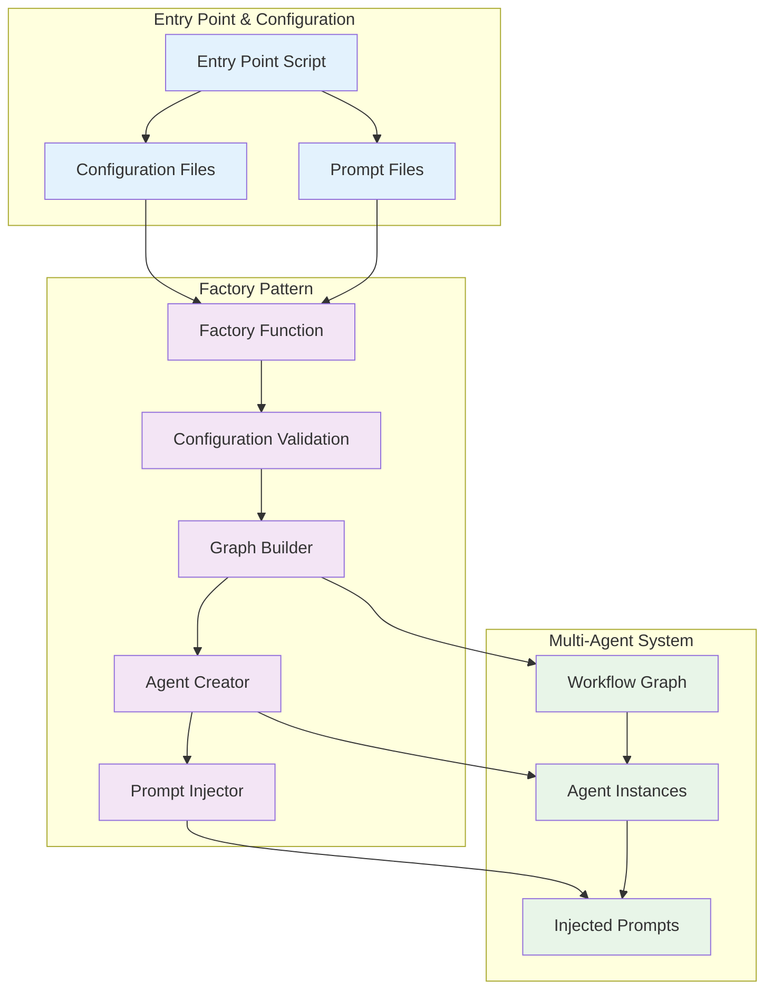

### 6.3 Prompt Management

Prompt management is critical for agent behavior, quality, and flexibility.

**Prompt Management:**
- **Loading**: Entry point loads prompts from external files
- **Supply**: Entry point supplies prompts to factory
- **Injection**: Factory injects prompts into agents during graph building
- **Contextual Usage**: Critic agent receives different prompts depending on workflow step (planner, researcher, expert)
- **Updates**: Prompts can be updated without code changes by modifying external files and then using the multi-agent system factory to create the updated graph
- **Validation**: Prompts are checked for non-emptiness

**Prompt Management Best Practices:**
- **Separation**: Prompts are kept separate from code for maintainability

**Future Considerations**
- **Proper Prompt Management**: Proper prompt management system is needed for versioning, templating, and prompt variations.


### 6.4 Entry Point and Batch Processing

The main entry point script is responsible for initializing the system, constructing configuration, and managing batch processing.

**Entry Point Responsibilities:**
- **Configuration Construction**: Constructs configuration with hard-coded retry limits and temperatures
- **Prompt Loading**: Loads system prompts from external files
- **Configuration Supply**: Supplies graph configuration and prompts to the multi-agent system factory
- **Graph Compilation**: Compiles the workflow graph once during system initialization
- **Graph Invocation**: Invokes the compiled graph once per question with isolated graph state
- **Graph State Processing**: Receives complete graph state after each graph run containing final answer and reasoning trace
- **Output Extraction**: Extracts final answer and reasoning trace from returned graph state
- **Batch Processing**: Processes input questions in batch mode (e.g., from JSONL files) with new graph state per question
- **Batch Results Storage**: Stores extracted answers and reasoning traces in batch result files
- **Error Handling**: Handles errors gracefully, logs failures, and ensures system resilience
- **Output Writing**: Writes answers and reasoning traces to output files in required format

**Batch Processing Features:**
- **Progress Tracking**: Tracks and logs progress through batch jobs
- **Question Isolation**: Each question maintains complete isolation with its own graph state
- **Graph State Return**: Complete graph state returned after each question processing
- **Output Extraction**: Final answer and reasoning trace extracted from returned graph state
- **Batch Results Storage**: All extracted outputs stored in consolidated batch result files
- **Resource Management**: Manages memory and cleans up resources between questions


**Related Sections**: Sections 7, 8 (referenced by error handling and decisions sections)

**Section Summary**: This section covers the configuration system, factory pattern implementation, prompt management, and entry point/batch processing capabilities of the multi-agent system, describing how the system is configured, instantiated, and deployed for robust operation.

**Key Takeaways**:
- Centralized configuration system specifies parameters and system prompts for the entire graph
- Configuration is constructed at runtime by entry point and consumed by factory for graph compilation
- Factory pattern assigns retry limits, temperatures, and prompts to graph definition before compilation
- Entry point constructs configuration with hard-coded values and loads prompts from external files
- Single graph compilation with per-question invocation ensures efficient batch processing
- Complete question isolation prevents state crossing and maintains privacy
- Clean output interface with graph state return and entry point extraction
- Entry point and batch processing support scalable, resilient, and automated operation

### 6.5 Output Interface and Data Flow

The system implements a clean output interface where the multi-agent system graph returns complete graph state, and the entry point extracts and processes the valuable information.

**Graph Output Interface:**
- **Complete State Return**: The multi-agent system graph returns the complete graph state after each run
- **Final Answer Variable**: Graph state contains the final answer generated by the finalizer agent
- **Reasoning Trace Variable**: Graph state contains the complete reasoning trace showing the workflow execution
- **Workflow Information**: Graph state includes all intermediate results, agent outputs, and workflow metadata
- **No Direct Output**: The graph itself does not write files or format output - it simply returns state

**Entry Point Output Processing:**
- **State Reception**: Entry point receives the complete graph state after each graph invocation
- **Value Extraction**: Entry point extracts the final answer and reasoning trace from the returned state
- **Batch Consolidation**: Extracted outputs are consolidated into batch result files
- **Format Management**: Entry point handles all output formatting and file writing
- **Error Handling**: Entry point processes any error states or failure information from graph state

**Data Flow Pattern:**
1. **Graph Execution**: Multi-agent system processes question and returns complete graph state
2. **State Reception**: Entry point receives graph state containing all workflow information
3. **Value Extraction**: Entry point extracts final answer and reasoning trace from state
4. **Batch Storage**: Extracted values are stored in batch result files
5. **Resource Cleanup**: Graph state is cleaned up and resources are freed


---

## 7. Error Handling & Quality Assurance

**Prerequisites**: Sections 1, 2, 3, 4, 5, 6 (Introduction, Architecture Principles, Core Components, Technology Stack, State Management, Configuration)  
**Dependencies**: Referenced by Section 8

### 7.1 Error Handling Architecture

The system implements a robust error handling architecture to ensure reliability, resilience, and clear failure attribution throughout the multi-agent workflow.

**High-Level Error Handling Strategy:**
- **Comprehensive Error Detection:** All exceptions and errors are detected and logged regardless of source (agents, tools, validation, runtime, etc.)
- **Error Categorization:** Errors are classified as API errors, validation errors, runtime errors, or tool-specific errors.
- **Fail-Fast Error Handling:** When critical errors occur, the system terminates immediately with clear failure reasons.

**Error Detection and Reporting:**
- **Comprehensive Error Detection:** All exceptions and errors are detected and logged regardless of source (agents, tools, validation, runtime, etc.)
- **Context-Rich Error Logging:** Each error is logged with appropriate context including component identification, workflow state, correlation ID, and relevant details
- **Error Details Capture:** Error logs include exception type, message, stack trace, and any relevant state information for debugging

**Error Logging Integration:**
- **Structured Error Logging:** All errors are logged using the Structlog framework described in section 7.3 with correlation IDs for traceability
- **Error Context Capture:** Error logs include component identification, workflow state, correlation ID, and error severity level
- **Error Correlation:** Error logs are linked to specific workflow states and agent actions for comprehensive debugging
- **Security-Conscious Error Logging:** Error details are logged without exposing sensitive data or internal system information

**Required Diagrams**: 
- **Diagram 7.1: Technical Error Handling Diagram** - Error detection, logging, and fail-fast termination

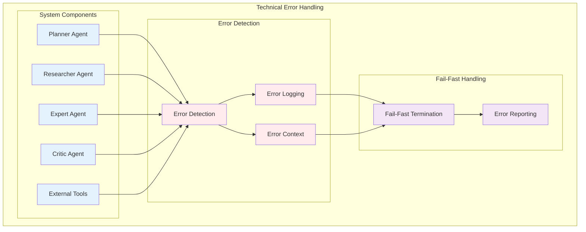

### 7.2 Quality Control and Retry Logic

The system implements a comprehensive quality control system with agent-specific retry logic to ensure robust operation and continuous improvement through critic-based feedback loops.

**Critic Agent Quality Control:**
- **Dynamic Prompts:** The critic agent uses different prompts for planner, researcher, and expert outputs.
- **Decision Making:** The critic decides to approve or reject outputs, providing constructive feedback for improvement.
- **Quality Assessment:** Critic checks for completeness, correctness, and adherence to requirements using predefined criteria for each agent type.
- **No History Retention:** Critic agent does not retain conversation history, ensuring unbiased feedback each time.

**Agent-Specific Retry Logic:**
- **Role-Based Limits:** Each agent type has configurable retry limits when critic rejects their work (planner: 2-3, researcher: 5-7, expert: 4-6).
- **Independent Counters:** Each agent maintains its own retry counter, tracked in the workflow state.
- **Increment on Critic Rejection:** The retry counter for the specific agent that was rejected gets incremented.
- **Limit Enforcement:** When retry limits are reached, the system proceeds to the finalizer with failure attribution.

**Quality Control Patterns:**
- **Feedback Loops:** Iterative improvement through repeated critic review and agent retries.
- **Immediate Retry:** Simple retry without delays for repeated critic rejections.
- **Graceful Critic Rejection Failure:** If retries are exhausted, orchestrator sets finalizer as next step and instructs finalizer to return specific final answer with failing agent attribution in reasoning trace.
- **Traceability:** All critic decisions and feedback are logged for audit and improvement.

**Required Diagrams**: 
- **Diagram 7.2: Quality Control & Retry Logic Architecture Diagram** - Critic agent decision-making and agent-specific retry configuration

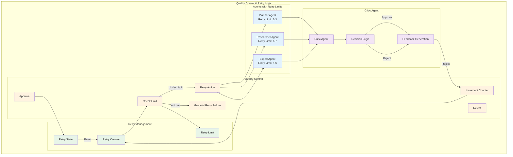

### 7.3 Logging & Observability

**Prerequisites**: Sections 7.1-7.2 (Error Handling & Quality Assurance)  
**Dependencies**: Referenced by Section 8 (Architectural Decisions)

#### 7.3.1 Logging Strategy Overview

The system implements a comprehensive logging strategy to establish traceability and observability across the multi-agent workflow. This strategy enables operational monitoring, debugging, and performance analysis while maintaining security and privacy standards.

**Logging Architecture Principles:**
- **Correlation-Based Tracing**: Each question processing run is assigned a unique correlation ID that links all log entries across the workflow
- **Hierarchical Organization**: Logs are organized by run, with separate directories for entry point and multi-agent system components
- **Security-Conscious Design**: Logging avoids sensitive data exposure while capturing sufficient context for debugging and monitoring
- **Standardized Format**: Consistent log message structure with standardized prefixes and separated variable values
- **Comprehensive Coverage**: All significant system events, state changes, and error conditions are logged

**Observability Goals:**
- **Request Tracing**: Complete visibility into question processing from entry point through final answer generation
- **Performance Monitoring**: Execution time tracking for agents, tools, and workflow steps
- **Error Correlation**: Linking errors to specific workflow states and agent actions
- **Quality Metrics**: Tracking critic decisions, retry patterns, and success rates
- **Operational Insights**: System health monitoring and capacity planning

#### 7.3.2 Logging Architecture Components

**Entry Point Logging Layer:**
- **Purpose**: Captures batch processing lifecycle, configuration loading, and entry point errors
- **Scope**: Question processing initiation, configuration validation, batch progress tracking
- **Log Levels**: INFO for normal operations, ERROR for failures, WARN for potential issues
- **Key Events**: Batch start/completion, question processing start/completion, configuration loading, error conditions

**Multi-Agent System Logging Layer:**
- **Purpose**: Tracks workflow execution, agent interactions, and system state changes
- **Scope**: Graph state transitions, agent execution, critic decisions, tool usage, error handling
- **Log Levels**: INFO for workflow progression, ERROR for failures, WARN for retries and critic rejections
- **Key Events**: Agent execution start/completion, state transitions, critic decisions, tool invocations, error conditions

**Correlation ID Management:**
- **Generation**: Unique correlation ID created at entry point for each question processing run
- **Propagation**: Correlation ID passed through entire workflow and included in all log entries
- **Storage**: Correlation ID stored in dedicated file for easy lookup and trace reconstruction
- **Lifetime**: Correlation ID persists for entire question processing lifecycle

**Log Organization Structure:**
- **Run-Based Organization**: Each processing run creates dedicated directory with correlation ID
- **Component Separation**: Separate log files for entry point and multi-agent system components
- **Summary Documentation**: Run summary file containing key metrics and execution statistics
- **Hierarchical Context**: Parent-child relationships between runs, questions, and workflow steps

#### 7.3.3 Logging Content Strategy

**Event Categorization:**
- **Workflow Events**: State transitions, step completions, workflow progression
- **Agent Events**: Execution start/completion, tool usage, output generation
- **Quality Events**: Critic decisions, retry attempts, feedback generation
- **Error Events**: Failures, exceptions, error conditions with context (see section 7.1 for error handling details)
- **Performance Events**: Execution times, resource usage, API call metrics

**Context Information:**
- **Correlation ID**: Links all events within a single question processing run
- **Component Identification**: Agent name, workflow step, tool name for event attribution
- **State Information**: Current workflow state, step progression, retry counts
- **Performance Metrics**: Execution times, success rates, error frequencies
- **Security Context**: Sanitized configuration, API endpoints, error types

**Error Logging Architecture:**
- **Error Event Capture**: All errors from section 7.1 error handling are captured as structured log events
- **Error Context Enrichment**: Error logs include correlation ID, component, workflow state, and error details
- **Error Traceability**: Error logs are linked to specific workflow steps and agent actions for debugging
- **Error Analysis Support**: Error logs support correlation-based queries and trend analysis for operational monitoring

**Security and Privacy Considerations:**
- **Sensitive Data Exclusion**: No API keys, passwords, or personal information in logs
- **Sanitized Configuration**: Log configuration structure without exposing sensitive values
- **Error Context**: Include error types and components without exposing internal data
- **Access Control**: Log files stored with appropriate permissions and access controls

#### 7.3.4 Observability Integration

**Performance Monitoring:**
- **Agent Execution Times**: Track individual agent performance and identify bottlenecks
- **Tool Usage Metrics**: Monitor external API usage, success rates, and error patterns
- **Workflow Efficiency**: Measure overall processing time and step-by-step performance
- **Resource Utilization**: Track memory usage, API call frequency, and system capacity

**Quality Assurance Integration:**
- **Critic Decision Tracking**: Log approval/rejection rates and feedback patterns
- **Retry Pattern Analysis**: Monitor retry frequency and success rates by agent type
- **Error Correlation**: Link errors to specific agents, tools, or workflow states
- **Success Rate Monitoring**: Track overall system success rates and failure patterns

**Operational Monitoring:**
- **System Health**: Monitor overall system performance and identify degradation patterns
- **Capacity Planning**: Track resource usage and identify scaling requirements
- **Error Trends**: Analyze error patterns and identify systemic issues
- **Performance Optimization**: Identify bottlenecks and optimization opportunities

#### 7.3.5 Log Management and Analysis

**Storage and Retention:**
- **Local Storage**: Logs stored in organized directory structure with run-based organization


**Required Diagrams**: 
- **Diagram 7.3: Logging Architecture Diagram** - Logging components, correlation flow, and storage organization

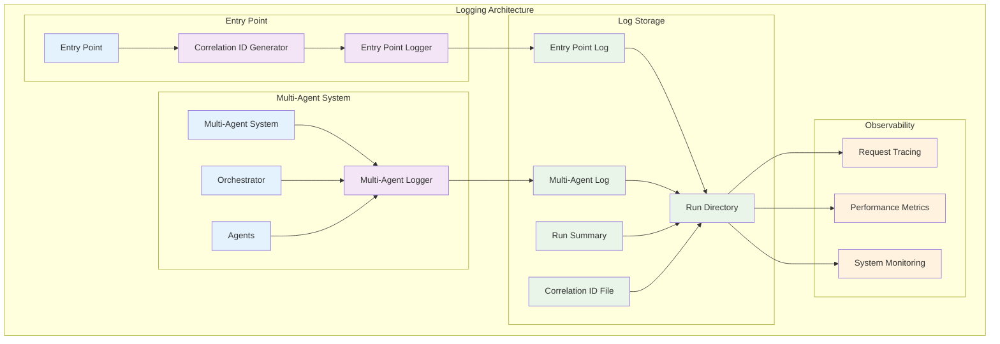

### 7.4 Testing Strategies

Testing is a first-class concern, with architecture designed for testability at all levels.

**Testable Architecture:**
- **Component Isolation:** Agents and tools are designed for independent testing and mocking.
- **Pure Logic Separation:** Business logic is separated from I/O and external dependencies for unit testing.
- **State Management Testability:** State transitions and updates are testable via Pydantic validation.

**Testing Support:**
- **Unit Testing:** Pure logic and agent behaviors are covered by unit tests.
- **Integration Testing:** End-to-end workflow and agent interactions are tested in integration tests.
- **Mocking and Fixtures:** Mock frameworks and test fixtures are used for tool and agent simulation.

**Testing Infrastructure:**
- **Automated Test Suites:** Continuous integration runs all tests on code changes.
- **Test Data Management:** Test data and fixtures are version-controlled and reusable.
- **Coverage Metrics:** Test coverage is tracked to ensure quality.

**Required Diagrams**: None (text-based section)

**Related Sections**: Section 8 (referenced by architectural decisions section)

**Section Summary:**
This section covers the error handling, retry logic, quality assurance, testing strategies, and logging observability of the multi-agent system, describing how the system maintains reliability, quality, and robustness while providing comprehensive traceability and monitoring capabilities.

**Key Takeaways:**
- Comprehensive error handling and critic rejection retry logic ensure system reliability with fail-fast error handling and graceful critic rejection failures
- Critic agent and feedback loops provide integrated quality control at every workflow step
- Testing strategies and infrastructure support maintainable, high-quality code and architecture
- Correlation-based logging provides complete traceability and observability across the multi-agent workflow
---

## 8. Architectural Decisions & Future Considerations

**Prerequisites**: Sections 1, 2, 3, 4, 5, 6, 7 (All previous sections)  
**Dependencies**: None (final section)

### 8.1 Key Design Decisions

The architecture is shaped by several foundational design decisions, each made to balance complexity, maintainability, and system goals.

**Centralized Orchestrator vs. Distributed Coordination:**
- Chose a centralized orchestrator for workflow control and state management to simplify coordination, debugging, and state integrity.
- Distributed coordination was rejected due to increased complexity and synchronization challenges.

**Graph-Based Workflow vs. Linear Pipeline:**
- Adopted a graph-based workflow (LangGraph) for flexible, conditional routing and modular agent integration.
- Linear pipelines were rejected as they limit extensibility and dynamic workflow control.

**Multi-Critic Approach vs. Single Critic:**
- Implemented a single critic agent with dynamic prompts for each workflow step, balancing quality control and system simplicity.
- Multiple critics were considered but added unnecessary complexity.

**Subgraph Patterns vs. Monolithic Agents:**
- **Decision**: Subgraph patterns for complex agent logic
- **Rationale**: Enables complex agent logic isolation and reusability
- **Alternative Considered**: Monolithic agents with embedded tool logic
- **Rejection Reason**: Would make agents harder to maintain and test

**Hard-Coded Workflow vs. Dynamic Workflow:**
- Chose a hard-coded workflow for predictability, easier debugging, and clear state transitions.
- Dynamic workflows were considered but deferred for future extensibility.

**Structured Logging vs. Unstructured Logging:**
- **Decision**: Structured logging using Structlog for comprehensive observability
- **Rationale**: Enables correlation-based tracing, JSON formatting, and security-conscious logging
- **Alternative Considered**: Standard Python logging with manual correlation ID management
- **Rejection Reason**: Would require significant custom implementation for structured logging and correlation ID propagation
- **Benefits**: Complete traceability, rapid debugging, performance insights, quality monitoring, security compliance, and operational excellence
- **Analysis Capabilities**: Correlation-based queries, performance analysis, error analysis, and trend analysis enable comprehensive system insights
- **Operational Benefits**: Debugging support, performance optimization, and quality improvement through critic decision analysis


### 8.2 Alternatives Considered

Several alternative architectural approaches were evaluated and rejected, with rationale documented for future reference.

**Distributed Orchestration:**
- Considered for scalability but rejected due to increased coordination overhead and state consistency risks.

**Single-Pass Execution:**
- Rejected in favor of iterative, feedback-driven workflow to improve answer quality and enable critic-based retries.

**Monolithic Agent Design:**
- Rejected to maintain separation of concerns, enable modular testing, and support future extensibility.

**Dynamic Workflow Routing:**
- Deferred for future versions to keep initial implementation simple and maintainable.

**Alternative Tool Integration Patterns:**
- Explored plugin-based tool loading but prioritized explicit tool binding for safety and traceability.

**Alternative Logging Approaches:**
- Considered standard Python logging but chose Structlog for structured JSON output and correlation ID support.
- Evaluated custom logging implementation but prioritized proven framework for maintainability and consistency.


### 8.3 Trade-offs and Risks

The architecture reflects conscious trade-offs to balance system goals, with identified risks and mitigation strategies.

**Complexity vs. Quality:**
- Critic agent and feedback loops add complexity but significantly improve output quality and reliability.

**Maintainability vs. Functionality:**
- Modular design and subgraph isolation improve maintainability but require more initial design effort.

**Scalability vs. Simplicity:**
- Centralized orchestration limits horizontal scaling but simplifies debugging and state management.

**Quality vs. Speed:**
- Iterative feedback and retries improve answer quality but increase latency and resource usage.

**Known Risks and Mitigations:**
- **API Dependency:** Reliance on external APIs (LLMs, search) mitigated by error handling and fallback strategies.
- **LLM Limitations:** Prompt engineering and critic feedback loops help address LLM unpredictability.
- **Configuration Errors:** Pydantic validation and clear error reporting reduce misconfiguration risk.
- **Tool Failures:** Fail-fast termination and retry logic ensure system resilience.


### 8.4 Architecture Evolution

The architecture is designed to support future evolution and adaptation as requirements change.

**Change Management:**
- Version control and documentation of architectural decisions (ADRs) support traceability and review.
- Regular review and update procedures ensure architecture remains aligned with system goals.

**Backward Compatibility:**
- Changes are evaluated for impact on existing workflows and interfaces.
- Migration strategies are planned for major changes.

**Extensibility:**
- Plugin architecture and subgraph patterns support future feature additions.
- Dynamic workflow routing and distributed orchestration are candidates for future versions.

**Governance:**
- Architecture reviews and stakeholder input guide major changes.
- Quality metrics and feedback inform ongoing improvements.


### 8.5 Glossary and References

**Glossary:**
- **Agent:** Autonomous component responsible for a specific role (e.g., planner, researcher, expert, critic, finalizer).
- **Orchestrator:** Central controller managing workflow, state, and agent coordination.
- **GraphState:** Centralized state object containing all workflow and agent data.
- **Subgraph:** Modular workflow component for complex agent logic (e.g., Researcher, Expert ReAct agents).
- **Critic Agent:** Agent responsible for quality control and feedback at each workflow step using dynamic prompts.
- **Prompt:** Instructional text injected into agents to define their behavior and capabilities.
- **Tool:** External capability (API, function, script) used by agents to perform tasks.
- **Retry Logic:** Mechanism for re-attempting failed agent actions when critic rejects their work, up to a configured limit.
- **Fail-Fast Termination:** System behavior that terminates immediately with clear failure reasons when critical errors occur.
- **Graceful Critic Rejection Failure:** System behavior where orchestrator sets finalizer as next step and instructs finalizer to return specific final answer with failing agent attribution in reasoning trace when critic rejection retry limits are exceeded.
- **Structlog:** Structured logging framework providing JSON-formatted logs with correlation ID support and context-aware logging capabilities.

**References:**
- **Source Code:** See project repository for implementation details.
- **LangGraph Documentation:** https://langchain-ai.github.io/langgraph/
- **LangChain Documentation:** https://python.langchain.com/
- **Pydantic Documentation:** https://docs.pydantic.dev/
- **C4 Model:** https://c4model.com/
- **Mermaid Syntax:** https://mermaid-js.github.io/
- **GAIA Benchmark:** https://gaia-benchmark.github.io/

**Further Reading:**
- Multi-agent system design patterns
- Prompt engineering best practices
- Error handling and resilience in distributed systems
- Testability and maintainability in AI workflows


**Section Summary:**
This section documents the key architectural decisions, alternatives considered, trade-offs, risks, and future evolution plans for the multi-agent system. It also provides a glossary and references for further study.

**Key Takeaways:**
- Key design decisions are documented with rationale and alternatives
- Trade-offs and risks are identified with mitigation strategies
- Architecture is designed for future extensibility and maintainability
- Glossary and references support onboarding and ongoing learning

---

## Diagram Index

This document contains the following 10 diagrams as specified in the architecture requirements:

### Core System Diagrams (4)
1. **System Context Diagram** (Section 1.3) - Shows the system and its external actors/dependencies
2. **Graph-Based Architecture Diagram** (Section 2.4) - Multi-agent system as directed graph with nodes, edges, subgraph boundaries, and workflow patterns
3. **Main Workflow Sequence Diagram** (Section 3.4) - Complete end-to-end workflow execution
4. **State Transition Diagram** (Section 3.4) - Workflow state machine with all state transitions

### Detailed Architecture Diagrams (4)
5. **Communication & Message Flow Diagram** (Section 3.5) - Orchestrator-to-agent communication patterns and message flow
6. **Tool Integration & External Dependencies Diagram** (Section 4.3) - Research tools, expert tools, and external API integration
7. **Technical Error Handling Diagram** (Section 7.1) - Error detection, logging, and fail-fast termination
8. **Data Architecture Diagram** (Section 5.1) - GraphState lifecycle and hierarchical state structure
9. **Quality Control & Retry Logic Architecture Diagram** (Section 7.2) - Critic agent decision-making and agent-specific retry configuration

### Implementation Detail Diagrams (1)
10. **Configuration & Factory Pattern Diagram** (Section 6.2) - Entry point flow and factory pattern implementation

---

**Subgraph Integration:**
- **Researcher Agent**: Manifests in a subgraph for multi-step research with tool interaction
  - Main graph researcher node handles dynamic creation, management, and updating of research subgraph states based on orchestrator's current research step ID
  - Acts as interface between main graph and research subgraph state
  - Manages orchestrator and research agent communication based on step ID
  - Extracts information and updates main graph state
  - Invokes researcher agent via researcher subgraph
- **Expert Agent**: Manifests in a subgraph for complex reasoning with calculation tools
  - Main graph expert node owns creation, management, updating, and access of expert subgraph state
  - Acts as interface between main graph and expert subgraph state
  - Handles all aspects of updating the main graph and subgraph states
  - Manages orchestrator and expert agent communication
  - Extracts information and updates main graph state
  - Invokes expert agent via expert subgraph
- **State Synchronization**: Main graph nodes manage state synchronization when invoking their respective subgraphs
- **Message Conversion**: Messages are converted between main graph and subgraph formats

**Cross-Component Communication:**
Complex agents (Researcher, Expert) use subgraphs with specific communication patterns:
- **Main Graph to Subgraph**: Messages are converted between AgentMessage and BaseMessage formats
- **Subgraph to Main Graph**: Results are extracted and integrated into main workflow state
- **Main Graph Node Management**: Main graph nodes handle dynamic state creation and management for their respective subgraphs
- **Researcher Node Interface**: Acts as interface between main graph and research subgraph state
- **Expert Node Interface**: Acts as interface between main graph and expert subgraph state
- **Research Step Coordination**: Orchestrator manages research step progression while researcher node handles subgraph execution
- **Expert Coordination**: Orchestrator sends instructions to expert agent for initial task execution and feedback messages when critic rejects work
- **State Synchronization**: Main graph nodes manage state synchronization when invoking their respective subgraphs
- **State Extraction and Integration**: Main graph nodes extract information from subgraph states and update main graph state variables
- **Message Conversion**: Messages sent to an agent using AgentMessage protocol must be converted to the BaseMessage protocol to enable the conversation with the agent's LLM.

**Subgraph States Contained Within Main GraphState:**
Researcher and Expert agents use subgraph states for their internal state management:
- **Dynamic Research States**: Research State instances created dynamically for each research step based on orchestrator's current research step ID
- **Conditional Research Creation**: If no research steps exist, no Research State instances are created
- **Mandatory Expert State**: Expert subgraph state always created since Expert agent is mandatory
- **Research State**: Individual state for each research step with conversation context and tool state
- **Expert subgraph state**: Single state for expert agent with conversation context and calculation state
- **State Containment**: Subgraph states are contained within the main GraphState
- **Subgraph State Access**: Subgraph states are accessible by both their respective subgraphs and the main graph
- **Main Graph State Access**: Agents share access to main graph state variables where appropriate

**Required Diagrams**: 
- **Diagram 8.1: Main Workflow Graph** - Complete multi-agent system with all agents and workflow
- **Diagram 8.2: Researcher Subgraph** - Detailed view of researcher agent's tool interaction
- **Diagram 8.3: Expert Subgraph** - Detailed view of expert agent's tool interaction

**Main Workflow Graph:**
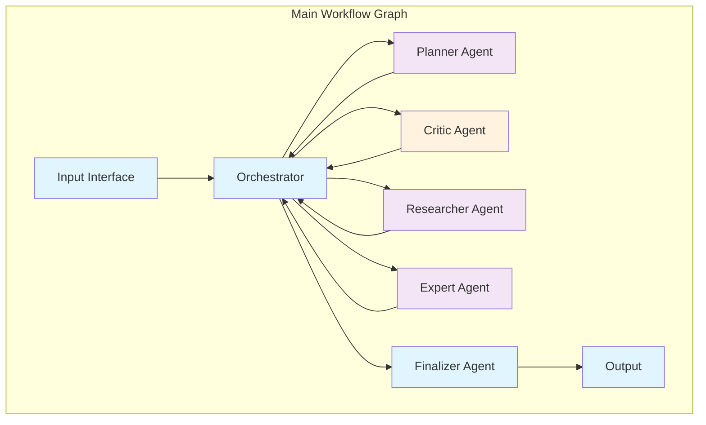

**Researcher Subgraph:**
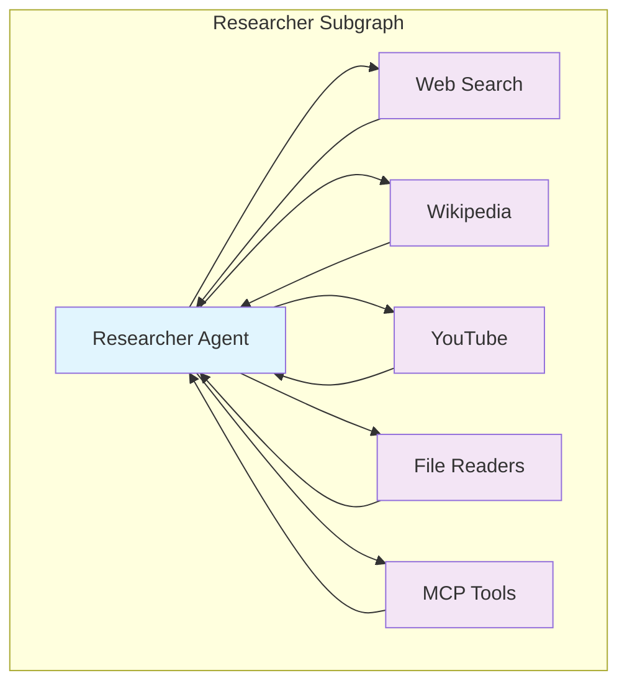

**Expert Subgraph:**
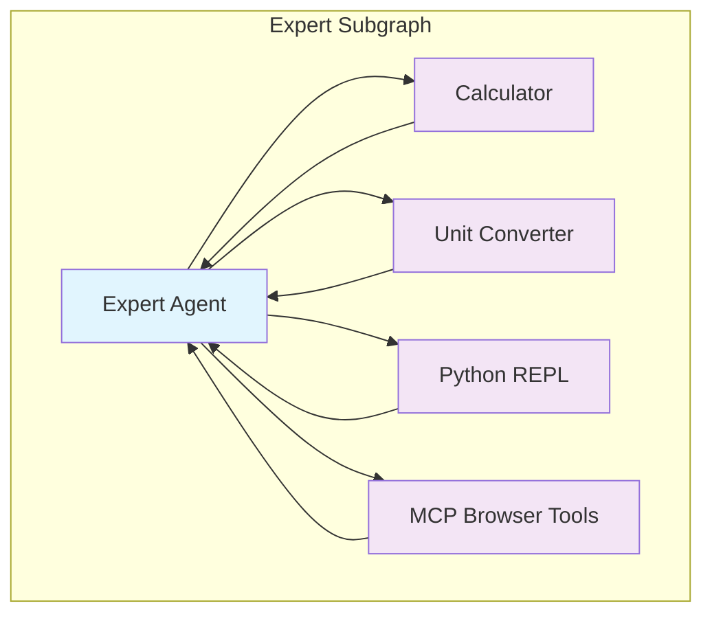

**Cross-Component Communication Protocols and Message Conversion:**
Complex agents (Researcher, Expert) use subgraphs with specific communication protocols:
- **Subgraph Communication**: Internal communication within subgraphs
- **Cross-Component Communication**: Communication between main graph and subgraphs
- **Subgraph Isolation**: Subgraphs maintain isolated communication channels

**Required Diagrams**: 
- **Critic Rejection Retry Logic Architecture Diagram** - Agent-specific retry configuration and management when critics reject agent work
