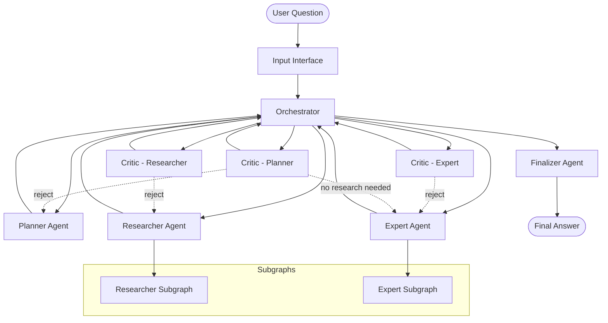

# Multi-Agent System Architecture

## Overview

The Multi-Agent System is designed to answer GAIA Level 1 questions through a coordinated workflow of specialized agents. GAIA Level 1 questions involve tasks that include:
- Answering simple questions, puzzles, or riddles
- Reading files and using them to answer questions
- Accessing the internet to find information

The system uses a centralized orchestrator pattern with distributed agent nodes, each responsible for specific aspects of question answering. The goal is to achieve at least 30% accuracy on GAIA Level 1 questions through robust error handling, quality control, and specialized agent optimization.

## System Architecture



## Core Components

### 1. Input Interface
- **Purpose**: Initializes system state and extracts user question
- **Responsibilities**: 
  - Extract question from input messages
  - Initialize all state variables to default values
  - Set initial workflow step
- **State Management**: Creates clean GraphState for new question processing

### 2. Orchestrator
- **Purpose**: Central control node that manages workflow execution
- **Responsibilities**:
  - Determine next execution step based on current state
  - Route messages between agents
  - Manage retry logic and error handling
  - Coordinate critic feedback integration
- **Design Pattern**: Centralized controller with state machine logic
- **Flow Control**: Hard-coded logic to determine the flow control of the graph
- **Step Tracking**: Keeps track of the overall process by knowing the current step when activated

**Orchestrator Steps**:
- `input`: Start of the graph (default value, never set again)
- `planner`: Invoke the planning agent
- `critic_planner`: Invoke the critic for the planning agent
- `researcher`: Invoke the researcher agent
- `critic_researcher`: Invoke the critic for the researcher agent
- `expert`: Invoke the expert agent
- `critic_expert`: Invoke the critic for the expert agent
- `finalizer`: Invoke the finalizer agent to generate the final answer and reasoning trace

**Orchestrator Logic**:
1. Determine the next step using current step and other graph state variables
2. Increment retry count when a critic decision is a rejection
3. Check retry count - if >= retry limit, set next step to finalizer with failure message
4. Set current step = next step, set next step as empty string
5. Send message to the agent being called in the new current step
6. Return state

### 3. Planner Agent
- **Purpose**: Analyzes questions and creates execution plans
- **Responsibilities**:
  - Break down questions into research and expert steps
  - Determine if research is needed
  - Create logical execution sequence
- **Tools**: None (pure LLM-based reasoning)
- **Output**: Structured plan with research_steps and expert_steps
- **Logic**: 
  - Analyze input question
  - Decompose into atomic logical steps:
    - Gathering information (specific pieces of information)
    - Analyzing information, performing calculations, answering with gathered context
  - May elect to not perform research if question can be answered without additional context

### 4. Researcher Agent
- **Purpose**: Gathers information using external tools
- **Responsibilities**:
  - Execute research steps sequentially
  - Use appropriate tools for information gathering
  - Synthesize research results
- **Tools**: Web search, Wikipedia, YouTube transcripts, file readers, MCP tools
- **Subgraph**: Uses LangGraph subgraph for tool interaction
- **Function**: 
  - Receives research requests to perform
  - Functions as a ReAct agent
  - May make multiple tool calls to return requested information
  - Can summarize retrieved information and extract factual information
  - Processes multiple research steps sequentially

### 5. Expert Agent
- **Purpose**: Synthesizes final answer using gathered information
- **Responsibilities**:
  - Follow expert steps to answer question
  - Use calculation and reasoning tools
  - Generate comprehensive answer with reasoning
- **Tools**: Calculator, unit converter, Python REPL
- **Subgraph**: Uses LangGraph subgraph for tool interaction
- **Function**:
  - Receives logical instructions to follow
  - Has required context provided
  - Functions as a ReAct agent with multi-step reasoning
  - Can perform specific calculations, summarize information, etc.

### 6. Critic Agents
- **Purpose**: Quality control and feedback mechanism
- **Responsibilities**:
  - Review work from planner, researcher, and expert
  - Provide approve/reject decisions
  - Generate constructive feedback for improvements
- **Types**: Critic_planner, Critic_researcher, Critic_expert
- **Tools**: None (pure LLM-based evaluation)
- **Function**: Acts as feedback/reflection mechanism to catch errors or issues as they happen

### 7. Finalizer Agent
- **Purpose**: Produces final answer and reasoning trace
- **Responsibilities**:
  - Synthesize all information into final answer
  - Generate comprehensive reasoning trace
  - Format output for user consumption
- **Tools**: None (pure LLM-based synthesis)
- **Function**: 
  - Triggered when final answer has been formulated
  - Either generates an answer or returns failure message
  - Creates reasoning trace of how the system answered the question

## Communication Architecture

### Message Management
An important aspect of multi-agent systems is how agent-to-agent communication works. The orchestrator must communicate with itself and the other agents.

**Shared Message Channel**: A centralized message channel is used to centralize agent-to-agent messaging.

**Message Filtering**: A message filtering function reduces the scope of the centralized message channel to keep messages and context relevant to the specific agent.

### Message Protocol
Agents communicate through a structured message system:

```python
class AgentMessage:
    sender: str        # Source agent
    receiver: str      # Target agent (usually "orchestrator")
    type: str          # "instruction", "feedback", "response"
    content: str       # Message content
    step_id: Optional[int]  # Research step identifier
```

### Subgraph Communication

#### Researcher Subgraph
Since the researcher agent is a ReAct agent, a subgraph must be employed:
- Each individual research step has a dedicated state for the researcher subgraph
- Researcher agent keeps track of conversation between itself and orchestrator for each research step
- Orchestrator still uses shared message channel to communicate
- When researcher agent is called in main graph, messages are updated before agent is invoked

#### Expert Subgraph
Since the expert agent is a ReAct agent, a subgraph must be employed:
- Expert subgraph state properly keeps track of conversation from orchestrator messages
- Direct conversation that expert agent uses is saved in expert subgraph state messages
- Orchestrator still uses shared message channel to communicate
- When expert agent is called in main graph, messages are updated before agent is invoked

## Data Architecture

### State Management
The system uses a centralized `GraphState` that contains:

```python
class GraphState:
    # Core data
    question: str                    # User's question
    research_steps: list[str]        # Planned research steps
    expert_steps: list[str]          # Planned expert steps
    research_results: list[Any]      # Results from research
    expert_answer: Any               # Expert's answer
    expert_reasoning: str            # Expert's reasoning
    
    # Workflow control
    current_step: str                # Current execution step
    next_step: str                   # Next execution step
    retry_count: int                 # Current retry count
    retry_limit: int                 # Maximum retries
    
    # Communication
    agent_messages: list[AgentMessage]  # Inter-agent messages
    
    # Subgraph states
    researcher_states: dict[int, ResearcherState]  # Per-step researcher state
    expert_state: Optional[ExpertState]            # Expert subgraph state
    
    # Error handling
    error: Optional[str]             # Error message
    error_component: Optional[str]   # Component that failed
```

## Technology Stack

### Core Framework
- **LangGraph**: Graph-based workflow orchestration
- **LangChain**: LLM integration and tool framework
- **Pydantic**: Data validation and type safety

### LLM Integration
- **OpenAI GPT-4o**: Primary LLM for complex reasoning
- **OpenAI GPT-4o-mini**: Secondary LLM for research and expert tasks
- **Structured Output**: JSON schema validation for all LLM responses

### External Tools
- **Tavily**: Web search capabilities
- **Wikipedia**: Knowledge base access
- **YouTube**: Video transcript extraction
- **File Readers**: PDF, Excel, PowerPoint processing
- **MCP Tools**: Browser automation and web interaction
- **Python REPL**: Code execution for calculations
- **Unit Converter**: Measurement conversions

## System Boundaries

### Internal Components
- All agent nodes and orchestrator
- State management and validation
- Inter-agent communication
- Error handling and logging

### External Dependencies
- **LLM APIs**: OpenAI GPT-4o and GPT-4o-mini
- **Search APIs**: Tavily search service
- **Knowledge APIs**: Wikipedia API
- **File Systems**: Local file access for document processing
- **Network**: HTTP requests for external services

### Integration Points
- **MCP Browser**: Web automation and interaction
- **File Processing**: Document parsing and content extraction
- **Tool Execution**: Safe execution of external tools

## Security Architecture

### Input Validation
- **Question Sanitization**: Basic input validation and sanitization
- **Tool Safety**: Restricted tool execution environments
- **State Validation**: Runtime state integrity checks

### Access Control
- **API Key Management**: Secure storage of external API keys
- **Tool Restrictions**: Limited tool execution capabilities
- **Error Handling**: Secure error message handling

### Data Privacy
- **No Persistence**: No persistent storage of user data
- **Memory Cleanup**: State cleared between question processing
- **Tool Isolation**: Isolated execution environments for tools

## Monitoring and Observability

### Logging
- **Structured Logging**: JSON-formatted logs with component context
- **Error Tracking**: Detailed error logging with stack traces
- **Performance Metrics**: Execution time tracking for each component

### Health Checks
- **Component Health**: Individual agent health monitoring
- **External Dependencies**: API availability monitoring
- **State Validation**: Runtime state integrity verification

### Metrics
- **Success Rate**: Question answering success metrics
- **Performance**: Response time and throughput metrics
- **Error Rates**: Component failure and retry metrics 