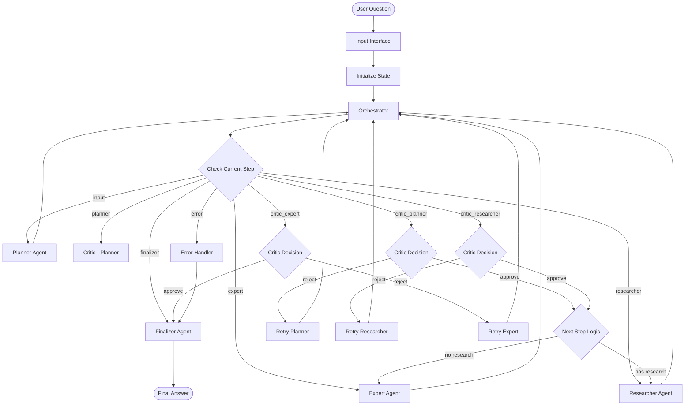

# Multi-Agent System Design

## Design Philosophy

The Multi-Agent System is designed around the principle of **specialized expertise with centralized coordination**. Each agent has a specific role and responsibility, while the orchestrator ensures coordinated execution and quality control through critic feedback loops.

## Core Design Principles

### 1. Separation of Concerns
- **Planner**: Focuses solely on breaking down questions into executable steps
- **Researcher**: Specializes in information gathering using appropriate tools
- **Expert**: Concentrates on synthesis and reasoning using calculation tools
- **Critic**: Dedicated to quality assessment and feedback generation
- **Finalizer**: Responsible for final answer synthesis and formatting

### 2. Centralized Control with Distributed Execution
- **Orchestrator**: Single point of control for workflow management
- **Agents**: Specialized execution units with focused responsibilities
- **State Management**: Centralized state with controlled access patterns

### 3. Quality-First Approach
- **Critic Integration**: Every major step is reviewed before proceeding
- **Feedback Loops**: Rejection triggers retry with improved context
- **Retry Logic**: Configurable retry limits with graceful degradation

### 4. Tool Integration Strategy
- **Subgraph Pattern**: Tool-using agents encapsulated in subgraphs
- **Conversation Preservation**: Tool interactions maintain conversation context
- **Safe Execution**: Restricted tool environments with error handling

### 5. Factory Pattern with Dependency Injection
- **Dynamic Creation**: All components created at runtime
- **Prompt Injection**: Prompts provided externally, not loaded internally
- **Configuration Injection**: Model settings and parameters injected via config
- **Flexible Assembly**: System assembled from injected dependencies

## Implementation Design

### Factory Pattern Implementation

#### Core Factory Function
```python
def create_multi_agent_graph(prompts: AgentPrompts, config: Optional[GraphConfig] = None):
    """
    Factory function that creates and compiles a multi-agent graph with injected prompts.
    
    Args:
        prompts: Dictionary containing all agent prompts
        config: Optional configuration for models and settings
        
    Returns:
        Compiled graph ready for invocation
    """
    # Set default configuration
    default_config = {
        "planner_model": "gpt-4o",
        "researcher_model": "gpt-4o-mini", 
        "expert_model": "gpt-4o-mini",
        "critic_model": "gpt-4o-mini",
        "finalizer_model": "gpt-4o",
        "temperature": 0,
        "retry_limit": 5
    }
    
    if config:
        default_config.update(config)
    
    # Create LLMs dynamically
    llm_planner = ChatOpenAI(model=default_config["planner_model"], temperature=default_config["temperature"])
    llm_researcher = ChatOpenAI(model=default_config["researcher_model"], temperature=default_config["temperature"])
    llm_expert = ChatOpenAI(model=default_config["expert_model"], temperature=default_config["temperature"])
    llm_critic = ChatOpenAI(model=default_config["critic_model"], temperature=default_config["temperature"])
    llm_finalizer = ChatOpenAI(model=default_config["finalizer_model"], temperature=default_config["temperature"])
    
    # Create tools dynamically
    research_tools = asyncio.run(get_research_tools())
    expert_tools = [python_repl_tool, unit_converter, calculator]
    
    # Bind tools to LLMs
    llm_researcher_with_tools = llm_researcher.bind_tools(research_tools)
    llm_expert_with_tools = llm_expert.bind_tools(expert_tools)
    
    # Create agent functions with injected prompts and LLMs
    planner_agent = create_planner_agent(prompts["planner"], llm_planner)
    researcher_agent = create_researcher_agent(prompts["researcher"], llm_researcher_with_tools, research_tools)
    expert_agent = create_expert_agent(prompts["expert"], llm_expert_with_tools, expert_tools)
    
    # Create critic agent with all three critic prompts
    critic_prompts = {
        "critic_planner": prompts["critic_planner"],
        "critic_researcher": prompts["critic_researcher"],
        "critic_expert": prompts["critic_expert"]
    }
    critic_agent = create_critic_agent(critic_prompts, llm_critic)
    
    finalizer_agent = create_finalizer_agent(prompts["finalizer"], llm_finalizer)
    
    # Create input interface with retry limit
    input_interface = create_input_interface(default_config["retry_limit"])
    
    # Build and compile the graph
    builder = StateGraph(GraphState)
    # ... graph building logic ...
    return builder.compile()
```

#### Agent Factory Functions
```python
def create_planner_agent(planner_prompt: str, llm_planner: ChatOpenAI):
    """Factory function for planner agent with injected prompt and LLM."""
    def planner_agent(state: GraphState) -> GraphState:
        # Agent implementation using injected prompt and LLM
        pass
    return planner_agent

def create_researcher_agent(researcher_prompt: str, llm_researcher_with_tools: ChatOpenAI, research_tools: list):
    """Factory function for researcher agent with injected dependencies."""
    def researcher_agent(state: GraphState) -> GraphState:
        # Agent implementation using injected prompt, LLM, and tools
        pass
    return researcher_agent

def create_expert_agent(expert_prompt: str, llm_expert_with_tools: ChatOpenAI, expert_tools: list):
    """Factory function for expert agent with injected dependencies."""
    def expert_agent(state: GraphState) -> GraphState:
        # Agent implementation using injected prompt, LLM, and tools
        pass
    return expert_agent

def create_critic_agent(critic_prompts: dict[str, str], llm_critic: ChatOpenAI):
    """Factory function for critic agent with injected prompts."""
    def critic_agent(state: GraphState) -> GraphState:
        # Agent implementation using injected prompts
        pass
    return critic_agent

def create_finalizer_agent(finalizer_prompt: str, llm_finalizer: ChatOpenAI):
    """Factory function for finalizer agent with injected prompt and LLM."""
    def finalizer_agent(state: GraphState) -> GraphState:
        # Agent implementation using injected prompt and LLM
        pass
    return finalizer_agent

def create_input_interface(retry_limit: int):
    """Factory function for input interface with injected retry limit."""
    def input_interface(state: GraphState) -> GraphState:
        # Input interface implementation using injected retry limit
        pass
    return input_interface
```

#### Subgraph Factory Functions
```python
def create_researcher_subgraph(researcher_prompt: str, llm_researcher_with_tools: ChatOpenAI, research_tools: list):
    """Factory function for researcher subgraph with injected dependencies."""
    # Create LLM node
    researcher_llm_node = create_researcher_llm_node(researcher_prompt, llm_researcher_with_tools)
    
    # Build subgraph
    builder = StateGraph(ResearcherState)
    builder.add_node("researcher_llm", researcher_llm_node)
    builder.add_node("tools", ToolNode(research_tools))
    
    # Add edges
    builder.add_edge(START, "researcher_llm")
    builder.add_conditional_edges("researcher_llm", tools_condition, {"tools": "tools", "end": END})
    builder.add_edge("tools", "researcher_llm")
    
    return builder.compile()

def create_expert_subgraph(expert_prompt: str, llm_expert_with_tools: ChatOpenAI, expert_tools: list):
    """Factory function for expert subgraph with injected dependencies."""
    # Create LLM node
    expert_llm_node = create_expert_llm_node(expert_prompt, llm_expert_with_tools)
    
    # Build subgraph
    builder = StateGraph(ExpertState)
    builder.add_node("expert_llm", expert_llm_node)
    builder.add_node("tools", ToolNode(expert_tools))
    
    # Add edges
    builder.add_edge(START, "expert_llm")
    builder.add_conditional_edges("expert_llm", tools_condition, {"tools": "tools", "end": END})
    builder.add_edge("tools", "expert_llm")
    
    return builder.compile()
```

### Configuration Management

#### GraphConfig TypedDict
```python
class GraphConfig(TypedDict, total=False):
    """Configuration for the multi-agent graph."""
    planner_model: str
    researcher_model: str
    expert_model: str
    critic_model: str
    finalizer_model: str
    temperature: float
    retry_limit: int
```

#### AgentPrompts TypedDict
```python
class AgentPrompts(TypedDict):
    """Type definition for agent prompts that will be injected into the system."""
    planner: str
    critic_planner: str
    researcher: str
    critic_researcher: str
    expert: str
    critic_expert: str
    finalizer: str
```

### Dynamic Resource Creation

#### LLM Creation
```python
# Create LLMs dynamically based on configuration
llm_planner = ChatOpenAI(model=default_config["planner_model"], temperature=default_config["temperature"])
llm_researcher = ChatOpenAI(model=default_config["researcher_model"], temperature=default_config["temperature"])
llm_expert = ChatOpenAI(model=default_config["expert_model"], temperature=default_config["temperature"])
llm_critic = ChatOpenAI(model=default_config["critic_model"], temperature=default_config["temperature"])
llm_finalizer = ChatOpenAI(model=default_config["finalizer_model"], temperature=default_config["temperature"])
```

#### Tool Creation and Binding
```python
# Create tools dynamically at runtime
research_tools = asyncio.run(get_research_tools())
expert_tools = [python_repl_tool, unit_converter, calculator]

# Bind tools to appropriate LLMs
llm_researcher_with_tools = llm_researcher.bind_tools(research_tools)
llm_expert_with_tools = llm_expert.bind_tools(expert_tools)
```

## Design Decisions and Rationale

### Why Multi-Agent Architecture?

#### Decision: Use multiple specialized agents instead of a single monolithic agent

**Rationale:**
- **Specialized Expertise**: Each agent can be optimized for its specific task
- **Fault Isolation**: Failure in one agent doesn't compromise the entire system
- **Maintainability**: Easier to modify or replace individual components
- **Scalability**: Agents can be scaled independently based on workload
- **Debugging**: Easier to identify and fix issues in specific components

**Alternatives Considered:**
- **Single Agent**: Would be simpler but less specialized and harder to debug
- **Microservices**: Would add unnecessary complexity for this use case
- **Pipeline Architecture**: Would be more rigid and harder to adapt

### Why Centralized Orchestrator?

#### Decision: Use a centralized orchestrator instead of peer-to-peer communication

**Rationale:**
- **Predictable Control Flow**: Clear, deterministic execution sequence
- **Simplified State Management**: Single source of truth for system state
- **Easier Debugging**: Centralized logging and error handling
- **Quality Control**: Centralized critic integration and retry logic
- **Message Routing**: Simplified inter-agent communication

**Alternatives Considered:**
- **Peer-to-Peer**: Would be more complex and harder to debug
- **Event-Driven**: Would add complexity without clear benefits
- **Distributed Orchestration**: Would be overkill for this use case

**Trade-offs:**
- **Pros**: Simplicity, predictability, easy debugging
- **Cons**: Single point of failure, less flexibility, potential bottleneck

### Why Critic Feedback Loops?

#### Decision: Include critic agents that review work before proceeding

**Rationale:**
- **Quality Assurance**: Catches errors early in the process
- **Iterative Improvement**: Allows for refinement of work
- **Error Recovery**: Provides feedback for retry attempts
- **Transparency**: Makes decision-making process explicit
- **Learning**: System can improve through feedback

**Alternatives Considered:**
- **No Review**: Would be faster but lower quality
- **Post-Processing Review**: Would catch errors too late
- **Continuous Monitoring**: Would be too complex for this use case

### Why Subgraph Pattern for Tool Usage?

#### Decision: Use LangGraph subgraphs for agents that need tool interaction

**Rationale:**
- **Tool Integration**: Seamless integration with LangChain tool framework
- **Conversation Preservation**: Maintains context during tool interactions
- **Conditional Routing**: Automatic routing between LLM and tool nodes
- **State Isolation**: Tool state isolated from main workflow state
- **Reusability**: Subgraphs can be reused in different contexts

**Alternatives Considered:**
- **Direct Tool Calls**: Would lose conversation context
- **Custom Tool Management**: Would require significant custom code
- **External Tool Services**: Would add unnecessary complexity

### Why Factory Pattern with Dependency Injection?

#### Decision: Use factory pattern for system creation with injected dependencies

**Rationale:**
- **Flexibility**: Easy to change prompts, models, and configuration
- **Testability**: Easy to inject test dependencies
- **Maintainability**: Clear separation of concerns
- **Reusability**: Factory can be used in different contexts
- **Configuration Management**: Centralized configuration handling

**Alternatives Considered:**
- **Static Configuration**: Would be less flexible
- **Configuration Files**: Would add complexity without clear benefits
- **Environment Variables**: Would be less structured

## Logical Flow and Execution Patterns

### High-Level Execution Flow



### Detailed Step-by-Step Execution

#### Step 1: Input Interface

**Purpose**: Initialize system state and extract user question

**Execution Logic**:
1. **Extract Question**: Get content from first message in input
2. **Initialize State**: Set all state variables to default values
3. **Set Initial Step**: Set `current_step = "input"` and `next_step = "planner"`
4. **Validate State**: Ensure all required fields are present

**State Changes**:
```python
# Before
state = {"messages": [HumanMessage(content="What is CRISPR?")]}

# After
state = {
    "question": "What is CRISPR?",
    "current_step": "input",
    "next_step": "planner",
    "retry_count": 0,
    "retry_limit": 5,
    "error": None,
    "error_component": None,
    # ... all other fields initialized
}
```

**Decision Points**: None (always proceeds to orchestrator)

#### Step 2: Orchestrator - Step Determination

**Purpose**: Determine the next execution step based on current state

**Execution Logic**:
1. **Check Current Step**: Examine `current_step` value
2. **Apply Decision Logic**: Use critic decisions to determine next step
3. **Handle Retry Logic**: Increment retry count on rejections
4. **Check Retry Limits**: Route to finalizer if limit exceeded

**Decision Logic**:

##### When `current_step == "input"`:
- Set `next_step = "planner"`

##### When `current_step == "planner"`:
- Set `next_step = "critic_planner"`

##### When `current_step == "critic_planner"`:
```python
if critic_planner_decision == "approve":
    if research_steps:  # Has research steps
        next_step = "researcher"
    else:  # No research needed
        next_step = "expert"
elif critic_planner_decision == "reject":
    retry_count += 1
    next_step = "planner"  # Retry planner
```

##### When `current_step == "researcher"`:
- Set `next_step = "critic_researcher"`

##### When `current_step == "critic_researcher"`:
```python
if critic_researcher_decision == "approve":
    if current_research_index < len(research_steps) - 1:
        # More research steps to do
        next_step = "researcher"
    else:
        # All research complete
        next_step = "expert"
elif critic_researcher_decision == "reject":
    retry_count += 1
    next_step = "researcher"  # Retry researcher
```

##### When `current_step == "expert"`:
- Set `next_step = "critic_expert"`

##### When `current_step == "critic_expert"`:
```python
if critic_expert_decision == "approve":
    next_step = "finalizer"
elif critic_expert_decision == "reject":
    retry_count += 1
    next_step = "expert"  # Retry expert
```

##### Retry Limit Check:
```python
if retry_count >= retry_limit:
    next_step = "finalizer"
    # Set failure state
```

#### Step 3: Agent Execution

**Purpose**: Execute the current agent and collect results

**Execution Logic**:
1. **Route to Agent**: Based on `current_step`
2. **Execute Agent**: Run agent-specific logic
3. **Collect Results**: Store agent output in state
4. **Return to Orchestrator**: Continue workflow

**Agent-Specific Patterns**:

##### Planner Agent:
```python
def planner_agent(state):
    # Extract question and context
    question = state["question"]
    
    # Generate plan using LLM
    plan = llm_planner.invoke({
        "question": question,
        "context": "Generate a plan to answer this question"
    })
    
    # Parse and validate plan
    research_steps = plan["research_steps"]
    expert_steps = plan["expert_steps"]
    
    # Update state
    state["research_steps"] = research_steps
    state["expert_steps"] = expert_steps
    
    return state
```

##### Researcher Agent:
```python
def researcher_agent(state):
    # Get current research step
    current_step = state["research_steps"][state["current_research_index"]]
    
    # Execute research using subgraph
    researcher_state = compiled_researcher_graph.invoke({
        "messages": get_agent_conversation(state, "researcher"),
        "research_request": current_step
    })
    
    # Store results
    state["research_results"].append(researcher_state["result"])
    state["current_research_index"] += 1
    
    return state
```

##### Expert Agent:
```python
def expert_agent(state):
    # Prepare expert context
    context = {
        "question": state["question"],
        "research_results": state["research_results"],
        "expert_steps": state["expert_steps"]
    }
    
    # Execute expert reasoning using subgraph
    expert_state = compiled_expert_graph.invoke({
        "messages": get_agent_conversation(state, "expert"),
        "context": context
    })
    
    # Store results
    state["expert_answer"] = expert_state["expert_answer"]
    state["expert_reasoning"] = expert_state["expert_reasoning"]
    
    return state
```

#### Step 4: Critic Evaluation

**Purpose**: Evaluate agent work and provide feedback

**Execution Logic**:
1. **Review Work**: Examine agent output and context
2. **Generate Decision**: Approve or reject with feedback
3. **Update State**: Store critic decision and feedback
4. **Route Accordingly**: Continue or retry based on decision

**Critic Patterns**:

##### Planner Critic:
```python
def critic_planner(state):
    # Review planner output
    plan = {
        "research_steps": state["research_steps"],
        "expert_steps": state["expert_steps"]
    }
    
    # Generate critic decision
    decision = llm_critic.invoke({
        "plan": plan,
        "question": state["question"],
        "context": "Evaluate if this plan will answer the question"
    })
    
    # Store decision
    state["critic_planner_decision"] = decision["decision"]
    state["critic_planner_feedback"] = decision["feedback"]
    
    return state
```

##### Researcher Critic:
```python
def critic_researcher(state):
    # Review research results
    research_result = state["research_results"][-1]
    research_step = state["research_steps"][state["current_research_index"] - 1]
    
    # Generate critic decision
    decision = llm_critic.invoke({
        "research_result": research_result,
        "research_step": research_step,
        "context": "Evaluate if this research result addresses the step"
    })
    
    # Store decision
    state["critic_researcher_decision"] = decision["decision"]
    state["critic_researcher_feedback"] = decision["feedback"]
    
    return state
```

##### Expert Critic:
```python
def critic_expert(state):
    # Review expert answer
    expert_answer = state["expert_answer"]
    expert_reasoning = state["expert_reasoning"]
    
    # Generate critic decision
    decision = llm_critic.invoke({
        "expert_answer": expert_answer,
        "expert_reasoning": expert_reasoning,
        "question": state["question"],
        "context": "Evaluate if this answer correctly addresses the question"
    })
    
    # Store decision
    state["critic_expert_decision"] = decision["decision"]
    state["critic_expert_feedback"] = decision["feedback"]
    
    return state
```

### Research Step Execution Pattern

**Sequential Research Execution**:
The system is designed to have each research step performed sequentially. The logic follows this cycle:

1. **Researcher Execution**: Complete the specific research step
2. **Critic Review**: Critic examines the research step results
3. **Decision Point**: 
   - If critic rejects: Re-trigger current research step with critic feedback
   - If critic approves: Pass next research step to researcher
4. **Cycle Continuation**: Continue until all research steps are complete

**Research State Management**:
```python
class ResearcherState:
    messages: list[BaseMessage]  # Conversation history
    step_index: int             # Current step being processed
    result: Optional[str]       # Research result
    error: Optional[str]        # Error message if any
```

### Expert Execution Pattern

**Expert Reasoning Flow**:
1. **Context Preparation**: Combine question, research results, and expert steps
2. **Step-by-Step Execution**: Follow expert steps sequentially
3. **Tool Integration**: Use calculation and reasoning tools as needed
4. **Answer Synthesis**: Generate comprehensive answer with reasoning
5. **Quality Validation**: Ensure answer addresses the original question

**Expert State Management**:
```python
class ExpertState:
    messages: list[BaseMessage]  # Conversation history
    question: str               # Original question
    research_data: list[str]    # Research results
    expert_answer: str          # Final answer
    expert_reasoning: str       # Reasoning trace
```

## Error Handling and Recovery

### Error Detection
- **State Validation**: Runtime checks for state integrity
- **Agent Failures**: Catch and handle agent execution errors
- **Tool Failures**: Handle external tool failures gracefully
- **Network Issues**: Manage API and network connectivity problems

### Recovery Strategies
- **Retry Logic**: Automatic retry with exponential backoff
- **Fallback Mechanisms**: Alternative approaches when primary methods fail
- **Graceful Degradation**: Continue with partial results when possible
- **Error Propagation**: Clear error messages to finalizer

### Error State Management
```python
# Error handling in state
state["error"] = "Error message"
state["error_component"] = "component_name"
state["retry_count"] += 1

# Check retry limits
if state["retry_count"] >= state["retry_limit"]:
    state["next_step"] = "finalizer"
    state["final_answer"] = "I could not answer the question."
```

## Performance Optimization

### Execution Optimization
- **Sequential Research**: Process research steps one at a time
- **Conditional Execution**: Skip research when not needed
- **State Minimization**: Keep only necessary state in memory
- **Tool Caching**: Cache tool results when appropriate

### Resource Management
- **Memory Management**: Clear state between questions
- **API Rate Limiting**: Respect external API limits
- **Connection Pooling**: Reuse connections where possible
- **Timeout Handling**: Set appropriate timeouts for all operations

## Testing and Validation

### Unit Testing Strategy
- **Agent Isolation**: Test each agent independently
- **State Validation**: Verify state transitions and integrity
- **Error Scenarios**: Test error handling and recovery
- **Mock Dependencies**: Mock external services and tools

### Integration Testing
- **End-to-End Workflows**: Test complete question answering flows
- **Critic Integration**: Verify critic feedback and retry logic
- **Subgraph Testing**: Test subgraph interactions and state management
- **Performance Testing**: Measure response times and resource usage

### Validation Criteria
- **Answer Quality**: Verify answers are accurate and complete
- **Reasoning Trace**: Ensure reasoning is logical and traceable
- **Error Handling**: Confirm graceful handling of failures
- **State Consistency**: Validate state integrity throughout execution 