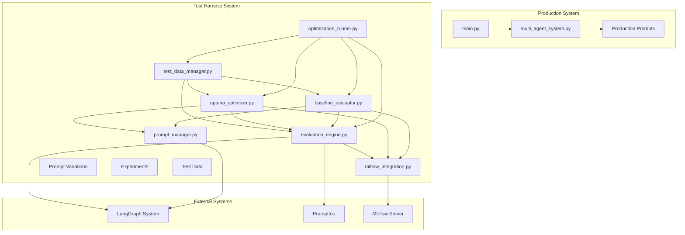
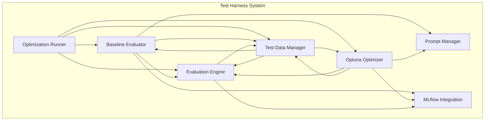
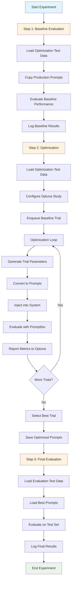
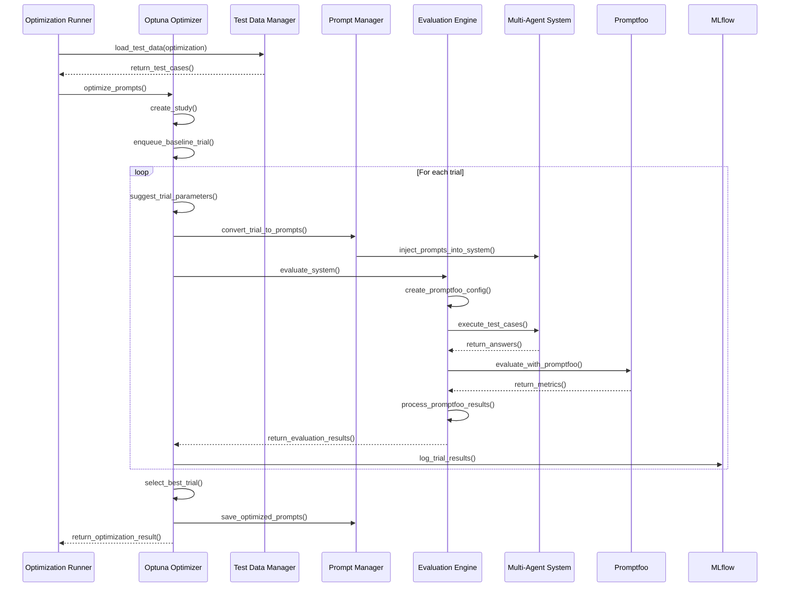
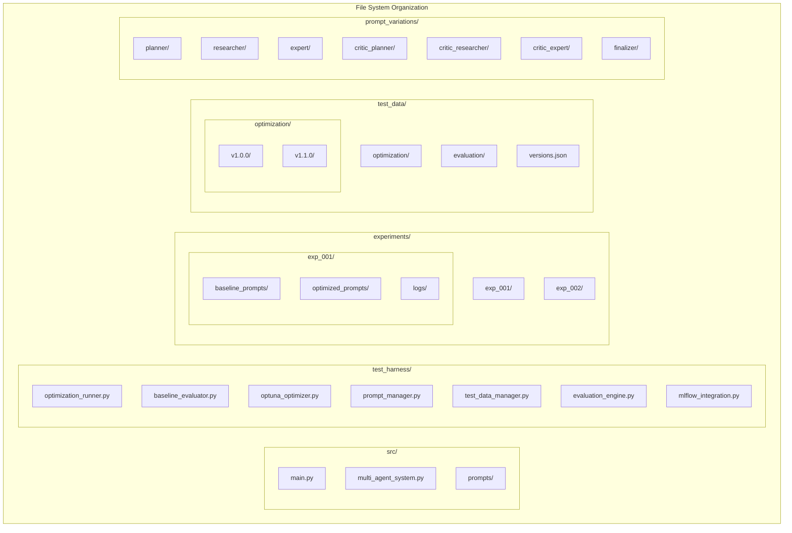

# Test Harness Architecture

## Overview
This document describes the architecture of the test harness system for optimizing prompts in a LangGraph multi-agent system. The architecture follows a modular design with clear separation between the test harness and production systems.

## Architecture Diagrams

### System Context Diagram



### Component Architecture Diagram



### Three-Step Workflow Data Flow



### Optimization Trial Sequence



### Deployment Structure



## Architectural Scope and Limitations

This architecture document focuses on the **research and development aspects** of the test harness system. The following production system concerns are intentionally excluded from architectural consideration:

- **Performance Architecture**: No performance targets, response time requirements, or throughput optimization
- **Scalability Architecture**: No distributed execution patterns, load balancing, or horizontal scaling strategies
- **Security Architecture**: No authentication, authorization, or data protection mechanisms
- **Reliability Architecture**: No fault tolerance patterns, redundancy strategies, or high availability design

These aspects are intentionally excluded to maintain focus on the core architectural goal: enabling systematic prompt optimization through experimentation and evaluation.

## System Context and Scope

### System Boundaries
The test harness operates as a **completely separate system** that generates and injects prompts:

#### **Production System (`src/`)**
- **Entry Point**: `src/main.py` - Production CLI for processing GAIA Level 1 questions and generating JSONL output
- **Core Logic**: `src/multi_agent_system.py` - LangGraph multi-agent system
- **Prompts**: `src/prompts/` - Stable production prompts
- **Purpose**: Process all GAIA Level 1 questions and generate comprehensive JSONL output with answers and reasoning traces

#### **Test Harness System (`test_harness/`)**
- **Entry Point**: `test_harness/optimization_runner.py` - Optimization CLI
- **Core Logic**: `test_harness/optimization_workflow.py` - Optimization workflow
- **Configuration**: `test_harness/optuna_config.py` - Optuna configuration for black-box optimization
- **Prompts**: `test_harness/prompt_variations/` - 3 complete prompts per agent for systematic testing
- **Purpose**: Generate and optimize prompts systematically using Optuna black-box optimization

## Building Block View

### Core Components

#### 1. **Optimization Runner**
- **Purpose**: Main entry point for the test harness
- **Responsibilities**: 
  - Parse CLI arguments
  - Coordinate the three-step workflow
  - Manage experiment lifecycle
  - Handle error conditions

#### 2. **Baseline Evaluator**
- **Purpose**: Evaluate current system performance
- **Responsibilities**:
  - Copy production prompts to baseline
  - Run baseline evaluation against optimization test cases
  - Log baseline performance metrics
  - Create baseline MLflow run

#### 3. **Optuna Optimizer**
- **Purpose**: Optimize prompt combinations using black-box optimization
- **Responsibilities**:
  - Configure Optuna study with multi-objective optimization
  - Manage optimization trials
  - Convert trial parameters to prompts
  - Evaluate prompt combinations using Promptfoo
  - Select best trial from Pareto front

#### 4. **Prompt Manager**
- **Purpose**: Manage prompt loading, injection, and storage
- **Responsibilities**:
  - Load prompts from various sources (production, variants, experiments)
  - Inject prompts into LangGraph system
  - Save optimized prompts
  - Maintain prompt isolation between environments

#### 5. **Test Data Manager**
- **Purpose**: Manage test data versioning and organization
- **Responsibilities**:
  - Maintain version registry
  - Load test data for specific versions
  - Validate test data integrity
  - Manage context files

#### 6. **Evaluation Engine**
- **Purpose**: Evaluate system performance using Promptfoo
- **Responsibilities**:
  - Generate Promptfoo configurations
  - Execute evaluations using `llm-rubric`
  - Aggregate evaluation results
  - Handle evaluation failures

#### 7. **MLflow Integration**
- **Purpose**: Track experiments and results
- **Responsibilities**:
  - Create MLflow runs for each step
  - Log prompts, metrics, and artifacts
  - Support experiment comparison
  - Maintain experiment history

## Runtime View

### Three-Step Workflow

#### **Step 1: Baseline Evaluation**
1. **Setup**: Create experiment directory and copy production prompts to baseline
2. **Evaluation**: Run multi-agent system with baseline prompts against optimization test cases
3. **Logging**: Log baseline prompts and performance metrics to MLflow
4. **Storage**: Save baseline performance for comparison

#### **Step 2: Optimization**
1. **Configuration**: Setup Optuna study with multi-objective optimization
2. **Baseline Trial**: Enqueue baseline prompt combination as first trial
3. **Optimization Loop**: 
   - Optuna suggests prompt combination
   - Convert parameters to prompts
   - Inject prompts into LangGraph system
   - Evaluate using Promptfoo
   - Report metrics back to Optuna
4. **Selection**: Select best trial from Pareto front
5. **Storage**: Save best optimized prompts

#### **Step 3: Final Evaluation**
1. **Loading**: Load best optimized prompts
2. **Evaluation**: Run against separate evaluation test cases
3. **Comparison**: Compare with baseline performance
4. **Logging**: Log final results to MLflow

## Deployment View

### File Structure Organization

#### **Production Prompts (`src/prompts/`)**
- **Purpose**: Stable, version-controlled production prompts used by the live system
- **Contents**: Current production prompts for all agents
- **File Structure**:
  ```
  src/prompts/
  ├── planner_system_prompt.txt
  ├── researcher_system_prompt.txt
  ├── expert_system_prompt.txt
  ├── critic_planner_system_prompt.txt
  ├── critic_researcher_system_prompt.txt
  ├── critic_expert_system_prompt.txt
  └── finalizer_system_prompt.txt
  ```
- **Version Control**: Fully version controlled and deployed to production
- **Access**: Read by production system, updated only through controlled deployment

#### **Baseline Prompts (`test_harness/experiments/{experiment_name}/baseline_prompts/`)**
- **Purpose**: Exact copy of production prompts for reference and rollback within each experiment
- **Contents**: Snapshot of production prompts at experiment start
- **File Structure**:
  ```
  test_harness/experiments/
  ├── exp_001/
  │   ├── baseline_prompts/
  │   │   ├── planner_system_prompt.txt
  │   │   ├── researcher_system_prompt.txt
  │   │   ├── expert_system_prompt.txt
  │   │   ├── critic_planner_system_prompt.txt
  │   │   ├── critic_researcher_system_prompt.txt
  │   │   ├── critic_expert_system_prompt.txt
  │   │   └── finalizer_system_prompt.txt
  │   └── optimized_prompts/
  └── exp_002/
      ├── baseline_prompts/
      └── optimized_prompts/
  ```
- **Creation**: Copied from `src/prompts/` at the start of each experiment
- **Usage**: Reference point for performance comparison and rollback within the experiment

#### **Prompt Variations (`test_harness/prompt_variations/`)**
- **Purpose**: Prompt variants per agent for systematic optimization, where each variant represents a different optimization strategy
- **Contents**: Experimental prompts representing different optimization strategies (e.g., role-focused, task-focused, framework-focused)
- **File Structure**:
  ```
  test_harness/prompt_variations/
  ├── planner/
  │   ├── variant_0_role_focused.txt
  │   ├── variant_1_task_focused.txt
  │   └── variant_2_framework_focused.txt
  ├── researcher/
  │   ├── variant_0_role_focused.txt
  │   ├── variant_1_task_focused.txt
  │   └── variant_2_framework_focused.txt
  ├── expert/
  │   ├── variant_0_role_focused.txt
  │   ├── variant_1_task_focused.txt
  │   └── variant_2_framework_focused.txt
  ├── critic_planner/
  │   ├── variant_0_role_focused.txt
  │   ├── variant_1_task_focused.txt
  │   └── variant_2_framework_focused.txt
  ├── critic_researcher/
  │   ├── variant_0_role_focused.txt
  │   ├── variant_1_task_focused.txt
  │   └── variant_2_framework_focused.txt
  ├── critic_expert/
  │   ├── variant_0_role_focused.txt
  │   ├── variant_1_task_focused.txt
  │   └── variant_2_framework_focused.txt
  └── finalizer/
      ├── variant_0_role_focused.txt
      ├── variant_1_task_focused.txt
      └── variant_2_framework_focused.txt
  ```
- **Naming Convention**: `variant_{index}_{strategy_name}.txt`
- **Strategies**: Role-focused, Task-focused, Framework-focused (expandable to additional strategies)

#### **Experiment Results (`test_harness/experiments/{experiment_name}/`)**
- **Purpose**: Store optimization results, best-performing prompts, and experiment-specific logs
- **Contents**: Baseline prompts, optimized prompts, experiment data, analysis results, and comprehensive logging
- **File Structure**:
  ```
  test_harness/experiments/
  ├── exp_001/
  │   ├── baseline_prompts/
  │   │   ├── planner_system_prompt.txt
  │   │   ├── researcher_system_prompt.txt
  │   │   ├── expert_system_prompt.txt
  │   │   ├── critic_planner_system_prompt.txt
  │   │   ├── critic_researcher_system_prompt.txt
  │   │   ├── critic_expert_system_prompt.txt
  │   │   └── finalizer_system_prompt.txt
  │   ├── optimized_prompts/
  │   │   ├── planner_system_prompt.txt
  │   │   ├── researcher_system_prompt.txt
  │   │   ├── expert_system_prompt.txt
  │   │   ├── critic_planner_system_prompt.txt
  │   │   ├── critic_researcher_system_prompt.txt
  │   │   ├── critic_expert_system_prompt.txt
  │   │   └── finalizer_system_prompt.txt
  │   ├── logs/
  │   │   ├── baseline_run.log
  │   │   ├── optimization_run.log
  │   │   ├── evaluation_run.log
  │   │   ├── optuna_trials.log
  │   │   ├── promptfoo_evaluations.log
  │   │   └── error_logs/
  │   │       ├── baseline_errors.log
  │   │       ├── optimization_errors.log
  │   │       └── evaluation_errors.log
  │   ├── optuna_study.pkl
  │   ├── promptfoo_results/
  │   ├── mlflow_artifacts/
  │   ├── experiment_summary.json
  │   └── prompt_metadata.yaml
  └── exp_002/
      ├── baseline_prompts/
      ├── optimized_prompts/
      ├── logs/
      └── ...
  ```
- **Baseline Prompts**: Exact copy of production prompts at experiment start
- **Optimized Prompts**: Best-performing prompt combination from Optuna optimization
- **Experiment Data**: Optuna study, Promptfoo results, MLflow artifacts
- **Metadata**: Version information, optimization parameters, performance metrics
- **Logs**: Comprehensive logging for each experiment step with detailed error context

### Test Data Versioning Architecture

#### File Structure
```
test_harness/
├── test_data/
│   ├── optimization/
│   │   ├── v1.0.0/
│   │   │   ├── test_cases.jsonl
│   │   │   └── context_files/
│   │   │       ├── sample_article.txt
│   │   │       └── reference_data.json
│   │   ├── v1.1.0/
│   │   │   ├── test_cases.jsonl
│   │   │   └── context_files/
│   │   │       ├── updated_article.txt
│   │   │       └── new_reference_data.json
│   │   └── v2.0.0/
│   │       ├── test_cases.jsonl
│   │       └── context_files/
│   │           └── math_problems.json
│   ├── evaluation/
│   │   ├── v1.0.0/
│   │   │   ├── test_cases.jsonl
│   │   │   └── context_files/
│   │   │       ├── validation_article.txt
│   │   │       └── benchmark_data.json
│   │   └── v1.1.0/
│   │       ├── test_cases.jsonl
│   │       └── context_files/
│   │           ├── new_validation_article.txt
│   │           └── updated_benchmark_data.json
│   └── versions.json
```

#### Version Registry Schema
**`test_harness/test_data/versions.json`**:
```json
{
  "latest_optimization": "v2.0.0",
  "latest_evaluation": "v1.1.0",
  "versions": {
    "optimization": {
      "v1.0.0": {
        "created": "2024-01-15",
        "description": "Initial optimization test cases",
        "directory": "optimization/v1.0.0",
        "test_case_count": 50
      },
      "v1.1.0": {
        "created": "2024-02-01",
        "description": "Added more diverse questions",
        "directory": "optimization/v1.1.0",
        "test_case_count": 60
      },
      "v2.0.0": {
        "created": "2024-03-01",
        "description": "Added mathematical reasoning questions",
        "directory": "optimization/v2.0.0",
        "test_case_count": 70
      }
    },
    "evaluation": {
      "v1.0.0": {
        "created": "2024-01-15",
        "description": "Initial evaluation test cases",
        "directory": "evaluation/v1.0.0",
        "test_case_count": 20
      },
      "v1.1.0": {
        "created": "2024-02-15",
        "description": "Updated evaluation cases",
        "directory": "evaluation/v1.1.0",
        "test_case_count": 25
      }
    }
  }
}
```

## Component Interfaces

### Interface Specifications

#### 1. **Optimization Runner Interface**

**Purpose**: Main entry point that orchestrates the three-step workflow and coordinates all other components.

**Responsibilities**:
- Orchestrate the complete three-step experiment workflow
- Coordinate communication between all other components
- Manage experiment lifecycle and error handling
- Validate input parameters before execution

**Provides Interface**:
- `run_experiment()`: Execute complete three-step workflow
- `validate_parameters()`: Validate all input parameters

**Key Data Flows**:
- Receives experiment configuration and test data paths
- Returns complete experiment results with baseline, optimization, and evaluation metrics
- Propagates errors upward with full context

**Requires Interface**:
- Baseline Evaluator for step 1 execution
- Optuna Optimizer for step 2 execution  
- Evaluation Engine for step 3 execution
- Test Data Manager for test data loading
- MLflow Integration for experiment tracking

#### 2. **Baseline Evaluator Interface**

**Purpose**: Evaluate current system performance using production prompts.

**Responsibilities**:
- Copy production prompts to experiment baseline directory
- Evaluate baseline performance against optimization test cases
- Log baseline results to MLflow
- Provide baseline metrics for comparison

**Provides Interface**:
- `evaluate_baseline()`: Evaluate baseline performance
- `copy_production_prompts()`: Copy production prompts to baseline

**Key Data Flows**:
- Receives test cases and experiment configuration
- Returns baseline performance metrics and prompts used
- Creates baseline prompt snapshot for experiment

**Requires Interface**:
- Prompt Manager for prompt loading
- Evaluation Engine for performance evaluation
- MLflow Integration for result logging

#### 3. **Optuna Optimizer Interface**

**Purpose**: Optimize prompt combinations using black-box optimization.

**Responsibilities**:
- Configure Optuna multi-objective optimization study
- Manage optimization trials and prompt evaluation
- Select best trial from Pareto front
- Log optimization results to MLflow

**Provides Interface**:
- `optimize_prompts()`: Execute complete optimization workflow
- `create_study()`: Configure Optuna study
- `select_best_trial()`: Select best trial from Pareto front

**Key Data Flows**:
- Receives prompt lists and test cases for optimization
- Returns best optimized prompts and Pareto front analysis
- Coordinates with Evaluation Engine for trial evaluation

**Requires Interface**:
- Prompt Manager for prompt conversion and injection
- Evaluation Engine for trial evaluation
- MLflow Integration for optimization logging

#### 4. **Prompt Manager Interface**

**Purpose**: Manage prompt loading, injection, and storage across the system.

**Responsibilities**:
- Create prompt lists for each agent (baseline + variants)
- Convert Optuna trial parameters to actual prompt content
- Inject prompts into LangGraph multi-agent system
- Save optimized prompts to experiment directories

**Provides Interface**:
- `load_prompt_lists()`: Create prompt lists per agent
- `convert_trial_to_prompts()`: Convert trial parameters to prompts
- `inject_prompts_into_system()`: Inject prompts into LangGraph system
- `save_optimized_prompts()`: Save optimized prompts

**Key Data Flows**:
- Receives baseline prompts and prompt variations
- Returns prompt lists organized by agent
- Receives trial parameters and returns actual prompt content
- Manages prompt injection into external LangGraph system

**Requires Interface**:
- LangGraph system for prompt injection
- File system for prompt storage

#### 5. **Test Data Manager Interface**

**Purpose**: Manage test data versioning and loading.

**Responsibilities**:
- Load test data for optimization and evaluation
- Resolve version specifications to actual versions
- Validate test data format and integrity
- Create and manage test data versions

**Provides Interface**:
- `load_test_data()`: Load test data by type and version
- `resolve_version()`: Resolve version to actual version string
- `validate_test_data()`: Validate test data format
- `create_version()`: Create new test data version

**Key Data Flows**:
- Receives data type and optional version specification
- Returns test cases and associated context files
- Manages version registry and metadata
- Validates data integrity before experiment execution

**Requires Interface**:
- File system for test data storage
- Version registry for metadata management

#### 6. **Evaluation Engine Interface**

**Purpose**: Evaluate system performance using Promptfoo.

**Responsibilities**:
- Evaluate system performance with specified prompts
- Generate Promptfoo configurations dynamically
- Process evaluation results to extract metrics
- Coordinate with LangGraph system for test execution

**Provides Interface**:
- `evaluate_system()`: Evaluate system with given prompts
- `create_promptfoo_config()`: Generate Promptfoo configuration
- `process_promptfoo_results()`: Process evaluation results

**Key Data Flows**:
- Receives prompts and test cases for evaluation
- Returns factual correctness count and composite score
- Coordinates with external LangGraph and Promptfoo systems
- Processes evaluation results for optimization feedback

**Requires Interface**:
- LangGraph system for test case execution
- Promptfoo service for evaluation
- File system for result storage

#### 7. **MLflow Integration Interface**

**Purpose**: Track experiments and results across all steps.

**Responsibilities**:
- Create MLflow runs for each experiment step
- Log prompts, metrics, and artifacts
- Support experiment comparison and tracking
- Maintain experiment history and reproducibility

**Provides Interface**:
- `create_run()`: Create MLflow run for experiment step
- `log_prompts()`: Log prompts used in experiment
- `log_metrics()`: Log performance metrics
- `log_artifacts()`: Log experiment artifacts

**Key Data Flows**:
- Receives experiment configuration and results
- Creates separate runs for baseline, optimization, and evaluation
- Logs all experiment data for tracking and comparison
- Provides experiment history and reproducibility

**Requires Interface**:
- MLflow server for experiment tracking

### Data Contracts

#### **Core Data Models**
- **TestCase**: Question, context files, and expected answer
- **TestDataResult**: Test cases and associated context files for a specific version
- **EvaluationMetrics**: Aggregated factual correctness and composite scores
- **ExperimentResult**: Complete experiment results with baseline, optimization, and evaluation
- **BaselineResult**: Baseline performance metrics and prompts used
- **OptimizationResult**: Best prompts, Pareto front, and optimization metrics
- **EvaluationResult**: Final evaluation metrics and prompts used
- **ValidationResult**: Validation status with errors and warnings

#### **Key Data Relationships**
- **TestCase** → **EvaluationResult**: Test cases are evaluated to produce results
- **TestDataResult** → **TestCase**: Test data contains multiple test cases
- **EvaluationMetrics** → **EvaluationResult**: Metrics are aggregated into results
- **BaselineResult** + **OptimizationResult** + **EvaluationResult** → **ExperimentResult**: All results combined
- **ValidationResult**: Used across all components for input validation

### Interface Communication Patterns

#### **Synchronous Communication**
- All component interactions are synchronous
- Components wait for responses before proceeding
- Error propagation is immediate and explicit

#### **Data Flow Patterns**
1. **Forward Flow**: Data flows from Optimization Runner through components in sequence
2. **Result Aggregation**: Results flow back through the component chain
3. **Error Propagation**: Errors propagate upward with context preservation

#### **Interface Error Handling**
- All interfaces return explicit success/failure status
- Error details are preserved through the call chain
- Failures trigger immediate experiment termination
- Error context is logged at each interface boundary

## Cross-Cutting Concepts

### 1. **Prompt Management Strategy**
- **Isolation**: Test harness prompts are completely isolated from production
- **Versioning**: Production prompts are version controlled, experiment prompts are not
- **Injection**: Prompts are injected into LangGraph system during evaluation
- **Rollback**: Support for manual rollback to baseline or previous versions

### 2. **Multi-Objective Optimization Strategy**
- **Primary Objective**: Maximize factual correctness count
- **Secondary Objective**: Maximize composite score (factuality + completeness + relevance)
- **Pareto Front Analysis**: Identify non-dominated solutions
- **Selection Strategy**: Choose highest factual correctness, then highest composite score

### 3. **Evaluation Strategy**
- **Two-Score System**: Factual correctness (binary) and composite score (continuous)
- **Aggregation**: Sum for factual correctness, average for composite score
- **Test Case Separation**: Different sets for optimization vs evaluation
- **Caching**: Leverage Promptfoo caching to avoid redundant evaluations

### 4. **Experiment Management**
- **Three-Step Process**: Baseline → Optimization → Evaluation
- **MLflow Integration**: Separate runs for each step
- **Local Storage**: All experiment data stored locally
- **Reproducibility**: Version tracking for test data and prompts

### 5. **Error Handling Strategy**
- **Fail-Fast**: Immediate termination on any failure
- **Comprehensive Logging**: Detailed error context and stack traces
- **No Retry**: Failures stop execution, no automatic recovery
- **Local Logs**: All logs stored within experiment directories

### 6. **Testing Strategy**
- **Unit Testing**: Each component must have comprehensive unit tests
- **Integration Testing**: Test component interactions and data flow
- **End-to-End Testing**: Test complete three-step workflow
- **Test Data Management**: Use versioned test data for consistent testing
- **Mocking Strategy**: Mock external dependencies (LangGraph, MLflow, Promptfoo)
- **Test Coverage**: Aim for 80%+ code coverage for critical components

## Quality Attributes

### Performance
- **Optimization Efficiency**: Use Optuna's TPE sampler for intelligent search
- **Caching**: Leverage Promptfoo caching to minimize redundant evaluations
- **Single-Threaded**: Prevent concurrent execution to avoid resource conflicts

### Reliability
- **Fail-Fast**: Immediate termination on errors with detailed logging
- **Rollback Support**: Manual rollback to baseline or previous versions
- **Validation**: Comprehensive validation of inputs and configurations

### Maintainability
- **Modular Design**: Clear component boundaries and interfaces
- **Separation of Concerns**: Test harness isolated from production system
- **Version Control**: Production prompts version controlled, experiments isolated

### Usability
- **CLI Interface**: Simple command-line interface for running experiments
- **Progress Feedback**: Clear progress indicators during optimization
- **Error Messages**: Actionable error messages with context

## Quality Requirements

### Quality Goals

The test harness prioritizes three key quality attributes that are essential for its research and development purpose:

1. **Reliability**: The system must handle failures gracefully with complete error context for debugging
2. **Usability**: The system must provide clear, actionable feedback to users during experiments  
3. **Maintainability**: The system must support easy debugging and modification of experiments

### Quality Tree

```
Test Harness Quality
├── Reliability
│   └── Fail-fast with complete error context
├── Usability
│   └── Clear progress feedback and error messages
└── Maintainability
    └── Comprehensive logging and modular design
```

### Quality Scenarios

#### **Reliability Scenario: Prompt Evaluation Failure**
**Stimulus**: Promptfoo evaluation fails during an Optuna trial
**Environment**: Optimization phase with 50+ trials
**Response**: System halts immediately, logs trial parameters, prompts used, and complete error stack
**Response Measure**: Zero corrupted results, complete debugging context preserved

#### **Usability Scenario: Long-Running Optimization**
**Stimulus**: User starts 200-trial optimization experiment
**Environment**: Normal optimization execution
**Response**: CLI shows "Trial 45/200, Best Score: 0.85, ETA: 2 hours"
**Response Measure**: User always knows progress and can estimate completion time

#### **Maintainability Scenario: Trial Analysis**
**Stimulus**: Researcher needs to understand why trial #67 performed poorly
**Environment**: Post-experiment analysis
**Response**: Complete trial data available: prompts, parameters, evaluation results, logs
**Response Measure**: Researcher can reproduce and analyze any trial within 3 minutes

### Quality Trade-offs

The test harness makes the following quality trade-offs to maintain simplicity:

- **Performance vs Reliability**: Prioritizes complete error context over execution speed
- **Convenience vs Control**: Requires manual intervention for failures rather than automatic recovery
- **Simplicity vs Features**: Focuses on core functionality over advanced features

### Quality Validation

Quality requirements are validated through:

1. **Reliability**: Fail-fast testing with various failure scenarios
2. **Usability**: CLI usability testing with different user types
3. **Maintainability**: Code review and logging completeness verification

## Architecture Decisions

### ADR-001: Separate Test Harness System
**Decision**: Create a completely separate test harness system that operates independently from the production system.

**Rationale**: 
- Prevents interference with production operations
- Allows independent development and testing
- Maintains system stability and reliability
- Enables parallel development of optimization features

**Consequences**:
- Positive: Clear separation of concerns, no production impact
- Negative: Additional complexity in prompt injection and management

### ADR-002: Three-Step Workflow
**Decision**: Use a three-step workflow: baseline evaluation, optimization, and final evaluation.

**Rationale**:
- Provides clear baseline for comparison
- Separates optimization from evaluation to prevent overfitting
- Enables comprehensive experiment tracking
- Supports systematic optimization process

**Consequences**:
- Positive: Clear experiment structure, comprehensive tracking
- Negative: Longer experiment duration, more complex orchestration

### ADR-003: Multi-Objective Optimization
**Decision**: Use multi-objective optimization with factual correctness as primary objective and composite score as secondary.

**Rationale**:
- Balances accuracy with quality
- Uses Pareto front analysis for optimal solutions
- Provides flexibility in optimization strategy
- Aligns with evaluation requirements

**Consequences**:
- Positive: Balanced optimization, flexible selection
- Negative: More complex optimization process, requires Pareto analysis

### ADR-004: Local Experiment Storage
**Decision**: Store all experiment data locally within experiment directories.

**Rationale**:
- Ensures data privacy and security
- Enables offline operation
- Simplifies deployment and configuration
- Supports comprehensive logging

**Consequences**:
- Positive: Privacy, offline capability, simple deployment
- Negative: No centralized experiment management, manual backup required

### ADR-005: Fail-Fast Error Handling
**Decision**: Implement fail-fast error handling with immediate termination and detailed logging.

**Rationale**:
- Prevents partial or corrupted results
- Ensures complete error context for debugging
- Maintains system integrity
- Simplifies error recovery

**Consequences**:
- Positive: System integrity, complete error context
- Negative: No automatic recovery, manual intervention required

## Integration Points

### 1. **LangGraph Integration**
- **Interface**: Prompt injection into multi-agent system
- **Method**: Dynamic prompt replacement during evaluation
- **Isolation**: No permanent changes to production system
- **Validation**: Verify prompt injection before evaluation

### 2. **Optuna Integration**
- **Interface**: Black-box optimization API
- **Configuration**: Multi-objective study with TPE sampler
- **Parameters**: Prompt indices for categorical optimization
- **Results**: Pareto front analysis and best trial selection

### 3. **Promptfoo Integration**
- **Interface**: Evaluation service API
- **Configuration**: Dynamic configuration generation per trial
- **Evaluation**: `llm-rubric` for factuality, completeness, and relevance
- **Caching**: Built-in caching to avoid redundant evaluations

### 4. **MLflow Integration**
- **Interface**: Experiment tracking API
- **Runs**: Separate runs for each workflow step
- **Logging**: Prompts, metrics, and artifacts
- **Comparison**: Support for experiment comparison

## Deployment Strategy

### Independent Deployment
- **Production System**: Can be deployed independently
- **Test Harness**: Can run optimization experiments independently
- **Prompts**: Manual promotion from experiments to production after human review
- **Isolation**: Production system does not require test harness to function

### Manual Promotion Process
1. **Review**: Human review of optimized prompts
2. **Validation**: Validate performance improvements
3. **Promotion**: Manual copy from experiment to production
4. **Rollback**: Support for rollback to previous versions

## Concurrency Constraints

### Single-Threaded Execution
- **Constraint**: No parallel runs allowed
- **Rationale**: Prevent resource conflicts and ensure consistent results
- **Implementation**: Exclusive access control for all operations
- **Validation**: System prevents concurrent execution

### Optimization Constraints
- **Constraint**: No concurrent optimization trials
- **Rationale**: Ensure consistent evaluation environment
- **Implementation**: Locks to prevent concurrent trials
- **Validation**: Clear error messages for concurrency violations 